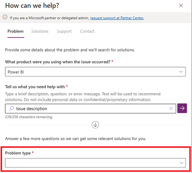
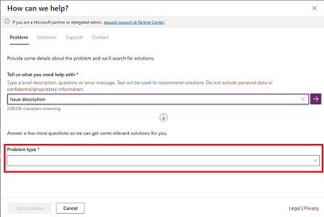

---
# Required metadata
		# For more information, see https://review.learn.microsoft.com/en-us/help/platform/learn-editor-add-metadata?branch=main
		# For valid values of ms.service, ms.prod, and ms.topic, see https://review.learn.microsoft.com/en-us/help/platform/metadata-taxonomies?branch=main

title:       How to createa a Fabric and Power BI Support Tikcet
description: Creating a support ticket for Fabric and Power BI
author:      royrubinstein # GitHub alias
ms.author:    rrubinstein
ms.service:  powerbi
# ms.prod:   # To use ms.prod, uncomment it and delete ms.service
ms.topic:    troubleshooting # Add the ms.topic value
ms.date:     06/14/2023
---

# Create a Support Ticket

Fabric and Power BI admin and users can contact support to get self-help solutions in real-time for their issue through either the [Power Platform Admin Center](https://admin.powerplatform.microsoft.com/support) (admins only) or the [Fabric Support Page](https://support.fabric.microsoft.com/en-US/support). If the issue can't be resolved through self-help, you can use the same **Contact Support** experience to contact a Microsoft support representative.

Below is an example for a Power BI dataset refresh issue:  

## Prerequisites

- You have a security role that is enabled for creating support requests. Users having one of these security roles can create support requests:

   - AAD Role Admin

   - Environment Administrator (or System Administrator role in Dataverse)

   - Company Admin

   - Billing Admin

   - Service Admin

   - CRM Service Admin

   - CRM Organization Admin

   - Security Admin

   - Partner Delegated Admin

   - SharePoint Admin

   - Teams Admin

   - Exchange Admin

   - Power BI Admin

   - Compliance Admin

   - Helpdesk Admin

- Power BI Pro users can create support tickets for Power BI.

- Fabric users can create support tickets for Fabric products.

## View solutions or create a support request

### Admin Experience

1. Sign in to the [Power Platform admin center](https://admin.powerplatform.microsoft.com/) with your admin credentials.

2. Select **Help + support** > **Get Help + support**

         

3. Select the product you're experiencing an issue with.

   > [!TIP]
   > You can type the product name to quickly find the requested product

4. Fill in the description of the issue and click on the arrow to the right. We will show solutions matching the issue's description provided by you.

         

5. If we were able to find suitable solutions based on the issue's description, you will need to select problem type and subtype and then to select **See solutions**. For some problem type and subtype selections, you will be asked to answer additional questions.

         

6. Based on the information you provided, you'll see a list of possible solutions to your issue. Select the relevant solution and see if the content can successfully guide you to a fix.

         

7. If the guidance doesn't resolve your issue, scroll down and select **Contact Support**, and fill in the fields in the following pages.

         

8. If you have a **Unified or Premier** support plan that is not listed, select **Add new contract** and fill in the fields. If you don't know your access or contract ID, please contact your service admin or Incident Manager or Customer Success Account Manager (CSAM).

   > [!TIP]
   > 
   >- For **Contract ID/Password**, please enter your Unified or Premier contract ID.
   >- The **Contract ID/Password** defaults to the Unified or Premier contract ID. If you have changed the password when registering online in the Unified/Premier portal, you should use the updated password instead of the contract ID.

9. 

### Non-Admin Experience

1. On the [Fabric Support page](https://support.fabric.microsoft.com/en-US/support), select the product you are experiencing an issue with

1. Fill in the description of the issue and click on the arrow to the right. We will show solutions matching the issue's description provided by you.

1. 5. If we were able to find suitable solutions based on the issue's description, you will need to select problem type and subtype and then to select **See solutions**. For some problem type and subtype selections, you will be asked to answer additional questions.

1. 6. Based on the information you provided, you'll see a list of possible solutions to your issue. Select the relevant solution and see if the content can successfully guide you to a fix.

1. 7. If the guidance doesn't resolve your issue, scroll down and select **Contact Support**, and fill in the fields in the following pages.

8. If you have a **Unified or Premier** support plan that is not listed, select **Add new contract** and fill in the fields. If you don't know your access or contract ID, please contact your service admin or Incident Manager or Customer Success Account Manager (CSAM).

1. > [!TIP]
A=>A.attrs.isDirty&&!Vp(A)&&A.attrs.depth!==void 0?(l.delim=l.repeat(" ",3*A.attrs.depth),l.delim):""> 
   - For **Contract ID/Password**, please enter your Unified or Premier contract ID.
   
A=>A.attrs.isDirty&&!Vp(A)&&A.attrs.depth!==void 0?(l.delim=l.repeat(" ",3*A.attrs.depth),l.delim):""> 
      - The **Contract ID/Password** defaults to the Unified or Premier contract ID. If you have changed the password when registering online in the Unified/Premier portal, you should use the updated password instead of the contract ID.
      
A=>A.attrs.isDirty&&!Vp(A)&&A.attrs.depth!==void 0?(l.delim=l.repeat(" ",3*A.attrs.depth),l.delim):""
A=>A.attrs.isDirty&&!Vp(A)&&A.attrs.depth!==void 0?(l.delim=l.repeat(" ",3*A.attrs.depth),l.delim):""### Live Chat
A=>A.attrs.isDirty&&!Vp(A)&&A.attrs.depth!==void 0?(l.delim=l.repeat(" ",3*A.attrs.depth),l.delim):""
1. For some of the combinations of problem type and subtype, users might see the option to start a live chat session with a Microsoft Support representative. The option to start a live chat session will appear on the **Contact** page. 

        

