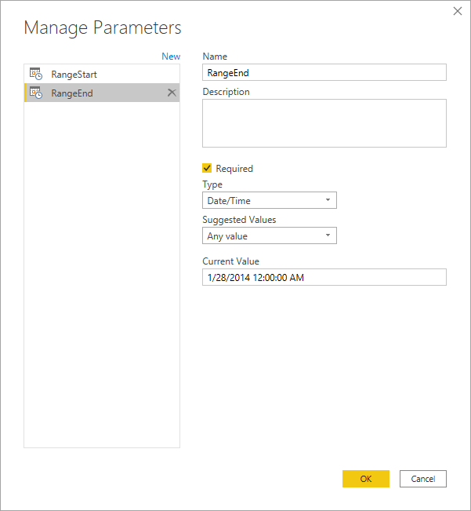
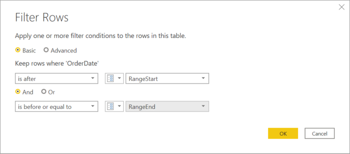
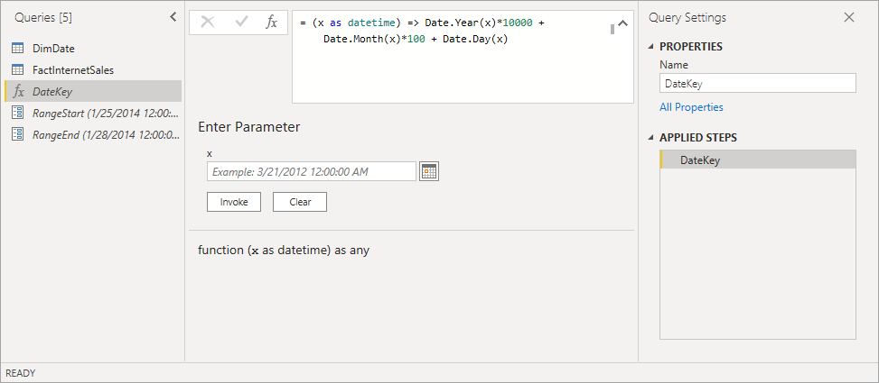
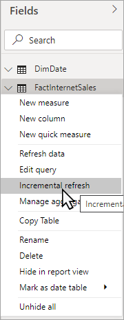
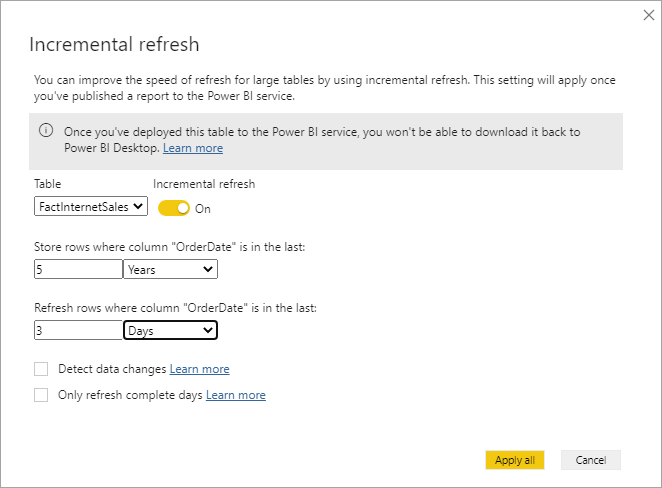

# Configure incremental refresh

This article describes how to configure incremental refresh for **datasets**. To learn about configuring incremental refresh for dataflows, see [Incremental refresh in Premium features of dataflows](../transform-model/dataflows/dataflows-premium-features.md#incremental-refresh).

Configuring incremental refresh includes creating range parameters, applying filters, and defining a policy for a table that is applied when a manual or scheduled refresh operation is performed on the dataset in the service. Before completing these steps, be sure to fully understand the functionality described in [Incremental refresh](incremental-refresh-overview.md).

Examples in this article show configuring incremental refresh for a single fact table, FactInternetSales, importing data from the sample AdventureWorksDW database (Yeah, we know. It's an old, but popular sample dataset:). For models with more than one fact table, incremental refresh policies can be defined for more than one table in the same dataset by using the same RangeStart and RangeEnd parameters.

## Create parameters

In this task, use Power Query Editor to create RangeStart and RangeEnd parameters with default values. The default values apply only when filtering the data to be imported into the model in Power BI Desktop. The values you enter should encompass only a small portion of the most recent data. When published to the service, these values are overridden by the incremental refresh policy.

1. In Power BI Desktop, click **Transform data** to open Power Query Editor.

1. In Power Query Editor, click **Manage Parameters** > **New Parameter**.

1. In **Manage Parameters** > **Name**, type **RangeStart** (case sensitive), then in **Type**, select **Date/Time**, and then in **Current Value** enter a start date and time value, for example, 1/25/2014 12:00:00 AM.

    

1. Create a second parameter named **RangeEnd**. In **Type**, select **Date/Time**, and then in **Current Value** enter an end date and time value. In this example, we specify 1/28/2014 12:00:00 AM, which is the last transaction date and time in the data source table.

    

Now that you have RangeStart and RangeEnd parameters configured, you then filter the data to be imported into the model based on those parameters.

## Filter data

With RangeStart and RangeEnd parameters defined, apply a filter based on *conditions* in the RangeStart and RangeEnd parameters.

1. In Power Query Editor, in the table, select the column you want to filter on, then click the filter icon > **Date/Time Filters** > **Custom Filter**.

1. In **Filter Rows**, to specify the first condition, select **is after** or **is after or equal to**, then select **Parameter**, and then select **RangeStart**.

    To specify the second condition, if you selected *is after* in the first condition, then select **is before or equal to**, or if you selected *is after or equal to* in the first condition, then select **is before** for the second condition, then select **Parameter**, and then select **RangeEnd**. For example,

    

   **Important:** Verify queries have an equal to (=) on either RangeStart or RangeEnd, but not both. If the equal to (=) exists on both parameters, a row could satisfy the conditions for two partitions, which could lead to duplicate data in the model. For example, `#"Filtered Rows" = Table.SelectRows(dbo_Fact, each [OrderDate] >= RangeStart and [OrderDate] <= RangeEnd)` could result in duplicate data.

    Click **OK** to close.

1. In Power Query Editor, click **Close & Apply**. Power Query will then import data based on the filters defined in the RangeStart and RangeEnd parameters, and any other filters you defined.

    Power Query will load only data specified between the RangeStart and RangeEnd parameters. Depending on the amount of data in that range, import should go quickly. If it seems slow and process intensive, it's possible the query is not folding.

## Convert DateTime to integer

This task is optional.

The data type of the RangeStart and RangeEnd parameters must be of date/time data type. However, for many data sources, tables do not contain a column of date/time data type, but instead have a date column of integer surrogate keys in the form of *yyyymmdd*. You can create a function that converts the date/time value in the parameters to match the integer surrogate key of the data source table. The function is then called in a filter step. This step is required if the data source table contains *only* a surrogate key as integer data type. 

1. In Power Query Editor, click **Get data** > **Blank Query**.

1. In **Query Settings**, type a name the function, for example, DateKey, and then in the formula editor, enter the following formula:

    `= (x as datetime) => Date.Year(x)*10000 + Date.Month(x)*100 + Date.Day(x)`

    

1. To test the formula, in **Enter Parameter**, enter a date\time value, and then click **Invoke**. If the formula is correct, an integer value for the date is returned. After verifying, delete the invoked function query.

1. In **Queries**, select the table, and then edit the query formula to call the function with the RangeStart and RangeEnd parameters. For example,

    `= Table.SelectRows(#"Sorted Rows", each [OrderDateKey] > DateKey(RangeStart) and [OrderDateKey] <= DateKey(RangeEnd))`

    

## Define policy

After you've defined RangeStart and RangeEnd parameters, and filtered data based on those parameters, you define an incremental refresh policy. The policy is applied only after the model is published to the service and a manual or scheduled refresh operation is performed.

1. In Data view > **Fields** > open the context menu for the table, and then click **Incremental refresh**.

    

1. In **Incremental refresh**, in **Table**, verify or select the table, and then click the **Incremental refresh** slider to **On**. If the slider is disabled, it means the Power Query expression for the table doesn't refer to the parameters with reserved names.

1. In **Store rows where column "columnname" is in the last:**, specify the whole range you want to include in the dataset. All rows with dates in this range will be imported to the dataset in the service (unless other filters apply).

1. In **Refresh rows where column "columnname" is in the last:**, specify the range you want to refresh. All rows with dates in this range will be refreshed in the dataset each time a manual or scheduled refresh operation is performed

    

1. Select optional advanced settings:

    Select **Detect data changes** to specify a date/time column used to identify and refresh only the days where the data has changed. This assumes such a column exists in the source system, which is typically for auditing purposes. This **should not be the same column** used to partition the data with the RangeStart/RangeEnd parameters. The maximum value of this column is evaluated for each of the periods in the incremental range. If it has not changed since the last refresh, there is no need to refresh the period.

    Select **Only refresh complete days** to refresh only complete, full days. If the refresh operation detects a day is not complete, rows for that day are not refreshed.

1. Click **Apply all** to complete the refresh policy. Source data is not imported with this step.

## Save and publish to the service

When your RangeStart and RangeEnd parameters, filtering, and refresh parameters are complete, be sure to save your model, and then publish to the service.

## Refresh dataset

In the service, refresh the dataset. The first refresh will  import historical data for the entire period specified in the **Store rows where column \<dateColumnName> is in the last:** policy setting. Depending on the amount of data, this can take quite a long time. Subsequent refreshes, either manual or scheduled are typically much faster because the incremental refresh policy is applied and only data for the period specified in **Refresh rows where column \<dateColumnName> is in the last:** policy setting is refreshed.

## See also

[Configure scheduled refresh](../connect-data/refresh-scheduled-refresh.md)  
[Incremental refresh](incremental-refresh-overview.md)  
[Troubleshoot incremental refresh](incremental-refresh-troubleshoot.md)  