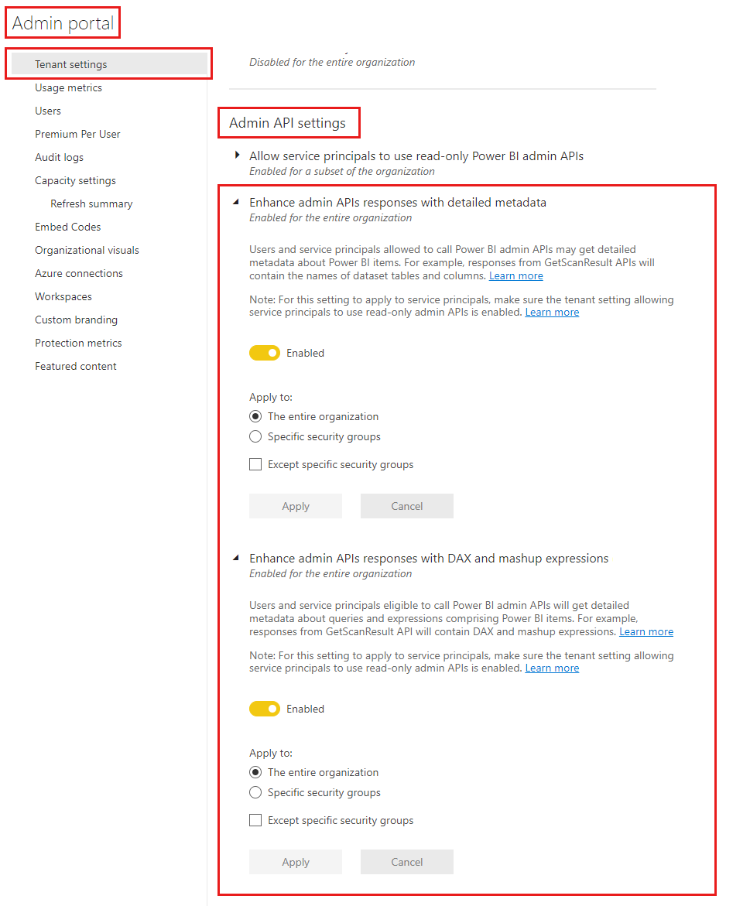

# Set up metadata scanning in your organization

Before metadata scanning can be run over an organization's Power BI workspaces, it must be set up by a Power BI administrator. Setting up metadata scanning involves two steps:

1. Enabling service principal authentication for read-only admin APIs.
1. Enabling tenant settings for detailed dataset metadata scanning.

## Enable service principal authentication for read-only admin APIs

Service principal is an authentication method that can be used to let an Azure AD application access Power BI APIs. With this authentication method, you don’t have to maintain a service account with an admin role. Rather, to allow your app to use the Admin APIs, you just have to give your approval after as part of the tenant settings configuration.

To see how to enable service principal access to read-only Admin APIs, see [Enable service principal authentication for read-only admin APIs](../enterprise/read-only-apis-service-principal-authentication.md).

If you don't want to enable service principal authentication, metadata scanning can be performed with standard delegated admin access token authentication.

## Enable tenant settings for metadata scanning

Two tenant settings control metadata scanning:

* **Enhance admin APIs responses with detailed metadata**: This setting turns on [Model caching](#model-caching) and enhances API responses with low-level dataset metadata (for example, name and description) for tables, columns, and measures.
* **Enhance admin APIs responses with DAX and mashup expressions**: This setting allows the API response to include DAX expressions and Mashup queries. This setting can only be enabled if the first setting is also enabled.

To enable these settings, go to **Admin portal > Tenant settings > Admin API settings**.

### Model caching

Enhanced metadata scanning uses a caching mechanism to ensure that **capacity resources are not impacted**.
Getting low-level metadata requires that the model is available in memory. To make sure Power BI shared or Premium capacity resources aren't impacted by having to load the model for every API call, the enhanced metadata scanning feature uses successful dataset refreshes and republishing by creating a cache of the model that is loaded into memory on those occasions. Then, when enhanced metadata scanning takes place, API calls are made against the cached model. No load is placed on your capacity resources due to enhanced metadata scanning.

Caching happens every successful dataset refresh and republish only if the following conditions are met:

* The **Enhance Admin APIs responses with detailed metadata** admin tenant setting is enabled (see [Enable tenant settings for metadata scanning](#enable-tenant-settings-for-metadata-scanning)).
* There has been a call to the scanner APIs within the last 90 days.

If the detailed low-level metadata requested isn't in the cache, it's not returned. High-level metadata, such as dataset name, is always returned, even if the low-level detail isn't available.

## Next steps

* [Enable service principal authentication for read-only admin APIs](../enterprise/read-only-apis-service-principal-authentication.md)
* [Metadata scanning](../enterprise/service-admin-metadata-scanning.md)
* [Power BI REST Admin APIs](/rest/api/power-bi/admin)
* More questions? Try asking the [Power BI Community](https://community.powerbi.com)
