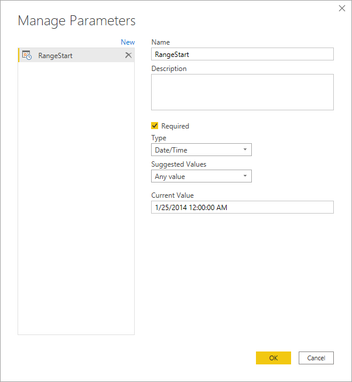

# Configure incremental refresh

## Define parameters

In this task, you define RangeStart and RangeEnd parameters with default values. The default values only apply when filtering the data to be loaded into the model in Power BI Desktop. The values you enter should encompass only a small portion of the most recent data. When published to the service, these values are overridden by the Incremental refresh policy you configure later.

1. In Power BI Desktop, click **Transform data** to open Power Query Editor.

1. In Power Query Editor, click **Manage Parameters** > **New Parameter**.

1. In **Manage Parameters** > **Name**, type **RangeStart**, in **Type**, select **Date/Time**, and then in **Current Value** enter a start date and time value, for example, 1/25/2014 12:00:00.

    

1. Create a second parameter named **RangeEnd**. In **Type**, select **Date/Time**, and then in **Current Value** enter an end date and time value. In this example, we specify 1/27/2014 12:00:00, which is the last transaction date and time in the data source fact table. 

    

Now that you have RangeStart and RangeEnd parameters configured, you then filter the data to be imported into the model based on those parameters.

## Filter data

With RangeStart and RangeEnd parameters defined, you can then apply a filter based on *conditions* in the RangeStart and RangeEnd parameters.

1. In the fact table, select the column you want to filter on, then click the filter icon > **Date/Time Filters** > **Custom Filter**.

1. In **Filter Rows**, to specify the first condition, select **is after** or **is after or equal to**, then select **Parameter**, and then select **RangeStart**.
    
    To specify the second condition, if you selected *is after* in the first condition, then select **is before or equal to**, or if you selected *is after or equal to* in the first condition, then select **is before** for the second condition, then select **Parameter**, and then select **RangeEnd**. For example,

    

   **Important:** Verify queries have an equal to (=) on either RangeStart or RangeEnd, but not both. If the equal to (=) exists on both parameters, a row could satisfy the conditions for two partitions, which could lead to duplicate data in the model. For example, `#"Filtered Rows" = Table.SelectRows(dbo_Fact, each [OrderDate] >= RangeStart and [OrderDate] <= RangeEnd)` could result in duplicate data.

    Click **OK** to close.

1. In Power Query Editor, click **Close & Apply**. Power Query will then import data based on the filters defined in the RangeStart and RangeEnd parameters, and any other filters you defined.

## Define Incremental refresh policy

After you've defined RangeStart and RangeEnd parameters, and filtered data based on those parameters, you define an Incremental refresh policy. The policy is applied only after the model is published to the service and a manual or scheduled refresh operation is performed.

1. In Data view > **Fields** > open the context menu for the fact table, and then click **Incremental refresh**.

    

1. In **Incremental refresh**, in **Table**, verify or select the fact table, and then click the **Incremental refresh** slider to **On**. If the slider is disabled, it means the Power Query expression for the table doesn't refer to the parameters with reserved names.

1. In **Store rows where column "columnname" is in the last:**, specify the whole range you want to include in the dataset. All rows with dates in this range will be imported to the dataset in the service (unless other filters apply).

1. In **Refresh rows where column "columnname" is in the last:**, specify the range you want to refresh. All rows with dates in this range will be refreshed in the dataset each time a manual or scheduled refresh operation is performed

    

1. 
