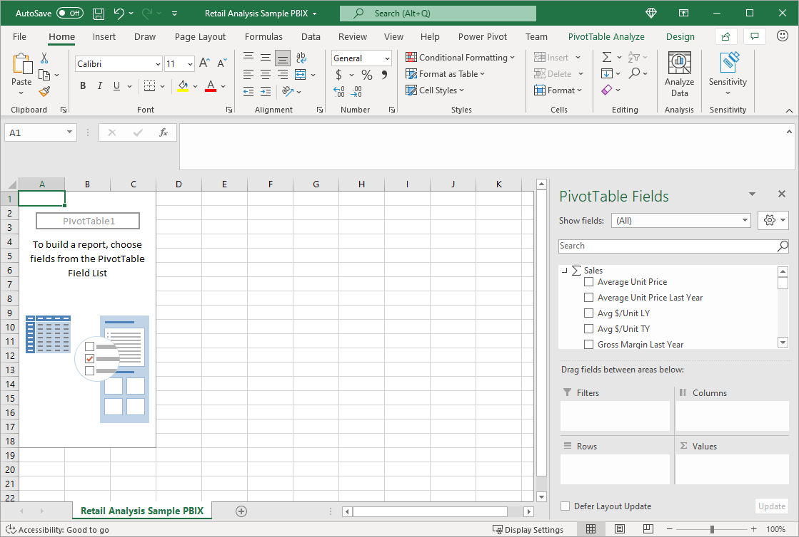

# Build refreshable reports in Excel with Power BI data

You've connected to a Power BI dataset in Excel by starting in [Power BI with Analyze in Excel](service-analyze-in-excel.md) or in [Excel with Get Data](service-connect-excel-power-bi-datasets.md). Now that you're connected, Excel presents you with an empty *PivotTable* and *Fields* list from the Power BI dataset, and you're ready analyze your data.

The Excel file has an MSOLAP connection string that connects to your dataset in Power BI. When you analyze or work with the data, Excel queries that dataset in Power BI and returns the results to Excel. If that dataset connects to a live data source using DirectQuery, Power BI queries the data source and returns the result to Excel.

With that connection to the data in Power BI now established, you can create PivotTables, charts, and analyze that dataset just as you would work with a local dataset in Excel.

:::image type="content" source="media/service-analyze-power-bi-datasets-excel/analyze-powerbi-datasets-excel-pivottable.png" alt-text="Blank PivotTable for Analyze in Excel.":::

## Data sources for Power BI datasets in Excel

Excel is especially useful for Power BI datasets and reports that connect to the following data sources:

* Azure Analysis Services *tabular* data models and SQL Server Analysis Services (SSAS) *tabular* or *multidimensional* data models.

    Connection to datasets from live connection to Analysis Services (Azure and SQL Server) aren't currently supported.

* Power BI Desktop files or Excel workbooks with data models that have model measures created using Data Analysis Expressions (DAX).

With **Excel for the web**, you can now explore and refresh Excel workbooks connected to Power BI datasets. If you have downloaded an Analyze in Excel workbook from Power BI or connected directly to a Power BI dataset from the Excel desktop app, you can share and refresh these workbooks through OneDrive and SharePoint. You can copy the link to the OneDrive or SharePoint location by clicking the **Share** button in the Excel desktop app and pasting the link directly in a browser. Now you start working with PivotTables connected to Power BI datasets in Excel for the web just like you would in the Excel desktop app.

> [!IMPORTANT]
> Analyzing Power BI data in Excel exposes all detail-level data to any users with permission to the dataset.

There are a handful of things to consider when you begin analyzing Power BI data in Excel, which might require an extra step or two to reconcile. These possibilities are described in the following sections.

## Refresh the data

You can refresh the Power BI dataset connection to update your reports in Excel in one of two ways.

- Right-click anywhere in the PivotTable and select **Refresh**.

    :::image type="content" source="media/service-analyze-power-bi-datasets-excel/analyze-powerbi-datasets-excel-refresh.png" alt-text="Right-click anywhere in the PivotTable and select Refresh.":::

- Select **Data** in the Excel ribbon and select **Refresh**.

    :::image type="content" source="media/service-analyze-power-bi-datasets-excel/analyze-powerbi-datasets-excel-data-refresh.png" alt-text="Select Data in the Excel ribbon and select Refresh.":::

    > [!IMPORTANT]
    > **Refresh** updates the Power BI connection string for the report you see on the sheet. **Refresh All** updates all the connection strings in the Excel workbook, including non-Power BI data sources.

### Sign in to Power BI
Although you’re signed in to Power BI in your browser, the first time you open a new Excel file in Excel you may be asked to sign in to Power BI with your Power BI account. This authenticates the connection from Excel to Power BI.

### Multiple Power BI accounts

If you have multiple Power BI accounts, you might be signed in to Power BI with one account, but your other account has access to the dataset being used in Excel. In that case, you might see a **Forbidden** error, or a sign-in failure when attempting to access a dataset that's being used in an Excel workbook. See the [Forbidden error](desktop-troubleshooting-analyze-in-excel.md#forbidden-error) section of "Troubleshoot connecting Excel to Power BI data."

## Considerations and limitations

- Row-level security (RLS) is supported for Analyze in Excel. RLS is enforced at the data-model level, and is always applied to all users accessing data in the report. Read more about [row-level security](../admin/service-admin-rls.md).
- There may be times when using Analyze in Excel that you get an unexpected result, or the feature doesn't work as you expected. See [Troubleshoot Analyze in Excel](desktop-troubleshooting-analyze-in-excel.md) for solutions to common issues.
- Only Power BI datasets that use Import mode will preserve hierarchies in Analyze in Excel workbooks. Power BI datasets built on DirectQuery or composite models will not have their hierarchies retained when using Analyze in Excel.
- Analyze in Excel doesn't support specifying a locale by modifying the connection string _after_ a workbook has been generated.
- You may see an error message if the data is larger than 2 GB. In that case, either reduce the amount of data, for example by applying filters, or use the XMLA endpoint. Learn more about the [XMLA endpoint](../admin/service-premium-connect-tools.md).

## Next steps

- [Access Power BI featured tables in Excel](service-excel-featured-tables.md)
- Read about [using Excel data types from Power BI](https://support.office.com/article/use-excel-data-types-from-power-bi-preview-cd8938ce-f963-444d-b82a-7140848241e9) in the Excel documentation.
- Questions? [Try the Power BI Community](https://community.powerbi.com/)
