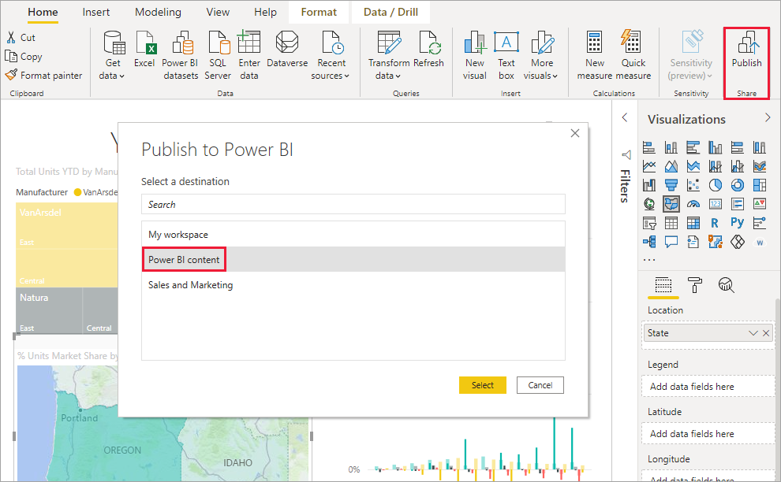
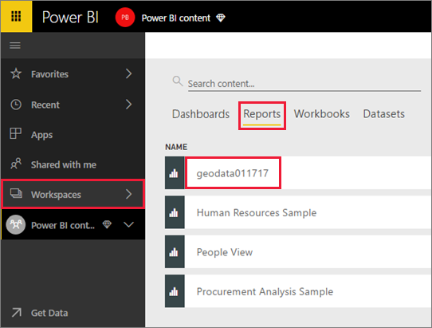

# Collaborate in a classic workspace
Power BI workspaces are great places to collaborate with your colleagues on dashboards, reports, and datasets to create *apps*. This article is about the original, *classic* workspaces.  

Collaboration doesn’t end with workspaces in Power BI. When you create one of the classic workspaces in Power BI, you're automatically creating a Microsoft 365 group in the background. Microsoft 365 offers other group services, such as sharing files on OneDrive for Business, conversations in Exchange, shared calendar and tasks, and so on. Read more about [groups in Microsoft 365](https://support.office.com/article/Create-a-group-in-Office-365-7124dc4c-1de9-40d4-b096-e8add19209e9).

> [!NOTE]
> The new workspace experience changes the relationship between Power BI workspaces and Microsoft 365 groups. When you create one of the new workspaces in Power BI, you no longer automatically create a Microsoft 365 group in the background. For more information, see [Create the new workspaces in Power BI](service-create-the-new-workspaces.md).

You need a [Power BI Pro license](../fundamentals/service-features-license-type.md) to create a workspace.

## Collaborate on Power BI Desktop files in a workspace
After you create a Power BI Desktop file, you can publish it to a workspace so everyone in the workspace can collaborate on it.

1. In Power BI Desktop, select **Publish** on the **Home** ribbon, then select the workspace in the **Select a destination** box.
   
    
2. In the Power BI service, select the arrow next to **Workspaces** > select the workspace.
   
    
3. Select the **Reports** tab, then choose your report.
   
    
   
    From here, it's like any other report in Power BI. You and others in the workspace can modify the report and save tiles to a dashboard of your choosing.

## Collaborate in Microsoft 365
Collaborating in Microsoft 365 starts from the classic workspace in Power BI.

1. In the Power BI service, select the arrow next to **Workspaces** > select **More options** (...) next to your workspace name. 
   
   
2. From this menu, you can collaborate with your group in a few ways: 
   
   * Have a [group conversation in Microsoft 365](#have-a-group-conversation-in-microsoft-365).
   * [Schedule an event](#schedule-an-event-on-the-group-workspace-calendar) on the group workspace calendar.
   
   The first time you go to your group workspace in Microsoft 365, it may take some time. Give it 15 to 30 minutes, then refresh your browser.

## Have a group conversation in Microsoft 365
1. Select **More options** (...) next to your workspace name \> **Conversations**. 
   
    
   
   The email and conversation site for your group workspace opens in Outlook for Microsoft 365.
   
   
2. Read more about [group conversations in Outlook for Microsoft 365](https://support.office.com/Article/Have-a-group-conversation-a0482e24-a769-4e39-a5ba-a7c56e828b22).

## Schedule an event on the group workspace calendar
1. Select **More options** (...) next to the workspace name \> **Calendar**. 
   
   
   
   The calendar for your group workspace opens in Outlook for Microsoft 365.
   
   
2. Read more about [group calendars in Outlook in Microsoft 365](https://support.office.com/Article/Add-edit-and-subscribe-to-group-events-0cf1ad68-1034-4306-b367-d75e9818376a).

## Manage a classic workspace
If you’re an owner or administrator for a workspace, you can also add or remove workspace members. Read more about [managing a Power BI workspace](service-manage-app-workspace-in-power-bi-and-office-365.md).

## Next steps
* [Publish apps in Power BI](service-create-distribute-apps.md).
* More questions? [Try the Power BI Community](https://community.powerbi.com/).
* Feedback? Visit [Power BI Ideas](https://ideas.powerbi.com/forums/265200-power-bi).
