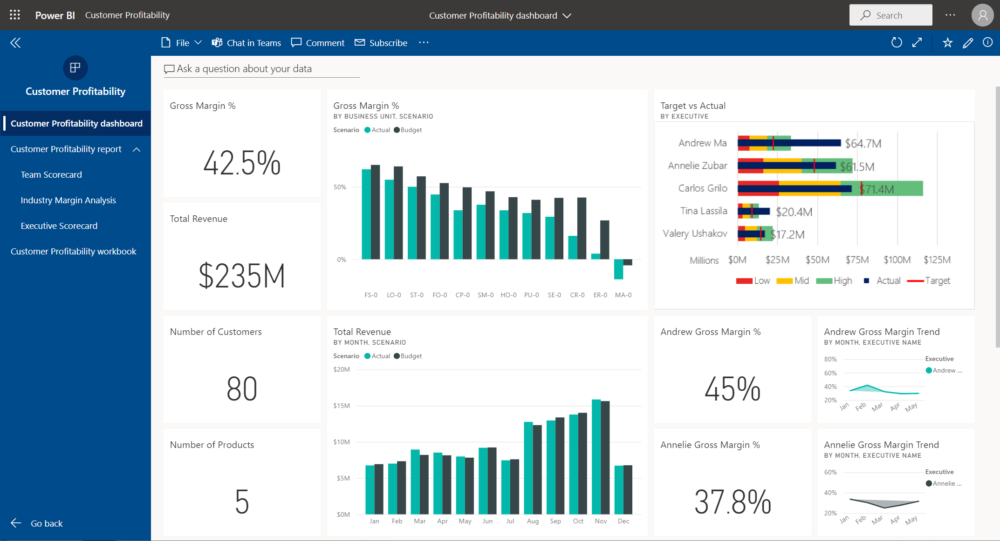
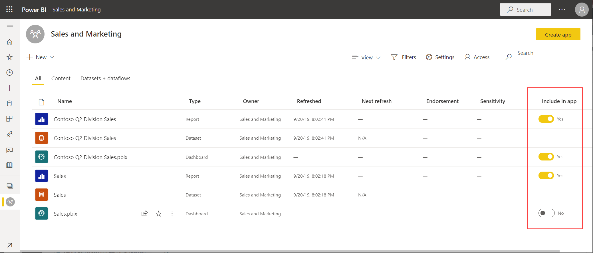
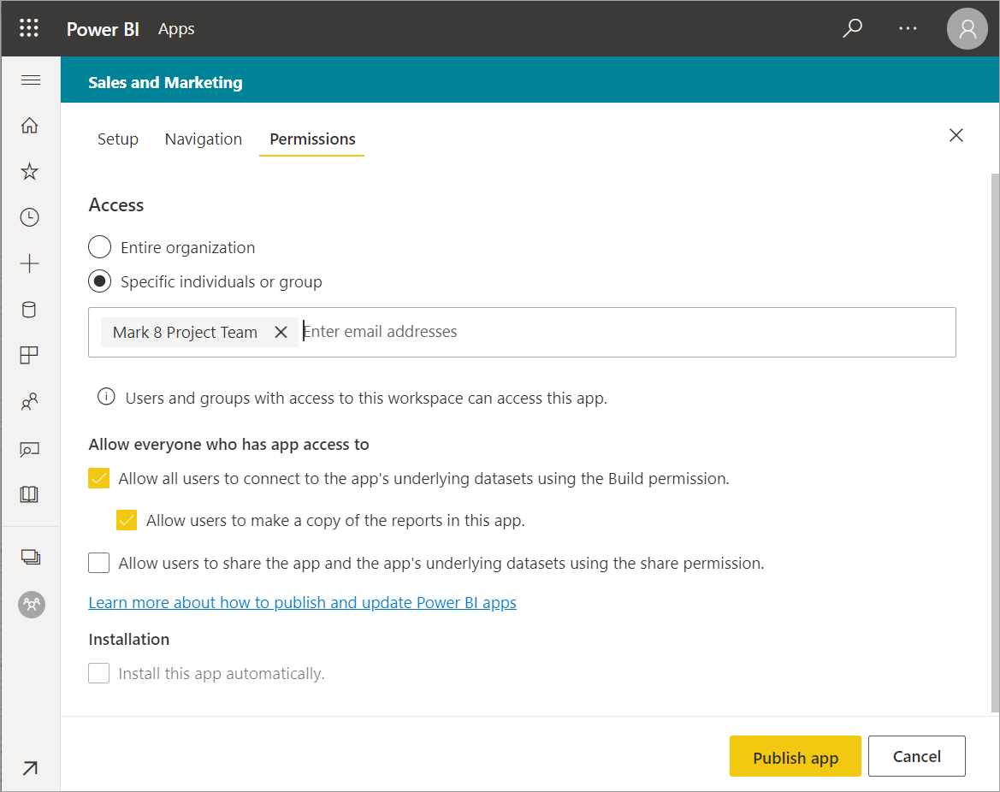

# Publish an app in Power BI

In Power BI, you can create official packaged content, then distribute it to a broad audience as an *app*. You create apps in *workspaces*, where you can collaborate on Power BI content with your colleagues. Then you can publish the finished apps to large groups of people in your organization. 

Your business users often need multiple Power BI dashboards and reports to run their business. With Power BI apps, you can create collections of dashboards and reports and publish these collections as apps to your whole organization or to specific people or groups. For you as a report creator or admin, apps make it easier to manage permissions on these collections.

Business users get your apps in a few different ways:

- They can find and install your app from Microsoft AppSource.
- You can send them a direct link.
- You can install it automatically in your coworkers' Power BI accounts if your Power BI administrator gives you permission.
- Power BI does not send any email to internal users when you distribute or update an app. If you distribute it to external users, those users receive an email with a direct link. 

You can create the app with its own built-in navigation, so your users can easily find their way around your content. They can't modify the contents of the app. They can interact with it either in the Power BI service, or one of the mobile apps -– filtering, highlighting, and sorting the data themselves. They get updates automatically and you can control how frequently the data refreshes. You can also give them Build permission to connect to the underlying datasets, and to create copies of the reports in the app. Read more about the [Build permission](../connect-data/service-datasets-build-permissions.md).

## Licenses for apps
To create or update an app, you need a Power BI Pro license. For app *consumers*, there are two options.

* **Option 1** The workspace for this app is *not* in a Power BI Premium capacity: All business users need Power BI Pro licenses to view your app. 
* **Option 2** The workspace for this app *is* in a Power BI Premium capacity: Business users without Power BI Pro licenses in your organization can view app content. However, they can't copy the reports, or create reports based on the underlying datasets. Read [What is Power BI Premium?](../admin/service-premium-what-is.md) for details.

## Publish your app
When the dashboards and reports in your workspace are ready, you choose which dashboards and reports you want to publish, then you publish them as an app. 

1. In the workspace list view, decide which dashboards and reports you want  **Included in app**.

    

    If you choose not to include a report that has a related dashboard, you see a warning next to the report. You can still publish the app, but the related dashboard won't have the tiles from that report.

    

2. Select the **Publish app** button in the upper right to start the process of creating and publishing an app from the workspace.
   
    

3. On **Setup**, fill in the name and description to help people find the app. You can set a theme color to personalize it. You can also add a link to a support site.
   
    

4. On **Navigation**, you select the content to be published as part of the app. Then you add app navigation, to organize the content in sections. See [Design the navigation experience for your app](#design-the-navigation-experience) in this article for details.
   
    

5. On **Permissions**, decide who has access to the app, and what they can do with it. 

    - In [classic workspaces](service-create-workspaces.md): everyone in your organization, specific people, or Azure Active Directory (Azure AD) security groups.
    - In the [new experience workspaces](service-create-the-new-workspaces.md): specific people, Azure AD security groups and distribution lists, and Microsoft 365 Groups. All workspace users are automatically given access to the app for the workspace.
    - You can allow app users to connect to the app's underlying datasets by giving them Build permission. They'll see these datasets when they're searching for shared datasets. Read more about [allowing users to connect to the app's datasets](#allow-users-to-connect-to-datasets), in this article.
    - Users with Build permission can also have permission to copy reports from this app to another workspace. Read more about [allowing users to copy reports in the app](#allow-users-to-copy-reports), in this article.
    
    >[!IMPORTANT]
    >If your app relies on datasets from other workspaces, it is your responsibility to ensure all app users have access to the underlying datasets.
    >If the app or report are in the same workspace as the dataset, make sure you add the report associated with the  dataset to the app as well.

6. You can install the app automatically for the recipients, if your Power BI admin has enabled this setting for you in the Power BI Admin Portal. Read more about [automatically installing an app](#automatically-install-apps-for-end-users) in this article.

    

7. When you select **Publish app**, you see a message confirming it's ready to publish. In the **Share this app** dialog box, you can copy the URL that's a direct link to this app.
   
    

You can send that direct link to the people you've shared it with, or they can find your app on the Apps tab by going to **Download and explore more apps from AppSource**. Read more about the [app experience for business users](../consumer/end-user-apps.md).

## Change your published app
After you publish your app, you may want to change or update it. It's easy to update it if you're an admin or member in the new workspace. 

1. Open the workspace that corresponds to the app. 
   
    

2. Make any changes you want to the dashboards or reports.
 
    The workspace is your staging area, so your changes aren't live in the app until you publish again. This lets you make changes without affecting the published apps.  
 
    > [!IMPORTANT]
    > If you remove a report and update the app, even if you add the report back to the app, your app consumers lose all customizations such as bookmarks, comments, etc.  
 
3. Go back to the workspace list of contents and select **Update app** in the upper-right corner.
   
1. Update **Setup**, **Navigation**, and **Permissions**, if you need to, then select **Update app**.
   
The people you've published the app to automatically see the updated version of the app. 

## Design the navigation experience
The **New navigation builder** option allows you to build a custom navigation for your app. The custom navigation makes it easier for your users to find and use content in the app. Existing apps have this option turned off and new apps default to the option being on.

When the option is off, you can select the **App landing page** to be either **Specific content**, for example a dashboard or report, or select **None** to show a basic list of content to the user.

When you turn on **New navigation builder**, you can design a custom navigation. By default all the reports, dashboards, and Excel workbooks you included in your app are listed as a flat list. 

You can further customize the app navigation by:

* Reordering the items using the up / down arrows. 
* Renaming items in the **Report details**, **Dashboard details**, and **Workbook details**.
* Hiding certain items from the navigation.
* Using the **New** option to add **sections** to group related content.
* Using the **New** option to add a **link** to an external resource to the nav pane. 

When you add a **link**, in **Link details** you can choose where the link opens. By default links open in the **Current tab**, but you can select **New tab**, or **Content area**. 

### Considerations for using the new navigation builder option
Here are general things to keep in mind when using the new navigation builder:

* Report pages are shown in the app navigation area as an expandable section. When a report has one visible page, only the report name is shown. Clicking the report name in the navigation opens the first page of the report. 

    > [!NOTE]
    > Your report might have only one visible page because you've set up navigation to the rest of the pages with buttons or drillthrough actions.

* If you turn off the new navigation builder and then publish or update your app, you lose the customizations you've made. For example, sections, ordering, links, and custom names for navigation items are all lost.
* The option to not use the app builder is available.

When adding links to your app navigation and selecting the Content area option:
* Ensure the link can be embedded. Some services block the embedding of their content in third-party sites like Power BI.
* Embedding Power BI service content like reports or dashboards in other workspaces isn't supported. 
* Embed Power BI Report Server content through its native embed URL content from an on premises deployment. Use the steps in [creating the Power BI Report Server URL](../report-server/quickstart-embed.md#create-the-power-bi-report-url) to get the URL. Be aware that regular authentication rules apply, so viewing the content requires a VPN connection to the on-premises server. 
* A security warning is shown at the top of the embedded content to indicate the content isn't in Power BI.

## Automatically install apps for end users
If an admin gives you permissions, you can install apps automatically, *pushing* them to end users. This push functionality makes it easier to distribute the right apps to the right people or groups. Your app appears automatically in your end users' Apps content list. They don't have to find it from Microsoft AppSource or follow an installation link. See how admins enable [pushing apps to end users](../admin/service-admin-portal.md#push-apps-to-end-users) in the Power BI admin portal article.

### How to push an app automatically to end users
Once the admin has assigned you permissions, you have a new option to **install the app automatically**. When you check the box and select **Publish app** (or **Update app**), the app is pushed to all users or groups defined in the **Permissions** section of the app on the **Access** tab.

### How users get the apps that you push to them
After you push an app, it shows up in their Apps list automatically. In this way, you can curate the apps that specific users or job roles in your organization need to have at their fingertips.

### Considerations for automatically installing apps
Here are things to keep in mind when pushing apps to end users:

* Installing an app automatically to users can take time. Most apps install immediately for users, but pushing apps can take time.  It depends on the number of items in the app and the number of people given access. We recommend pushing apps during off hours with plenty of time before users need them. Verify with several users before sending broad communication about the apps' availability.

* Refresh the browser. Before seeing the pushed app in the Apps list, the user may need to refresh, or close and reopen their browser.

* If users don't immediately see the app in the Apps list, they should refresh or close and reopen their browser.

* Try not to overwhelm users. Be careful not to push too many apps so your users perceive the pre-installed apps are useful to them. It's best to control who can push apps to end users to coordinate timing. Establish a point of contact for getting apps in your organization pushed to end users.

* Guest users who haven't accepted an invite don't get apps automatically installed for them.  

## Allow users to connect to datasets

When you check the option to **Allow users to connect to the app's underlying datasets**, you're giving app users *Build permission* on those datasets. With this permission, they can do several key actions:

- [Use the app datasets](../connect-data/service-datasets-across-workspaces.md) as the basis for their reports.
- Search for these datasets in Power BI Desktop and in the get-data experience in the Power BI service.
- Create reports and dashboards based on these datasets.

When you clear this option, new users you add to the app don't get Build permission. However, for existing app users, permissions on the underlying datasets don't change. You can remove Build permission manually from app users who should no longer have it. Read more about the [Build permission](../connect-data/service-datasets-build-permissions.md).

## Allow users to copy reports

When you check the option to **Allow users to make a copy of the reports in this app**, your users can save any of the reports in the app to their My Workspace or another workspace. To make a copy, users need a Pro license, even if the original report is in a workspace in a Premium capacity. They can then customize the reports to their unique needs. You have to select the **Allow all users to connect to the app's underlying datasets using Build permission** option first. By selecting these options, you're enabling the new [copy reports from other workspaces](../connect-data/service-datasets-copy-reports.md) capability.

## Unpublish an app
Any member of a workspace can unpublish the app.

>[!IMPORTANT]
>When you unpublish an app, app users lose their customizations. They lose any personal bookmarks, comments, or subscriptions associated with content in the app. Only unpublish an app if you need to remove it.
> 

* In a workspace, select the ellipsis (**...**) in the upper-right corner > **Unpublish app**.
  
    

This action uninstalls the app for everyone you've published it to, and they no longer have access to it. It doesn't delete the workspace or its contents.

## View your published app

When your app consumers open your app, they see the navigation you created, instead of the standard Power BI nav pane. The app navigation lists the reports and dashboards in the sections you've defined. It also lists the individual pages in each report, rather that just the report name. You can expand and collapse the left navigation by using the arrows in the menu bar.

In full-screen mode, you can show or hide the navigation by selecting the option in the corner.

## Considerations and Limitations
Things to keep in mind about publishing apps:

* The permissions page doesn't change permission on datasets in other workspaces. You do see a warning reminding you to grant access to those datasets independently. A best practice is to contact the dataset owner before starting to build your app to ensure it is OK to give all your app users access those datasets. 
* You can have at most 100 users or groups in the access list for the app. However, you can give more than 100 users access to the app. To do so, use one or more user groups that contain all the desired users.
* For the new workspace experience, if the user added to the app access list already has access to the app through the workspace, they will not be shown in the access list for the app.  
* When using the new look for the Power BI service, the support site URL is shown in the item information card. Read more about the ['new look' in Power BI](../consumer/service-new-look.md).
* Apps have an option to allow users to share the app and the app's underlying datasets by using the share permission. For new apps, this option is off by default. We recommend turning this option off for your existing apps and updating permission on the underlying datasets. The option was enabled for existing apps because apps were initially designed to replace content packs, which had this behavior.
* Apps can have a maximum of 200 dashboards. 

## Next steps
* [Create a workspace](service-create-workspaces.md)
* [Install and use apps in Power BI](../consumer/end-user-apps.md)
* [Power BI apps for external services](../connect-data/service-connect-to-services.md)
* [Power BI Admin Portal](../admin/service-admin-portal.md)
* Questions? [Try asking the Power BI Community](https://community.powerbi.com/)
