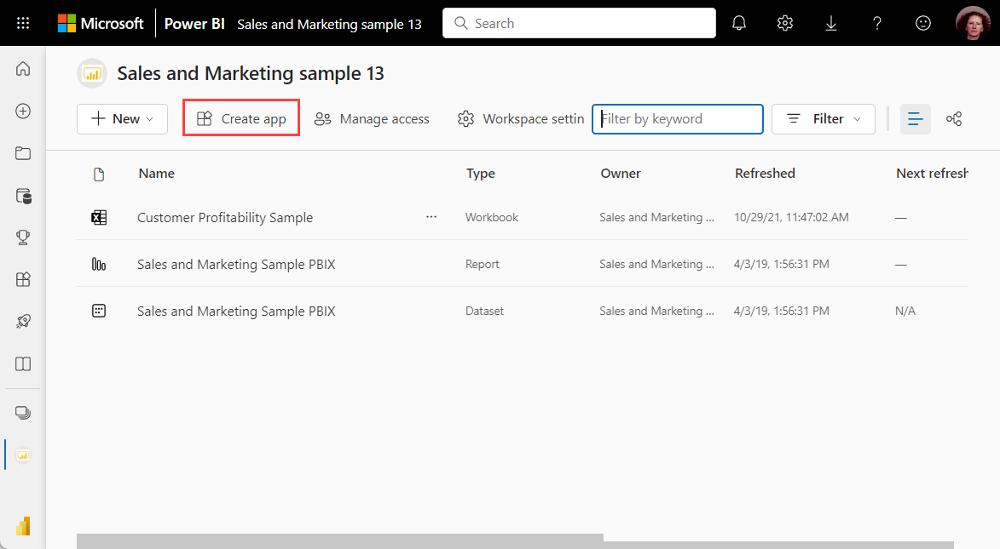
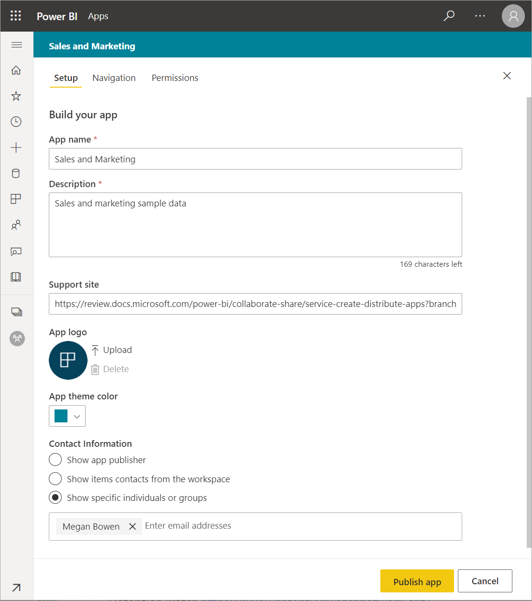
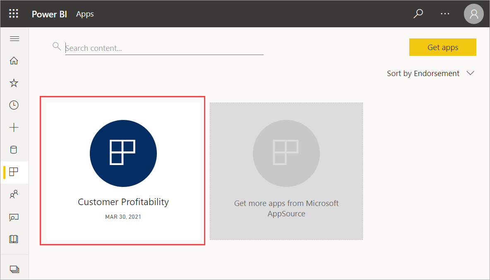
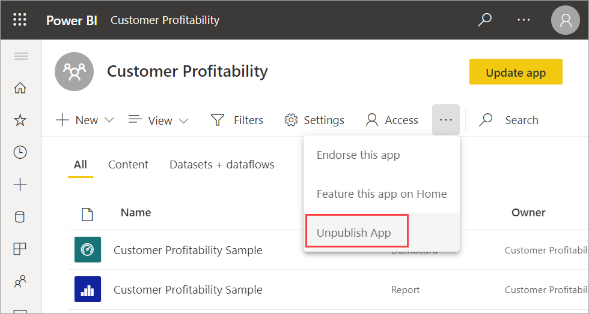
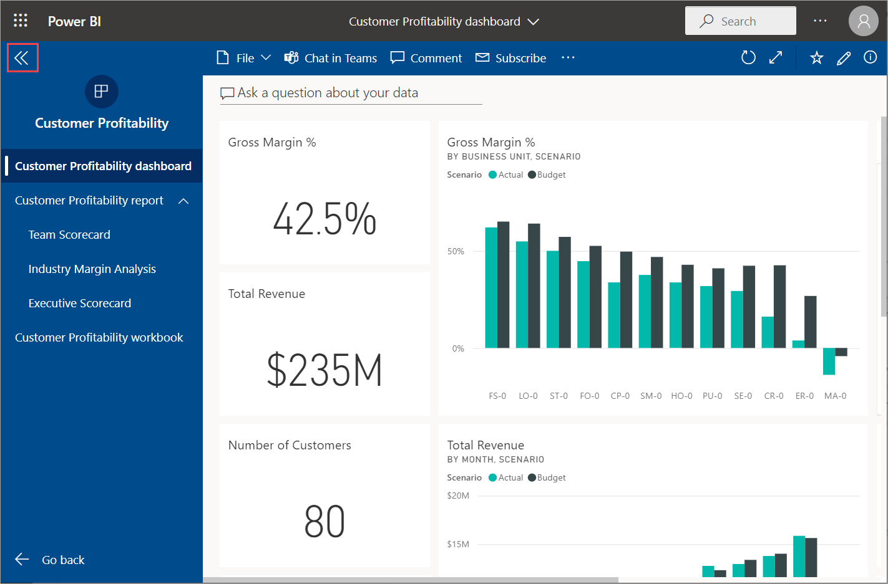

# Publish an app in Power BI

In Power BI, you can create official packaged content, then distribute it to a broad audience as an *app*. You [create apps in *workspaces*](service-create-the-new-workspaces.md), where you can collaborate on Power BI content with your colleagues. Then you can publish the finished app to large groups of people in your organization. The [App consumer view](#app-consumer-view) section of this article outlines the app user experience.

Your business users often need multiple Power BI dashboards and reports to run their business. With Power BI apps, you can create collections of dashboards and reports and publish these collections as apps to your whole organization or to specific people or groups. For you as a report creator or admin, apps make it easier to manage permissions on these collections.

Business users get your apps in a few different ways:

- They can find and install apps from Apps marketplace or AppSource.
- You can send them a direct link.
- You can install it automatically in your coworkers' Power BI accounts if your Power BI administrator gives you permission.
- Power BI does not send any email to internal users when you distribute or update an app. If you distribute it to external users, those users receive an email with a direct link. 

Your users (App consumers) can't modify the contents of the app. They can interact with it either in the Power BI service, or one of the mobile apps -– filtering, highlighting, and sorting the data. You can also give them permission to share datasets and create their own content in the app. Read the [Manage audience access] (#manage-audience-access) section for more details.

## Licenses for apps
To create or update an app, you need a Power BI Pro or Premium Per User (PPU) license. For app *consumers*, there are two options.

* **Option 1** The workspace for this app is *not* in a Power BI Premium capacity: All business users need Power BI Pro or Premium Per User (PPU) licenses to view your app. 
* **Option 2** The workspace for this app *is* in a Power BI Premium capacity: Business users without Power BI Pro or Premium Per User (PPU) licenses in your organization can view app content. However, they can't copy the reports, or create reports based on the underlying datasets. Read [What is Power BI Premium?](../enterprise/service-premium-what-is.md) for details.

## Publish your app
Once the dashboards and reports in your workspace are ready, you can choose which dashboards and reports you want to publish as App and which audience groups to add in the App. 

1. In the workspace list view, decide which dashboards and reports you want to include in app by clicking **New**.

    

2. Select the **Create app** button in the upper right to start the process of creating and publishing an app from the workspace.
   
    

3. On **Setup**, fill in the name and description to help people find the app. You can also set a theme color, add a link to a support site, and specify contact information.
   
    

4. On **Content**, add the content to the app from the workplace. You can also add links to other websites. See [Adding content in the App] (#adding-content-in-the-app) section of this document for more details. Once the content is added, you can change the order of the content by

    a)	Dragging and dropping the content
   
    
    
    b)	Using move up or move down options next to each content.
    
    

5. On **Audience**, you can create and manage audience groups within the App. Furthermore, by using the Manage Audience Access, you can specify which groups or users should be added to the current audience group. See Manage Audience Access  section for more details. 

You can also change the name of the audience by double clicking on the default audience label. You can create up to 10 audience groups within an App. By clicking the hide/unhide icon next to each content, you can control the access to each content within an App.

    
    
    >[!IMPORTANT]
    >If your app relies on datasets from other workspaces, it is your responsibility to ensure all app users have access to the underlying datasets.
    >If the app or report is in the same workspace as the dataset, make sure you add the report associated with the  dataset to the app as well.

    > [!NOTE]
    > If you are removing permissions from an app that has already been published, see the note in the [App permissions](#app-permissions) section below.

6. You can install the app automatically for the recipients, if your Power BI admin has enabled this setting for you in the Power BI Admin Portal. Read more about [automatically installing an app](#automatically-install-apps-for-end-users) in this article.

7. Select **Publish app** to publish the App. 
    
    
8. Once, the app is successfully published, you will see a Successfully published message that includes shareable app link which you can copy and share with your app consumers. 
   
    

Alternatively, you can share the published app by clicking the **Copy link** button at the bottom of the Setup page. This generates a shareable app link that you can share with your app consumers.

    
    
Your app consumers can also request access to your app by searching for the app from Apps marketplace or AppSource. Read App consumer view(#app-consumer-view) to know more about the App experience for the consumers.

## Manage app access request
Once app is installed, you can visit the app permission management page by clicking on **Manage permissions** in your Apps Tab.
 
    

You will also see a notification banner on Workspace if there are any pending access requests. You can click on **view** to directly access the app permission management page. 
 
    

The Permission management page contains following tabs – 
•	**Direct access** – this includes all the users that already have access to the app
•	**Pending access** – this includes all the pending requests

    
 

## Change your published app
After you publish your app, you may want to change or update it. 

1. Open the workspace that corresponds to the app. If you're a workspace Admin or Member, you can open the workspace right from the app, by selecting the **Edit app** pencil.
   
    

2. Make any changes you want to the dashboards or reports.
 
    The workspace is your staging area, so your changes aren't live in the app until you publish again. This lets you make changes without affecting the published apps.  
 
    > [!IMPORTANT]
    > If you remove a report and update the app, even if you add the report back to the app, your app consumers lose all customizations such as bookmarks, comments, etc.  
 
3. Select **Update app** in the upper-right corner of the Workspace content view.

    
    
4. Update **Setup**, **Content**, and **Audience**, if you need to, then select **Update app**.

    The people you've published the app to automatically see the updated version of the app.

    
## Add content in the App
You can easily add content such as reports, dashboards etc. and even links to other websites. By clicking on **Add content** button in the **Content** tab, you can select contents that you want to add from the current workspace. See below.
 
     
     
     
 
You can also preview the added content and can add links to websites by clicking the **Add a link** from the drop-down menu next to **Add content**.

     

    > [!NOTE]
    > When you publish an App, all App content will be included by default for each Audience group. However, when you update an App, newly added content will not be included by default.

## Manage Audience Access
When creating or updating an app, you can control who gets the access to the app contents by using **Manage Audience Access** pane under the Audience tab.  
 
     
     
For each audience group, you can grant access to either all people in your organization or specific users/groups. You can also configure the following advanced settings per audience group – 

* **Allow users to share the datasets in this app** 

    When you check the option to **Allow users to share the datasets in this app**, you're giving app consumers permission to share the app and underlying datasets of the app audience.
    
* **Allow users to build content with the datasets in this app**

    When you check the option to **Allow users to build contents with the datasets in this app**, your app consumers can create their own reports and dashboards based on the App audience datasets.
    
     

    
> [!NOTE]
> The advanced settings above are applicable to the audience except your workspace users.

## Automatically install apps for end users
If an admin gives you permission, you can install apps automatically, pushing them to end users (app consumers). This push functionality makes it easier to distribute the right apps to the right people or groups. Your app appears automatically in your end users' Apps content list. They don't have to find it from Apps marketplace or Microsoft AppSource or follow an installation link. See how admins enable [pushing apps to end users](../admin/service-admin-portal-content-pack-app.md#push-apps-to-end-users) in the Power BI admin portal article.

### How to push an app automatically to end users
Once the admin has assigned you permissions, you have a new option to **install the app automatically**. When you check the box and select **Publish app** (or **Update app**), the app is pushed to all audience groups defined in the **Audience** tab of the app.

### How users get the apps that you push to them
After you push an app, it shows up in their Apps list automatically. In this way, you can curate the apps that specific users or job roles in your organization need to have at their fingertips.

### Considerations for automatically installing apps
Here are things to keep in mind when pushing apps to end users:

* It isn't possible to automatically install an app for an entire organization. You notice that when you select the checkbox for **install app automatically**, the option for **entire organization** becomes inactive.

* Installing an app automatically to users can take time. Most apps install immediately for users, but pushing apps can take time.  It depends on the number of items in the app and the number of people given access. We recommend pushing apps during off hours with plenty of time before users need them. Verify with several users before sending broad communication about the apps' availability.

* Refresh the browser. Before seeing the pushed app in the Apps list, the user may need to refresh, or close and reopen their browser.

* If users don't immediately see the app in the Apps list, they should refresh or close and reopen their browser.

* Try not to overwhelm users. Be careful not to push too many apps so your users perceive the pre-installed apps are useful to them. It's best to control who can push apps to end users to coordinate timing. Establish a point of contact for getting apps in your organization pushed to end users.

* Guest users who haven't accepted an invite don't get apps automatically installed for them.  

## Unpublish an app
Any member of a workspace can unpublish the app.

* In a workspace, select  **More options (...)** > **Unpublish app**.
  
    

This action uninstalls the app for everyone you've published it to, and they no longer have access to it. Please note that this action doesn't delete the workspace or its contents.

>[!IMPORTANT]
>When you unpublish an app, app users (consumers) lose their customizations. They lose any personal bookmarks, comments, etc associated with content in the app. Only unpublish an app if you need to remove it.
> 

## App consumer view
The App consumers can only see the content based on the access permissions for their respective audience groups. Consumers who have access to multiple audience groups will see group tabs on the top bar to switch between different audience views easily (as shown below). By default, the consumers are displayed the All tab view, which is a consolidated view showing all content that they have access to.  The App consumer can browse different audience groups tab to see what content is added for that group. 

## Considerations and Limitations
Things to keep in mind about publishing apps:

* AppSource is an external service that only has public facing service apps. For organizational apps, user can just go to Apps marketplace to find them. Template apps are also available from Apps marketplace
* You can create 10 audience groups per app.
* You can have at most 1000 users or groups in the access list for the app. However, you can give more than 1000 users access to the app. To do so, use one or more user groups that contain all the desired users.
* If the user you added to the app access list already has access to the app through the workspace, they're not shown in the access list for the app.  
* Once you click a tile in a dashboard within a published app, you would be directed to the underlying report within the app. If you choose not to include a report that has a related dashboard in the app, you will not be directed to the underlying report on clicking the related tile.
* The support site URL is shown in the item information card.
* Apps can have a maximum of 200 dashboards. 

## Next steps

* [Create apps in *workspaces*](service-create-the-new-workspaces.md)
* [Install and use apps in Power BI](../consumer/end-user-apps.md)
* [Power BI apps for external services](../connect-data/service-connect-to-services.md)
* [Power BI Admin Portal](../admin/service-admin-portal.md)
* Questions? [Try asking the Power BI Community](https://community.powerbi.com/)
