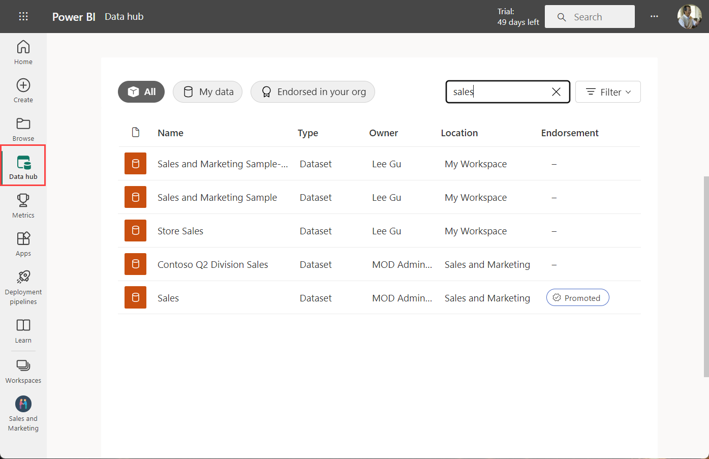
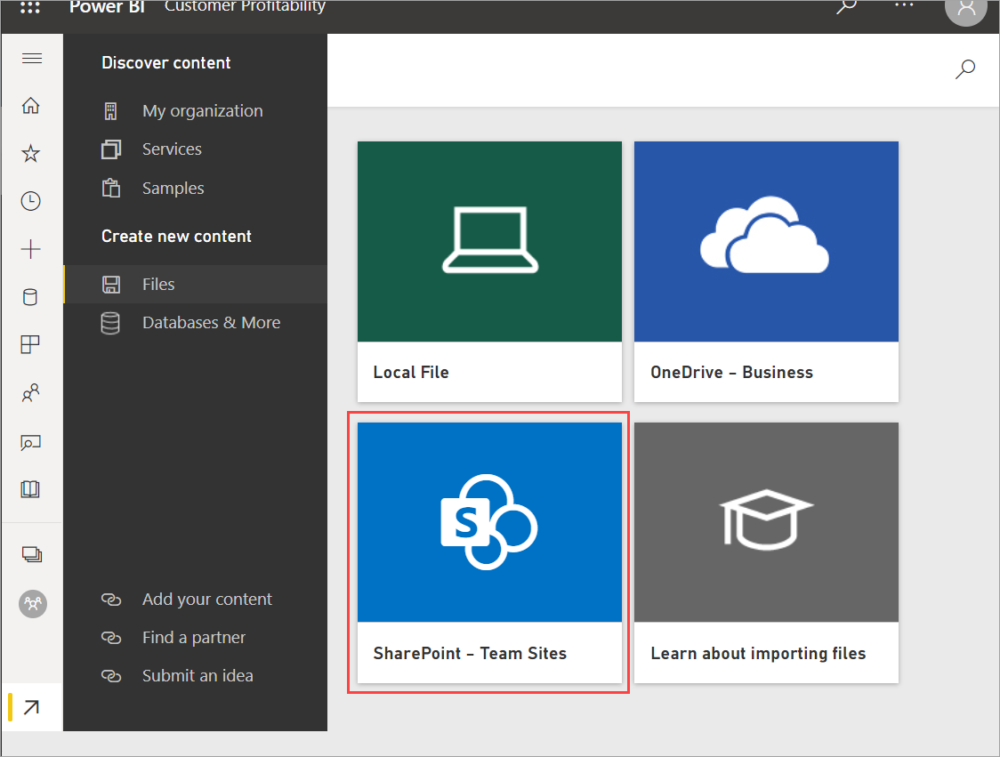

# Create the new workspaces in Power BI

This article explains how to create one of the *new workspaces* instead of a *classic* workspace. Both kinds of workspaces are places to collaborate with colleagues. In them, you create collections of dashboards, reports, and paginated reports. If you want, you can also bundle that collection into an *app* and distribute it to a broader audience. For more background, see the [new workspaces](service-new-workspaces.md) article.

Ready to migrate your classic workspace? See [Upgrade classic workspaces to the new workspaces in Power BI](service-upgrade-workspaces.md) for details.

## Create one of the new workspaces

1. Select **Workspaces** > **Create workspace**.
   
     

2. Give the workspace a unique name. If the name isn't available, edit it to come up with a name that's unique.
   
    When you create an app from the workspace, by default it will have the same name and icon as the workspace. You can change both when you create the app.
   
1. Here are some optional settings for your workspace. They're explained in more detail in the [Workspace settings](#workspace-settings) section later in this article:

    - Upload a **Workspace image**. Files can be .png or .jpg format. File size has to be less than 45 KB. 
    - [Specify a Workspace OneDrive](#set-a-workspace-onedrive) to use a Microsoft 365 group file storage location.    
    - [Add a Contact list](#create-a-contact-list), the names of people to contact for information about the workspace. By default, the workspace admins are the contacts.
    - [Allow contributors to update the app](#allow-contributors-to-update-the-app) for the workspace
    - [Assign the workspace to a Premium capacity](#premium-capacity-settings).
    - Connect the workspace to an Azure Data Lake Gen2 storage account (in preview). Read about this functionality in the article [Configuring dataflow storage to use Azure Data Lake Gen 2](../transform-model/dataflows/dataflows-azure-data-lake-storage-integration.md#connecting-to-an-azure-data-lake-gen-2-at-a-workspace-level).

1. Select **Save**.

    Power BI creates the workspace and opens it. You see it in the list of workspaces you’re a member of.

## Workspace settings

To see these workspace settings, expand **Advanced** in the **Settings** pane.

### Create a contact list

You can specify which users receive notification about issues occurring in the workspace. By default, any user or group specified as a workspace admin is notified, but you can add others to the *contact list*. Users or groups in the contact list are listed in the user interface (UI) to help users get help related to the workspace.

1. Access the **Contact list** setting in one of two ways:

    In the **Create a workspace** pane when you first create it.

    In the nav pane, select the arrow next to **Workspaces**, select **More options** (...) next to the workspace name > **Workspace settings**. The **Settings** pane opens.

    

2. Under **Advanced**, **Contact list**, accept the default, **Workspace admins**, or add your own list of **Specific users or groups**. 

    

3. Select **Save**.

### Set a workspace OneDrive

The Workspace OneDrive feature allows you to configure a Microsoft 365 group whose OneDrive shared library is available to workspace users. You create the group *outside* of Power BI first, in OneDrive. Read about creating a [OneDrive shared library](https://support.microsoft.com/office/create-a-new-shared-library-from-onedrive-for-work-or-school-345c8599-05d8-4bf8-9355-2b5cfabe04d0).

Power BI doesn't synchronize permissions between users or groups with workspace access, and users or groups with Microsoft 365 group membership. A best practice is to give [access to the workspace](service-give-access-new-workspaces.md) to the same Microsoft 365 group whose file storage you configured. Then manage workspace access by managing membership of the Microsoft 365 group.

1. Access the **Workspace OneDrive** setting in one of two ways:

    In the **Create a workspace** pane when you first create it.

    In the nav pane, select the arrow next to **Workspaces**, select **More options** (...) next to the workspace name > **Workspace settings**. The **Settings** pane opens.

    

2. Under **Advanced** > **Workspace OneDrive**, type the name of the Microsoft 365 group that you created earlier. Type just the name, not the URL. Power BI automatically picks up the OneDrive for the group.

    

3. Select **Save**.

**Access the workspace OneDrive location**

After you've configured the OneDrive location, you get to it in the same way you get to other data sources in the Power BI service.

1. In the nav pane, select **Get Data**, then in the **Files** box select **Get**.

    

1.  Select **SharePoint - Team Sites**.

    

1. Type the URL of the shared library you created earlier, or select **Connect** to see the content available to you.

    new image of Enter Site URL to Connect to

1. Navigate to the folder containing your Power BI files.

    new image of SharePoint - Team Sites

### Allow contributors to update the app

You can create and publish *apps* from the new workspace experiences. Each workspace can hold the content for an associated *app*, a collection of dashboards, reports, and datasets which you can distribute to others in your organization. Read more about [publishing apps from the new workspaces](service-create-distribute-apps.md).

By default, only workspace Admins and Members can publish and update the app for the workspace. The **Allow contributors to update the app for this workspace** setting lets workspace Admins delegate the ability to update the app for the workspace to users with the workspace Contributor role.

1. Access the **Allow contributors to update the app** setting in one of two ways:

    In the **Create a workspace** pane when you first create it.

    In the nav pane, select the arrow next to **Workspaces**, select **More options** (...) next to the workspace name > **Workspace settings**. The **Settings** pane opens.

    
2. Under **Advanced**, expand **Security settings**. Select **Allow contributors to update the app for this workspace**. 

When enabled, contributors can:
* Update app metadata like name, icon, description, support site, and color.
* Add or remove items included in the app, like adding reports or datasets.
* Change the app navigation or default item the app opens on.

However, contributors can't:
* Publish the app for the first time
* Change who has permission to the app

## Premium capacity settings

On the **Premium** tab in the **Settings** pane, you can choose settings related to Premium capacities.

1. Set **Premium capacity** to **On**.

    

1. Choose either Premium capacity or **Premium Per User**. Read more about [Premium Per User](../admin/service-premium-per-user-faq.md).

    :::image type="content" source="media/service-create-the-new-workspaces/power-bi-workspace-premium-per-user.png" alt-text="Screenshot of Choose Premium or Premium Per User.":::

1. Choose **Default storage limit**. Read more about [enabling large datasets](../admin/service-premium-large-models.md#enable-large-datasets).

## Next steps
* Read about [organizing work in the new workspaces experience in Power BI](service-new-workspaces.md)
* [Create classic workspaces](service-create-workspaces.md)
* [Publish an app from the new workspaces in Power BI](service-create-distribute-apps.md)
* Questions? [Try asking the Power BI Community](https://community.powerbi.com/)
