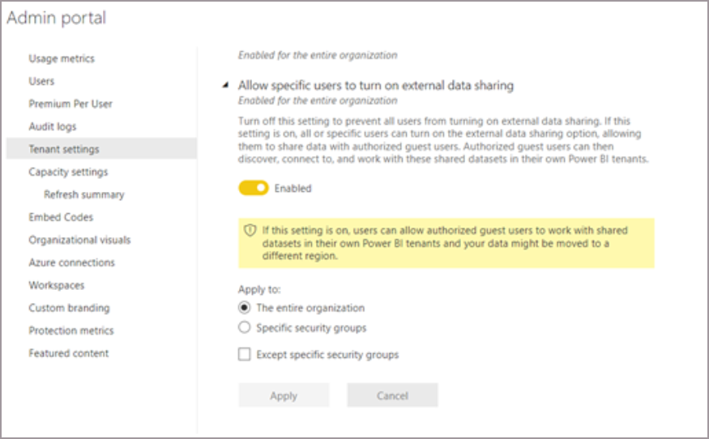

# Use in-place semantic model sharing to enable external users to view and share semantic models in their own tenants (preview) - Admin info

Power BI in-place semantic model sharing allows data providers to share semantic models with external users that they can access in their organizations tenants. This article provides instructions for the Power BI administrator on how to enable tenant settings to allow in-place semantic model sharing.

## Requirements

For a full list of requirements necessary to use in-place datset sharing, see the requirements section of [About Power BI in-place semantic model sharing with guest users in external organizations](./service-dataset-external-org-share-about.md#requirements).

## Licensing

Users must have an active Power BI account and a Power BI Pro or Premium license. For detailed information on licensing requirements, see the licensing requirements section of [Distribute Power BI content to external guest users with Microsoft Entra B2B](../enterprise/service-admin-azure-ad-b2b.md#licensing).

## Allow guest users to work with shared semantic models in their own tenants 

Microsoft Entra B2B guest users can access semantic models shared with them in their own tenants. Use the following steps to enable access by external users of semantic models shared with them by users within your organization: 

1. In the admin portal, go to **Tenant settings**.

1. Click on **Allow guest users to work with shared semantic models in their own tenants**.
 
1. Set the toggle to **Enable**.

    

> [!NOTE]
> This setting is off by default for customers. If this setting is disabled, a guest user will still be able to access the semantic model in the provider tenant but not in their own tenant.

## Allow specific users to turn on external data sharing 

As a Power BI admin, you can specify which users or user groups can share semantic models externally with guests from a different tenant through the in-place mechanism. Disabling this setting prevents any user from sharing semantic models externally by restricting the ability of users to turn on external sharing for semantic models they own or manage.  

> [!NOTE]
> The **Allow specific users** setting is on by default for customers. However, external users won't be able access any semantic models shared in-place if the setting **Allow specific users to turn on external data sharing** is off.  

1. In the admin portal, go to **Tenant settings**.

1. Click on **Allow specific users to turn on external data sharing**.

1. Make sure the toggle is set to **Enable**.

1. Specify if you want this setting to apply to **The entire organization**, **Specific security groups**, or to exclude specific security groups. Click the checkbox next to **Except specific security groups** to add any groups you want to exclude.
 
1. Click **Apply**.

    

## Next steps
- [Use Power BI in-place semantic model sharing (preview) to share semantic models with external users](service-dataset-external-org-share-provider.md)
- [Access shared semantic models in Power BI as a guest user from an external organization (preview)](service-dataset-external-org-share-view.md)
