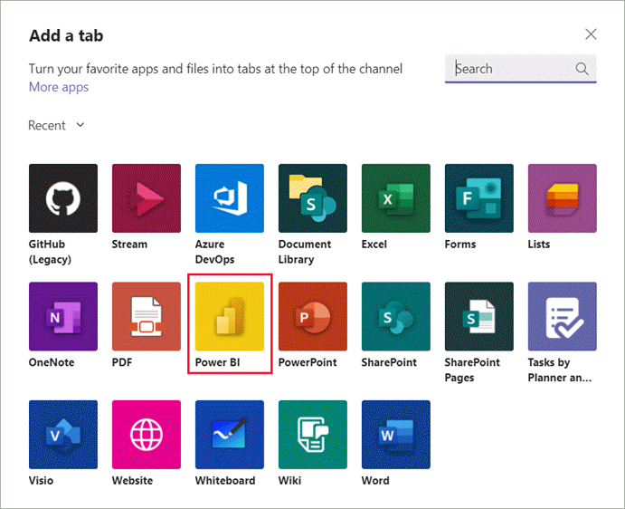
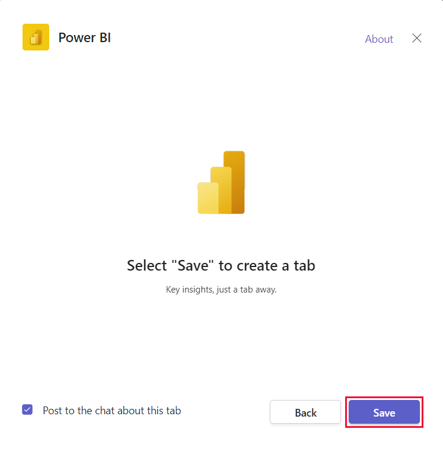

# Embed Power BI content in Microsoft Teams

You can easily embed interactive Power BI reports in Microsoft Teams channels and chats. 

## Requirements

To embed a report on the **Power BI** tab in Teams, you need to meet these requirements:

- Teams has the **Power BI** tab.
- You have at least a Viewer role in the workspace that hosts the report. For information about the different roles, see [Roles in workspaces](service-roles-new-workspaces.md).

To view a report on the **Power BI** tab in Teams, your users need to meet these requirements:

- They're Teams users with access to channels and chats.
- They have permission in Power BI to view the report.

See [Collaborate in Microsoft Teams with Power BI](service-collaborate-microsoft-teams.md) for background on how Power BI and Microsoft Teams work together, including other requirements.

## Embed a report in Microsoft Teams

Follow these steps to embed your report in a Microsoft Teams channel or chat.

1. Open a channel or chat in Microsoft Teams, and select the **+** icon.

    

1. Select the **Power BI** tab.

    

1. Select **Save** to Add the **Power BI** tab and go to report configuration.

1. You will see configuration screen like below:

You can choose any of the options below to integrate the report:
- Paste the report link into 'Paste a Power BI link' input and press 'Add tab'. New tab will be added.

> [!NOTE]
> If you use share link to embed your report - make sure that other users have access to this report and required permissions are granted. They won't get access automatically in this case.

- Click on 'Browse workspaces' to select report from a workspace or a Power BI app. 'Select a report, app or scorecard' dialog will be displayed, where you can choose any report, app or scorecard available for you. You can use 'Search' text input to find required artifact to open by text match.

- Click on 'Create new' to create new report.

## Reset report in Microsoft Teams tab. Tab settings.

If you no longer need a report in created **Power BI** tab - you can reset it and configure new. To do this you would need to follow next steps:
1. Right-click on Teams tab name, select 'Settings'
1. Click on 'Reset tab' button.

Tab will be reset, and you will see configuration screen where you can set up new report, app or scorecard.
You can also tweak other parameters in 'Settings' dialog - like Tab name or permissions.

### Reports you can embed on the Power BI tab

You can embed the following report types on the **Power BI** tab:

- Power BI interactive reports (.pbix files)
- Power BI paginated reports (.rdl files)
- Reports in workspaces, including My workspace
- Reports in Power BI apps

## Start a conversation

When you add a Power BI report tab to Microsoft Teams, Microsoft Teams automatically creates a tab conversation for the report.

- Select the **Show tab conversation** icon in the upper-right corner.

    

    The first comment is a link to the report. Everyone in that Microsoft Teams channel can see and discuss the report in the conversation.

    

## Known issues and limitations

- In Microsoft Teams, when you export data from a visual in a Power BI report, the data is automatically saved to your *Downloads* folder. It's an Excel file called **data (*n*).xlsx**, where *n* is the number of times you've exported data to the same folder.
- You can't embed Power BI dashboards in the **Power BI** tab for Microsoft Teams.
- [URL filters](service-url-filters.md) aren't supported with the **Power BI** tab for Microsoft Teams.
- In national clouds, the **Power BI** tab isn't available.
- After you save the tab, you don't change the tab name through the tab settings. Use the **Rename** option to change it.
- When you view Power BI tabs in Teams mobile, the best viewing experience is through the [Power BI mobile apps](../consumer/mobile/mobile-apps-for-mobile-devices.md). In the Teams Mobile tabs list, select **More options (...)** > **Open in browser**. When you have the Power BI mobile app installed on your device, the report opens in the Power BI mobile app. 
- For other issues, see "Known issues and limitations" in [Collaborate in Microsoft Teams](service-collaborate-microsoft-teams.md#known-issues-and-limitations).
- Cross-tenant links are not supported.

## Next steps

- [Collaborate in Microsoft Teams with Power BI](service-collaborate-microsoft-teams.md)

More questions? [Try asking the Power BI Community](https://community.powerbi.com/).
