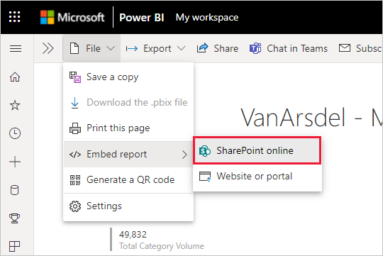
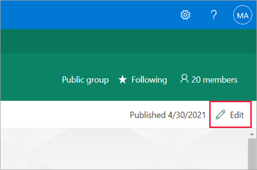
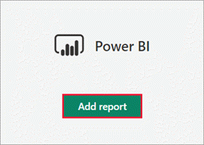
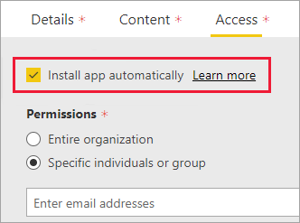
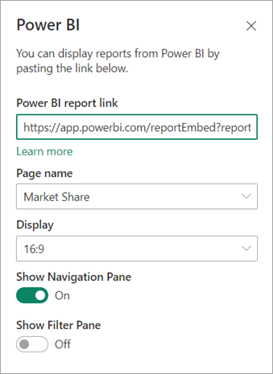
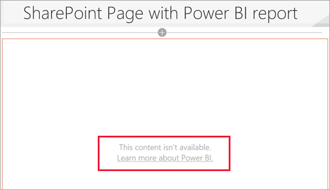

# Embed a report page in PowerPoint

With the Power BI report add-in for PowerPoint, you can easily embed interactive Power BI report pages in PowerPoint slides.

Report pages embedded into PowerPoint using the Power BI report add-in for PowerPoint respect all Power BI permissions and data security, including [row-level security (RLS)](../enterprise/service-admin-rls.md), so your data remains secure.

## Requirements

To embed a Power BI report page into PowerPoint, the Power BI report add-in must be installed in PowerPoint. If it is not installed, see [Get the Power BI report add-in for PowerPoint](TBD).

## Embed your report

To embed a live Power BI report page into PowerPoint, you first need to get the URL to the page you want to embed. You then paste this URL into the Power BI report add-in in PowerPoint.

There are three ways to get the report page URL:

* Through the **Share** option
* Through the **Export** option
* From the browser's address bar

These methods differ in whether or not they can preserve the report page's current state, and what permissions people who open the PowerPoint presentation will have for viewing the report. The table below summarizes the differences.

| URL source | Allows inserting current state | Can users who open the presentation view the report? |
|---------|---------|---------|
| Share     | Yes        | Yes        |
| Export     | Yes         |  Depends on the user's Power BI permissions |
| Address bar     | No        |  Depends on the user's Power BI permissions |

Use the **Share** option if you want to be sure that all users who open the presentation will be able to view the report.

Choose how you want to get the report page URL.

# [Share option](#tab/share)

1. Open the report to the page you want to insert. If desired, configure the page to the desired state using filters, selection, slicers, etc.

1. Choose **Share**.

    

1. Choose the permissions you want to grant and who you want to grant them to, as described in the [sharing reports documentation](service-share-dashboards#share-a-report-via-link). Click **Apply**.

    

1. Check the **Include my changes** box if you want to share the report pages current state, and then select **PowerPoint**.

    

1. Copy the URL to paste into the Power BI PowerPoint add-in. Alternatively choose **Open in PowerPoint** to insert the report page directly into a new, blank PowerPoint presentation.

    

Typically, the link generated by this method provides viewing access to the report.

# [Export option](#tab/export)

Content for Windows...

# [Browser address bar](#tab/addressbar)

Content for Windows...

---

### Get a report URL

1. Open a report in the Power BI service.

2. On the **File** menu, select **Embed report** > **SharePoint Online**.

    

3. Copy the report URL from the dialog.

    

### Add the Power BI report to a SharePoint Online page

1. Open the target page in SharePoint Online and select **Edit**.

    

    Or, in Sharepoint Online, select **Pages** > **+ New** > **Site Page** to create a new modern site page.

    

2. Select the **+** dropdown and then select the **Power BI** web part.

    

3. Select **Add report**.

      

4. Paste the previously-copied report URL into the **Power BI report link** field. The report loads automatically.

    

5. Select **Publish** to make the change visible to your SharePoint Online users.

    

## Grant access to reports

Embedding a report in SharePoint Online doesn't automatically give users permission to view the report - you need to set view permissions in Power BI.

> [!IMPORTANT]
> Make sure to review who can see the report within the Power BI service and grant access to those not listed.

There are two ways to provide report access in Power BI. The first way, if you're using a Microsoft 365 Group to build your SharePoint Online team site, is to list the user as a member of the **workspace within the Power BI service** and the **SharePoint page**. For more information, see how to [manage a workspace](service-manage-app-workspace-in-power-bi-and-office-365.md).

The second way is to embed a report within an app and share it directly with users:  

1. The author, who must be a Pro user, creates a report in a workspace. To share with *Power BI free users*, the workspace needs to be set as a *Premium workspace*.

2. The author publishes the app and installs it. The author must install the app so it has access to the report URL that is used for embedding in SharePoint Online.

3. Now all end users need to install the app too. You can also use the **Install app automatically** feature, which you can enable in the [Power BI admin portal](../admin/service-admin-portal.md), to have the app pre-installed for end users.

   

4. The author opens the app and goes to the report.

5. The author copies the embed report URL from the report the app installed. Don't use the original report URL from the workspace.

6. Create a new team site in SharePoint Online.

7. Add the previously-copied report URL to the Power BI web part.

8. Add all end users and/or groups who are going to consume the data on the SharePoint Online page and in the Power BI app you created.

    > [!NOTE]
    > **Users or groups need access to both the SharePoint Online page and the report in the Power BI app to see the report on the SharePoint page.**

Now the end user can go to the team site in SharePoint Online and view the reports on the page.

## Multi-factor authentication

If your Power BI environment requires you to sign in using multi-factor authentication, you may be asked to sign in with a security device to verify your identity. This occurs if you did not sign in to SharePoint Online using multi-factor authentication, but your Power BI environment requires a security device to validate an account.

> [!NOTE]
> Power BI does not yet support multi-factor authentication with Azure Active Directory 2.0 - users will see an error message. If the user signs in again to SharePoint Online using their security device, they may be able to view the report.

## Web part settings

Below are the settings you can adjust for the Power BI web part for SharePoint Online.

| Property | Description |
| --- | --- |
| Page name |Sets the web part's default page. Select a value from the drop-down. If no pages are displayed, either your report has one page, or the URL you pasted contains a page name. Remove the report section from the URL to select a specific page. |
| Display |Adjusts how the report fits within the SharePoint Online page. |
| Show Nav Pane |Shows or hides the page nav pane. |
| Show Filter Pane |Shows or hides the filter pane. |

## Reports that do not load

If your report does not load within the Power BI web part, you may see the following message:

There are two common reasons for this message.

1. You do not have report access.
2. The report was deleted.

Contact the SharePoint Online page owner to help resolve the issue.

## Licensing

Users viewing a report in SharePoint need either a **Power BI Pro or Premium Per User (PPU) license** or the content needs to be in a workspace that's in a **[Power BI Premium capacity (EM or P SKU)](../enterprise/service-admin-premium-purchase.md)**.

## Known issues and limitations

* Error: "An error occurred, please try logging out and back in and then revisiting this page. Correlation ID: undefined, http response status: 400, server error code 10001, message: Missing refresh token"
  
  If you receive this error, try one of the troubleshooting steps below.
  
  1. Sign out of SharePoint and sign back in. Be sure to close all browser windows before signing back in.

  2. If your user account requires multi-factor authentication (MFA), then sign in to SharePoint using your MFA device (phone app, smart card, etc.).
  
  3. Azure B2B Guest users accounts are not supported. Users see the Power BI logo that shows the part is loading, but it doesn't show the report.

* Power BI does not support the same localized languages that SharePoint Online does. As a result, you may not see proper localization within the embedded report.

* You may encounter issues if using Internet Explorer 10. <!--You can look at the [browsers support for Power BI](../fundamentals/power-bi-browsers.md) and for [Microsoft 365](https://products.office.com/office-system-requirements#Browsers-section). -->

* The Power BI web part is not available for [national clouds](https://powerbi.microsoft.com/clouds/).

* The classic SharePoint Server is not supported with this web part.

* [URL filters](service-url-filters.md) are not supported with the SPO web part.

## Next steps

* [Allow or prevent creation of modern site pages by end users](https://support.office.com/article/Allow-or-prevent-creation-of-modern-site-pages-by-end-users-c41d9cc8-c5c0-46b4-8b87-ea66abc6e63b)  
* [Create and distribute an app in Power BI](service-create-distribute-apps.md)  
* [Share a dashboard with colleagues and others](service-share-dashboards.md)  
* [What is Power BI Premium?](../enterprise/service-premium-what-is.md)
* [Embed report in a secure portal or website](service-embed-secure.md)

More questions? [Try asking the Power BI Community](https://community.powerbi.com/)
