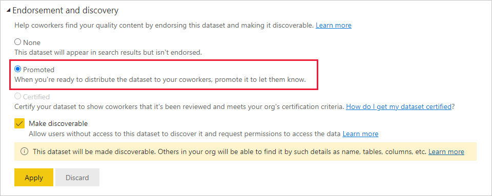
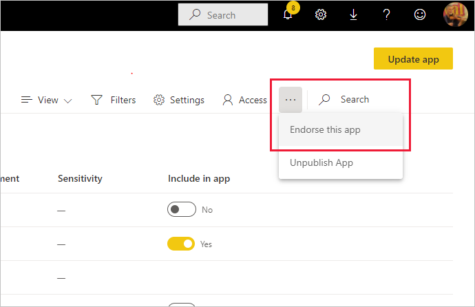

# Endorse your content

Power BI provides two ways you can endorse your valuable, high-quality content to increase its visibility: **promotion** and **certification**.

* **Promotion**: Promotion is a way to highlight content you think is valuable and worthwhile for others to use. It encourages the collaborative use and spread of content within an organization.

    Any content owner, as well as any member with write permissions on the workspace where the content is located, can promote the content when they think it's good enough for sharing.

* **Certification**: Certification means that the content meets the organization's quality standards and can be regarded as reliable, authoritative, and ready for use across the organization.

    Only [authorized reviewers (defined by the Power BI administrator)](../admin/service-admin-setup-certification.md) can certify content. Content owners who wish to see their content certified and are not authorized to certify it themselves need to follow their organization's guidelines about getting their content certified.

Currently it is possible to endorse
* Datasets
* Dataflows
* Reports
* Apps

If [dataset discoverability](service-discovery.md) has been enabled in your organization, endorsed datasets can be made discoverable. When a dataset is discoverable, users who don't have access to it will be able to find it and request access. See [Dataset discoverability](service-discovery.md) for more detail.

This article describes how to [promote content](#promote-content), how to [certify content](#certify-content) if you're an authorized reviewer, and how to [request certification](#request-content-certification) if you're not.

See [Endorsement: Promoting and certifying Power BI content](service-endorsement-overview.md) to learn more about endorsement.

## Promote content

To promote content, you must have write permissions the workspace where the content you want to promote is located.

>[!NOTE]
>For the purposes of illustration, the endorsement dialog for datasets is shown below. The dialogs for the other content types are almost identical, with the same radio button options. 

1. Go to the [settings](#how-to-get-to-content-settings) of the content you want to promote.

1. Expand the endorsement section and select **Promoted**.

    If you are promoting a dataset and see a **Make discoverable** checkbox, it means you can make it possible for users who don't have access to the dataset to find it. See [dataset discovery](service-discovery) for more detail.

    If you're promoting a dataset, provide a brief, informative description of the dataset. The description is important - this is what users will see they click the dataset's info icon in the datasets hub. 

    

1. Select **Apply**.

## Certify content

Content certification is a big responsibility, and only authorized users can certify content. Other users can [request content certification](#request-content-certification). This section describes how to certify content.

>[!NOTE]
>For the purposes of illustration, the endorsement dialog for datasets is shown below. The dialogs for the other content types are almost identical, with the same radio button options.

1. Get write permissions on the workspace where the content you want to certify is located. You can request these permissions from the content owner or from anyone with admin permissions on the workspace.

1. Carefully review the content and determine whether it meets your organization's certification standards.

1. If you decide to certify the content, go to the workspace where it resides, and then open the [settings](#how-to-get-to-content-settings) of the content you want to certify.

1. Expand the endorsement section and select **Certified**.

    If you are certifying a dataset and see a **Make discoverable** checkbox, it means you can make it possible for users who don't have access to the dataset to find it. See [dataset discovery](service-discovery) for more detail.

    If you're certifying a dataset, make sure the dataset has an informative description. The description is important - users who don't have access to the dataset will be able to see this description when they click the dataset's info icon in the datasets hub.

    

1. Select **Apply**.

## Request content certification

If you would like to certify your content but are not authorized to do so, follow the steps below.

>[!NOTE]
>For the purposes of illustration, the endorsement dialog for datasets is shown below. The dialogs for the other content types are almost identical, with the same radio button options. 

1. Go to the workspace where the content you want to be certified is located, and then open the [settings](#how-to-get-to-content-settings) of that content.

1. Expand the endorsement section. The **Certified** button is greyed out since you are not authorized to certify content. Click the link about how to get your content certified.

    
    
    >[!NOTE]
    >If you clicked the link above but got redirected back to this note, it means that your Power BI admin has not made any information available. In this case, contact the Power BI admin directly.

## How to get to content settings

The Endorsement dialog is accessed through the settings of the content you want to endorse. Follow the instructions below to get to the settings for each content type.

* **Datasets**: In list view, hover over the dataset you want to endorse, click **More options (...)**, and then choose **Settings** from the menu that appears.
* **Dataflows**: In list view, hover over the dataflow you want to endorse, click **More options (...)**, and then choose **Settings** from the menu that appears.

* **Reports**: In list view, hover over the report you want to endorse, click **More options (...)**, and then choose **Settings** from the menu that appears. Alternatively, if the report is open, choose **File > Settings**.

* **Apps**: Go to the app workspace, click **More options (...)** on the menu bar, and choose **Endorse this app**.

    

## Next steps

* [Read more about content endorsement](service-endorsement-overview.md)
* [Enable content certification](../admin/service-admin-setup-certification.md) (Power BI admins)
* [Read more about dataset discoverability](service-discovery.md)
* Questions? [Try asking the Power BI Community](https://community.powerbi.com/)
