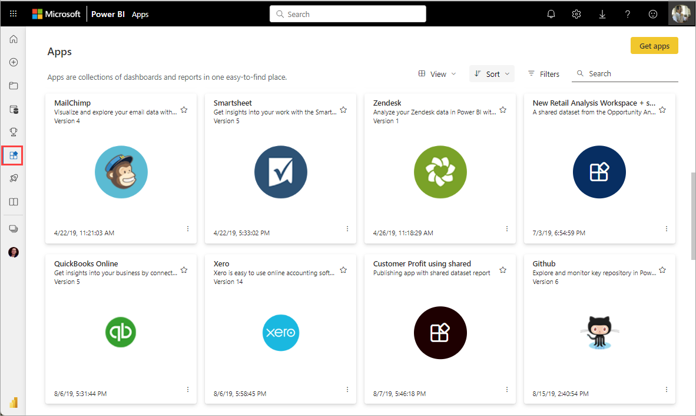
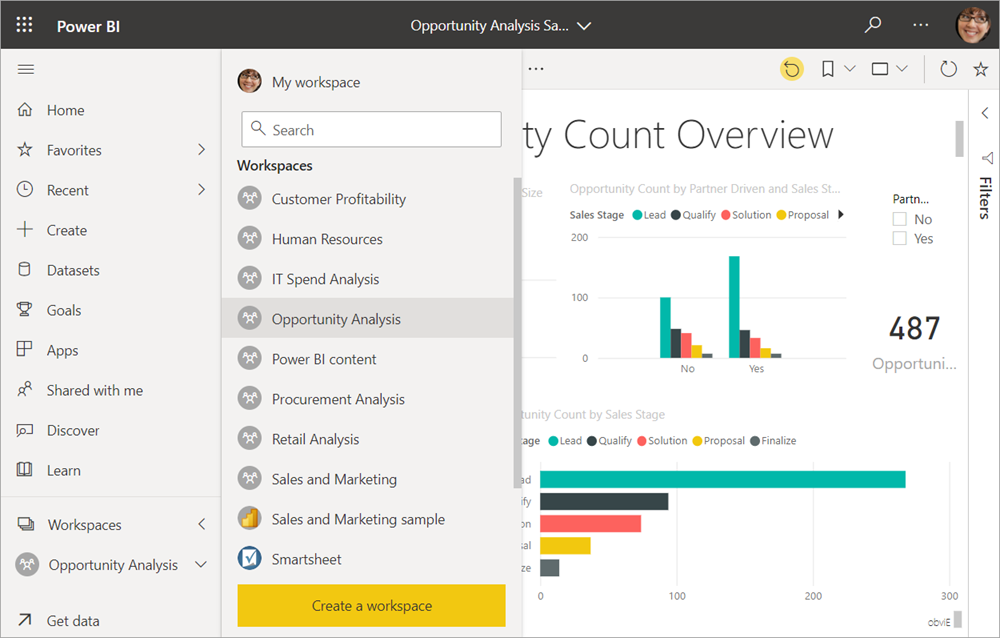
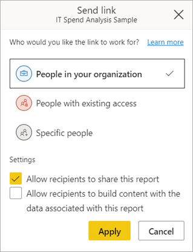
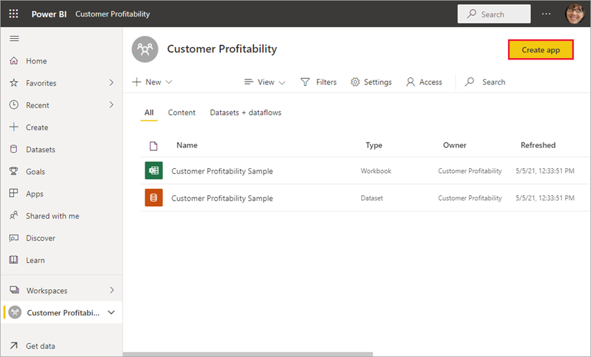
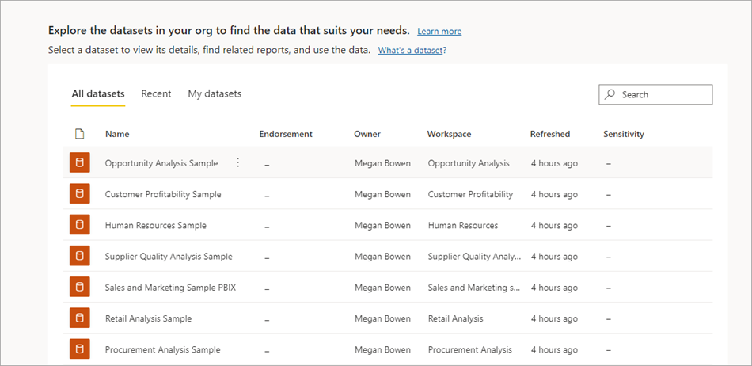

# Ways to collaborate and share in Power BI

You've created reports or dashboards. Maybe you want to collaborate on them with your coworkers. Or maybe you're ready to distribute them more widely. What's the best way to collaborate and share them? In this article, we compare your options.

*Apps in the Power BI service*

**Collaborate**

- [Collaborate with coworkers in *workspaces*](#collaborate-in-a-workspace) to create meaningful reports and dashboards.
- [Collaborate in *Microsoft Teams*](#collaborate-in-microsoft-teams).

**Distribute or share dashboards and reports**

- [*Share reports or dashboards*](#share-reports-or-dashboards) from your My Workspace or another workspace.
- Annotate and [share from the Power BI *mobile apps*](#annotate-and-share-from-the-power-bi-mobile-apps).
- Bundle reports and dashboards in workspaces into *apps* and [distribute your apps](#distribute-insights-in-an-app) to a larger group or your whole organization.
- [Embed reports](#embed-reports-in-secure-portals-or-public-web-sites) in *secure portals* or *public web sites*.
- [Print reports](#print-or-save-as-pdf-or-other-static-file).
- [Create a *template app*](#create-and-deploy-template-apps) that you can distribute to external Power BI users, via Microsoft AppSource.
 
**Share data**

- [Create *shared datasets*](#share-a-dataset) that coworkers can use as the basis for their own reports, in their own workspaces.
- [Create *dataflows*](#create-dataflows) as a way to share a common data source.

No matter which option you choose, to share your content you need a [Power BI Pro license](../fundamentals/service-features-license-type.md), or the content needs to be in a [Premium capacity](../enterprise/service-premium-what-is.md). License requirements vary for the colleagues who view your content, depending on the option you choose. The following sections spell out details. 

## Collaborate in a workspace

When teams work together, they need access to the same documents so they can collaborate easily. In Power BI workspaces, teams share the ownership and management of their dashboards, reports, datasets, and workbooks. Sometimes Power BI users organize their workspaces based on organizational structures, or they create them for specific projects. Still other organizations use several workspaces to store different versions of reports or dashboards they use. 

Workspaces provide roles that determine what permissions your coworkers have. Use those roles to determine who can manage the workspace, edit or distribute content, or just view content. Read more about [roles in the new workspaces](service-roles-new-workspaces.md).

Workspaces are better for collaboration than My Workspace, because they allow co-ownership of content. You and your entire team can easily make updates or give others access. My Workspace is best used by individuals for one-off or personal content.

Now, imagine you have a finished report you need to share with your colleagues. What's the best way to give them access to the report? The answer depends on a number of factors. 

- If colleagues need to keep the report up to date, or need access to all the content in the workspace, add them to the workspace as Members or Contributors. 
- If colleagues just need to view the content in the workspace, add them as Viewers.
- If colleagues just need to see that report and not all the content in the workspace, you can share the report via link or grant them direct access.
- If the report is better consumed with related reports or dashboards that you need to distribute to many colleagues, then publishing an *app* is likely the best choice.

Read about how to [create the new workspaces](service-create-the-new-workspaces.md). 

## Collaborate in Microsoft Teams

Increase data-driven collaboration in your organization by embedding your Power BI reports and Power BI paginated reports in Microsoft Teams. The Power BI service has a **Chat in Teams** button for reports. You can add separate Power BI tabs for each individual report, and give each tab the name of the report, or any other name. 

When you add a Power BI report tab to Microsoft Teams, Teams automatically creates a tab conversation for the report. Everyone in that Microsoft Teams channel can see and discuss the report in the conversation. 

:::image type="content" source="media/service-how-to-collaborate-distribute-dashboards-reports/power-bi-teams-conversation-tab.png" alt-text="Microsoft Teams conversation tab":::

Read more about [collaborating in Microsoft Teams with Power BI](service-collaborate-microsoft-teams.md).

## Share reports or dashboards

Let's say your report in Power BI Desktop is ready, and you want other people to have access to it. One way to get it to them is to *share* it in the Power BI service. You publish it to your own My Workspace or another workspace. Maybe you create a dashboard to go with it, and you're ready.

You need a Power BI Pro license to share your content. The people you share it with do too, or the content needs to be in a workspace in a [Premium capacity](../enterprise/service-premium-what-is.md). When you share a dashboard or report, recipients can view it and interact with it. If you give them permission, they can edit it, make a copy of it, and share it with their coworkers. They see the same data that you see in the dashboard or report. They have access to all the data in the underlying dataset, unless [row-level security (RLS)](../enterprise/service-admin-rls.md) is applied.

You can share reports via links that give access:

Additionally, you can share reports by granting users direct access:

You can also share dashboards by granting user direct access but not via links that give access:

If you share a dashboard with people outside your organization, they can view and interact with the dashboard, but they can't share it with others. 

Read about how to [share reports and dashboards](service-share-dashboards.md) from the Power BI service. Or read about adding a filter to a link and [share a filtered view of your report](service-share-reports.md).

## Annotate and share from the Power BI mobile apps

In the Power BI mobile apps for iOS and Android devices, you can annotate a tile, report, or visual and then share it with anyone via email.

You're sharing a snapshot of the tile, report, or visual. Your recipients see it exactly as it was when you sent the mail. The mail also contains a link to the dashboard or report. If they have a Power BI Pro license or the content is in a [Premium capacity](../enterprise/service-premium-what-is.md), and you've shared the content with them already, they can open it. You can send snapshots of tiles to anyone, not just coworkers in the same email domain.

Read more about [annotating and sharing tiles, reports, and visuals](../consumer/mobile/mobile-annotate-and-share-a-tile-from-the-mobile-apps.md) from the iOS and Android mobile apps.

You can also [share a snapshot of a tile](../consumer/mobile/mobile-windows-10-phone-app-get-started.md) from the Power BI app for Windows 10 devices, but not annotate it.

## Distribute insights in an app

Say you want to distribute your dashboard to a broad audience in your organization. You and your coworkers have created a *workspace*, then created and refined dashboards, reports, and datasets in the workspace. Now you select the dashboards and reports and publish them as an *app*, either to a group or to your whole organization.

Apps are easy to find and install in the Power BI service ([https://app.powerbi.com](https://app.powerbi.com)). You can send your business users a direct link to the app, or they can search for it in AppSource. If your Power BI administrator gives you permissions, you can install an app automatically in your coworkers' Power BI accounts. Read about how to [publish an app](service-create-distribute-apps.md).

After they install the app, they can view it in their browser or mobile device.

For your users to view your app, they need a Power BI Pro license, too, or the app needs to be stored in a Power BI Premium capacity. Read [What is Power BI Premium?](../enterprise/service-premium-what-is.md) for details.

You can publish apps to people outside your organization, too. They can view and interact with the app content, but can't share it with others. Now you can create *template apps* and deploy them to any Power BI customer.

## Embed reports in secure portals or public web sites

### Embed in secure portals

You can embed Power BI reports in portals or web sites where your users expect to see them.  
With the **Embed in SharePoint Online** and the **Embed** option in the Power BI service, you can securely embed reports for your internal users. Whichever option you choose, Power BI enforces all permissions and data security before users see content. The person viewing the report needs the appropriate license.  

- **Embed in SharePoint Online** works with the Power BI web part for SharePoint Online. It provides a single sign-on experience with control over how the report is embedded. Read more about [Embedding in SharePoint Online](service-embed-report-spo.md).
- **Embed** works with any portal or web site that supports embedding content using a URL or an iFrame. Read more about the [Embed](service-embed-secure.md) option.

### Publish to public web sites

**Publish to web** allows you to publish Power BI reports to the whole Internet by embedding visualizations in blog posts, web sites, social media, and other online communications. Anyone on the Internet can view your reports, and you have no control over who sees what you've published. They don't need a Power BI license. Publishing to the web is available only for reports that you can edit. You can't publish reports to the web if they're shared with you or if they're in an app. Read about how to [publish to the web](service-publish-to-web.md).

>[!Warning]
>Use [Publish to web](service-publish-to-web.md) only to share content publicly, not for internal sharing.

## Print or save as PDF or other static file

From the Power BI service, you can print, save as PDF, or save as other static file format, any of these items:

- An entire dashboard
- A dashboard tile
- A report page
- A paginated report
- A visualization from the Power BI service. 

You can only print Power BI reports one page at a time. You can't print the entire report at once. Read about how to [print or save a report or dashboard as a static file](../consumer/end-user-print.md).

Paginated reports, on the other hand, are designed to be printed. Read a [comparison of Power BI reports and paginated reports](../paginated-reports/paginated-reports-report-builder-power-bi.md#compare-power-bi-reports-and-paginated-reports) for details. 

## Create and deploy template apps

*Template apps* are designed to be distributed publicly, often in Microsoft AppSource. You build an app, and with little or no coding, you can deploy it to any Power BI customer. Your customers connect to their own data and instantiate their own accounts. Read more about [Power BI template apps](../connect-data/service-template-apps-overview.md).

## Share a dataset

Let's face it, some people are more skilled at creating high-quality, well-designed data models in their reports. Maybe you're that person. Your whole organization can benefit from using the same well-designed data models. *Shared datasets* fill that role. When you create a report with a data model that everyone should use, you can save that report to the Power BI service and give the right people permission to use it. Then they can build their reports on your dataset. That way, everyone is basing their reports on the same data, and seeing the same "version of the truth."

Read more about [creating and using shared datasets](../connect-data/service-datasets-across-workspaces.md).

## Create dataflows

*Dataflows* are a self-service way to unify data from disparate sources and prepare it for modeling. Analysts create dataflows to ingest, transform, integrate, and enrich big data. They create and manage dataflows in workspaces in the Power BI service. Read about [self-service data prep with dataflows](../transform-model/dataflows/dataflows-introduction-self-service.md).

## Considerations and limitations

- You can't share reports from Power BI Report Server. Instead, you can create [subscriptions for yourself or others](/sql/reporting-services/working-with-subscriptions-web-portal).

## Next steps

- [Share dashboards with coworkers and others](service-share-dashboards.md)
- [Create and publish an app in Power BI](service-create-distribute-apps.md)
- [Embed report in a secure portal or web site](service-embed-secure.md)

Have feedback? Go to the [Power BI Community site](https://community.powerbi.com/) with your suggestions.

More questions? [Try the Power BI Community](https://community.powerbi.com/)
