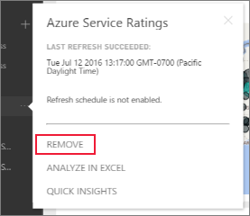

# Remove your connection to a Power BI organizational content pack

> [!NOTE]
> Organizational content packs are being deprecated. Now is a good time to upgrade your content packs to apps, if you haven't started yet. See [Upgrade classic workspaces to the new workspaces in Power BI](service-upgrade-workspaces.md) for details.
> 

A coworker created a content pack. You discovered it in AppSource and added it to your Power BI workspace. Now you don't need it any longer.  How do you remove it?

To remove a content pack, you remove its dataset.  

* In the nav pane, select the ellipsis to the right of the dataset and select **Remove \> Yes**.  
  
  

Removing the dataset also removes all associated reports and dashboards. However, removing your connection to the content pack doesn't delete the content pack from your organization's AppSource. You can only [delete a content pack from AppSource](service-organizational-content-pack-manage-update-delete.md) if you're the one who created it.

## Next steps

* [Create and distribute an app in Power BI](service-create-distribute-apps.md) 
* [Basic concepts for designers in the Power BI service](../fundamentals/service-basic-concepts.md)  
* More questions? [Try the Power BI Community](https://community.powerbi.com/)
