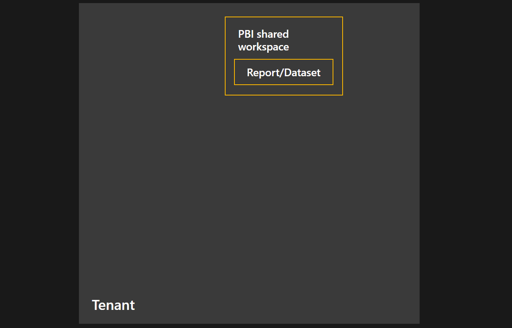

# About Power BI in Power Apps Solutions (preview)

The Power BI/Power Apps solutions integration enables Power Apps app makers to add Power BI reports and datasets as Dataverse components in Power Apps solutions. When a Power BI report or dataset is added to a Power Apps solution, it will stay connected as the solution is deployed across environments and tenants, and can be seamlessly managed as part of the solutions Application Lifecycle Management process across environments and tenants.

Working in Power Apps, the Power Apps maker creates Power BI report and dataset components based on reports and datasets in Power BI workspaces and adds them to a solution. When the Power BI report or dataset component is created and added to a solution, the Power BI artifacts are exported and uploaded to Dataverse, and a new dedicated workspace in Power BI is automatically created to store the artifacts. This dedicated Power BI workspace inherits privileges from several pre-defined roles in the Power Apps environment (see Permission sync between Power Apps environment and Power BI workspace), giving the users in these roles permission in the workspace, thus enabling co-authoring between Power Apps and Power BI. This process ensures that your Power BI reports and datasets can be embedded as system dashboards or inside forms, and will survive deployment across environments and tenants.

The animation below illustrates how a Power BI report and dataset are exported from a shared Power BI workspace into Dataverse, and then stored in a specially provisioned dedicated Power BI workspace. When the solution is exported (managed or unmanaged) it includes the Power BI content.​ In the deployment environment (cross-environment and cross-tenant) Dataverse provisions the Power BI workspace and artifacts in a dedicated environment workspace.

For the integration to work, it needs to be enabled in Power BI by a Power BI administrator. See [Enable the Power BI/Power Apps Solutions integration](./service-power-bi-powerapps-integration-enable.md).

There are some non-typical ways in which Power BI reports and datasets linked to Power BI components in Power Apps may behave. See [Using the Power BI/Power Apps solutions integration](./service-power-bi-powerapps-integration-using.md).

Finally, there are security and life cycle considerations to take into account when using Power BI components in Power Apps solutions. See [Considerations working with the Power BI/Power Apps solutions integration](./service-power-bi-powerapps-integration-considerations.md).

## Next Steps

* [Enable the Power BI/Power Apps Solutions integration](./service-power-bi-powerapps-integration-enable.md)
* [Using the Power BI/Power Apps solutions integration](./service-power-bi-powerapps-integration-using.md)
* [Considerations working with the Power BI/Power Apps solutions integration](./service-power-bi-powerapps-integration-considerations.md)
* [Power BI content management in Power Apps solutions](/power-apps/maker/model-driven-apps/power-bi-content-management-power-apps-solutions)
* More questions? [Try asking the Power BI Community](https://community.powerbi.com/)