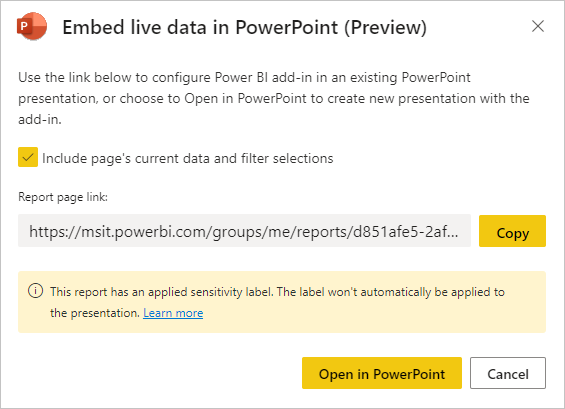
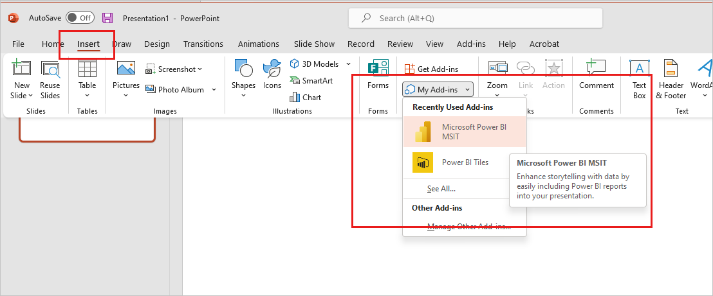
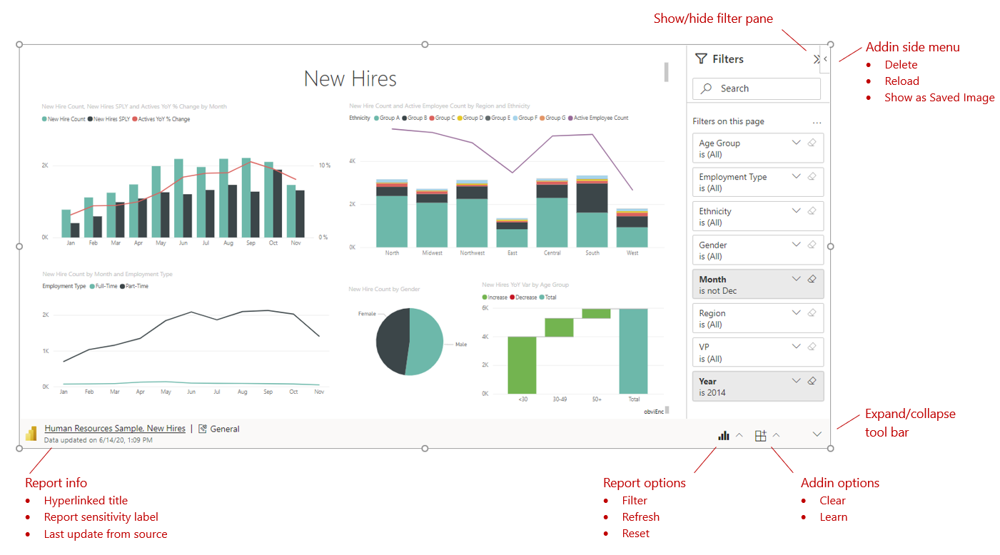

# Embed a report page in PowerPoint

With the Power BI report add-in for PowerPoint, you can easily embed interactive Power BI report pages in PowerPoint slides.

Report pages embedded into PowerPoint using the Power BI report add-in for PowerPoint respect all Power BI permissions and data security, including [row-level security (RLS)](../enterprise/service-admin-rls.md), so your data remains secure.

## Requirements

To embed a Power BI report page into PowerPoint, the Power BI report add-in must be installed in PowerPoint. If it is not installed, see [Get the Power BI report add-in for PowerPoint](TBD).

## Embed your report page

To embed a live Power BI report page into PowerPoint, you first need to [get the URL](#get-the-report-page-url) to the page URL. You then [paste the URL](#paste-the-report-page-url-into-the-powerpoint-add-in) into the Power BI report add-in in PowerPoint.

### Get the report page URL

There are three ways to get the report page URL:

* Through the **Share** option
* Through the **Export** option
* From the browser's address bar

These methods differ in whether or not they can preserve the report page's current state, and what permissions people who open the PowerPoint presentation will have for viewing the report. The table below summarizes the differences.

| URL source | Supports inserting current state | Can users who open the presentation view the report? |
|---------|---------|---------|
| Share     | Yes        | Yes        |
| Export     | Yes         |  Depends on the user's Power BI permissions |
| Address bar     | No        |  Depends on the user's Power BI permissions |

Use the **Share** option if you want to be sure that all users who open the presentation will be able to view the report.

Choose how you want to get the report page URL.

# [Share option](#tab/share)

1. Open the report to the page you want to insert. If desired, configure the page to the desired state using filters, selection, slicers, etc.

1. Choose **Share**.

    

1. Choose the permissions you want to grant and who you want to grant them to, as described in the [sharing reports documentation](service-share-dashboards#share-a-report-via-link). Click **Apply**.

    

1. Check the **Include my changes** box if you want to share the report pages current state, and then select **PowerPoint**.

    

1. Copy the URL to paste into the Power BI PowerPoint add-in. Alternatively choose **Open in PowerPoint** to insert the report page directly into a new, blank PowerPoint presentation.

    

Typically, the link generated by this method provides viewing access to the report.

# [Export option](#tab/export)

1. Open the report to the page you want to insert. If desired, configure the page to the desired state using filters, selection, slicers, etc.

1. Choose **Export > PowerPoint > Embed live data**.

    

1. Check the **Include page's current data and filter selections** box if you want to export the current state, and then copy the URL to paste into the Power BI PowerPoint add-in. Alternatively choose **Open in PowerPoint** to insert the report page directly into a new, blank PowerPoint presentation.

    

# [Browser address bar](#tab/addressbar)

Open the report to the page you want to insert, copy the URL from the browser’s address bar, and then copy the URL to paste into the Power BI PowerPoint add-in.

---

### Paste the report page URL into the PowerPoint add-in

When you have the report page URL, paste it into the Power BI report add-in in PowerPoint.

1. Open PowerPoint and navigate to the slide where you want to insert the report and select the Power BI add-in.

    
 
    If you don't see the add-in, see [Get the Power BI report add-in for PowerPoint](TBD).

1. Paste the report page URL into the text box and then click **Insert**. The report will load into the add-in.

    :::image type="content" source="media/service-embed-report-powerpoint/Animation.gif" alt-text="Screenshot of inserting the Power B I report page into the add-in.":::

## Working with the embedded report page

When you first insert a report page into PowerPoint, the initial view is determined by the URL you used. This initial state is called the default view. As you work with the report, you can always restore the default view if you want to go back to it.

You interact with the report just as you would in the Power BI service. You can apply filters and slicers, select data points, and drill down on data.

You can interact with the report in both edit mode and presentation modes. The main difference between the two modes is that changes you make to a view in edit mode are persistent, whereas changes you make while in presentation mode are not persistent. This behavior is useful for preparing presentations, which will be discussed later. 

In addition to the report data and visuals of the report itself, there are a number of controls and features that help you with your work.

### Common actions

Common things you might want to do when viewing a report page in the add-in are described below. For more details and additional options, see the detailed descriptions of the menus and buttons.
* **Interact with the report**: You can apply filters and slicers, select data points, and drill down on data just like you can in the Power BI service. See XXX for details about interacting with reports in Power BI.
* **Refresh report page**: Choose Report actions menu > Refresh. Brings over the latest data from the Power BI service. Note: Does not initiate data update from the data source.
* **Restore the original report view**: Choose Report actions menu > Reset. Returns the report page’s state to what it was when the page was originally inserted.
* **Display report page as a static image**: Choose Add-in side menu > Display as static image. Turns the current state of the live report into a static image. Select again to restore the live view.
* **Expand/collapse the filter pane**: Choose Report actions menu > Filter, or click the Show/hide filter pane.
* **Reload the report page**: Choose Add-in site menu > Reload. Causes the report to reload. Use this option if you need to bring over non-data related changes to the report itself, such as the addition/deletion of visuals, etc. 
* **Expand/collapse toolbar**: Choose Expand/collapse the toolbar button. Hiding the toolbar create more space for the report. This can be especially useful in presentation mode.

### Preparing a presentation

One of the main differences between edit mode and presentation mode is that in edit mode the current state of the report page is persistent, while it is not in presentation mode. This makes it possible to set up your desired view in edit mode and then start presenting (the presentation will start with the state you set up), While you are presenting you can interact with the report just as you would in the Power BI service. When you leave presentation mode, the report view returns to the state it was in when you entered presentation mode. This makes it easy to repeat the presentation multiple times without having to reconfigure the report view each time.

### Report options

| Option | Description |
|---|---|
|Filter|Shows or hides the filters pane, where you can filter your report, just like in the service. This option is present only if the page has filters defined.|
|Refresh|Refreshes the report page with the latest data from the Power BI service. Note: Refresh does not trigger getting data from the data sources. It just gets the latest data from the Power BI service.|
|Reset|Restores the state of the report page to the state it was in when first inserted into the PowerPoint presentation.|

## Next steps

More questions? [Try asking the Power BI Community](https://community.powerbi.com/)
