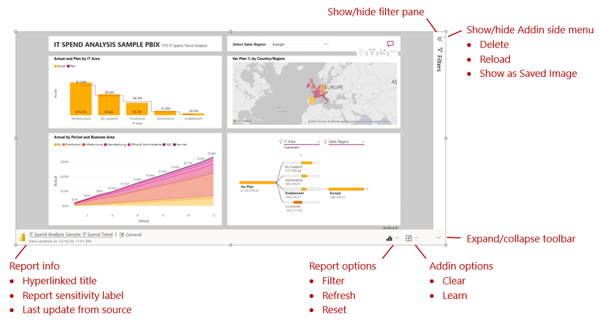
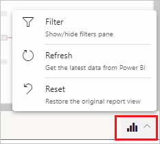
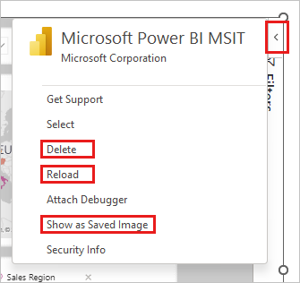

# Using the Power BI add-in for PowerPoint

When you first add a live Power BI report page into PowerPoint using the Power BI add-in for Powerpoint, the initial view is determined by the [URL](./service-power-bi-powerpoint-add-in-install.md#get-the-report-page-url) you used. This initial state is called the default view. As you work with the report, you can always [restore](#report-options) the default view if you want to go back to it.

You interact with the report just as you would in the Power BI service. You can apply filters and slicers, select data points, and drill down on data.

[Animated gif that shows interacting with the report]

You can interact with the report both in normal viewing modes and in **Slide Show** mode.
* In the normal viewing modes, changes you make to the report state (via filtering, selection, slicing, etc.) are saved.
* In **Slide Show** mode, such changes aren't saved. When you exit the slide show, the report goes back to the state it was in when you left the normal viewing mode.

This behavior is useful for preparing slide shows. You set up your presentation in normal mode, and then you can present it as a slide show multiple times without having to set it up again each time, no matter how much slicing, dicing, and filtering you do in the course of the show - when the slide show is over, the report page goes back to the state it was in at the beginning of the slide show.

Note about Save as Static Image

In addition to the interactive features of the report itself (filters, selection, slicers, etc.) the add-in has menus that provide other controls and features to help you with your work.

## Report info

* **Hyperlinked title**: Report name and page name. Click on the title to open Power BI to that report page.
* **Report sensitivity label**: Shows the sensitivity label applied to the report in Power BI. Note: this is not the sensitivity label (if any) applied to the PowerPoint file itself.
* **Last update from source**: Shows the time and date of the last data update from the data sources.

## Report options

* **Filter**: Shows or hides the filters pane, where you can filter your report, just like in the Power BI service. This option is available only if the page has filters defined.
* **Refresh**: Refreshes the report page with the latest data from the Power BI service. Note: Refresh does not trigger getting data from the data sources.
* **Reset**: Restores the state of the report page to the state it was in when it was first added to the PowerPoint presentation.

## Add-in options

* **Clear**: Removes the report page from the add-in and returns you to the add-in **Insert** screen, where you can start over by pasting in a new report page URL.
* **Learn**: Opens a carousal of help pages.

## Expand/collapse toolbar

Expands or collapses the toolbar across the bottom of the report. This feature is particulary useful in Slide Show mode, when you need more space and want a cleaner display.

## Add-in side pane

* **Delete**: Removes the add-in from the PowerPoint slide.
* **Reload**: Reloads the report page. Use this option if visuals have been changed, added or deleted. The report page reloads every time PowerPoint is opened, so you need to use this option only if the report has changed while you’ve had PowerPoint open.

    If all you want to do is refresh the data, use the **Refresh** option in the Report options menu instead.

* **Show as Saved Image**: Converts the current state as a saved, static image. You can’t interact with this image. Data is not updated. You can copy and paste this image wherever you want. Select Show as Saved Image again to restore the live current view. The report will reload.

## Show/hide filters pane

Shows or hides the filters pane.

## Next steps

* [About the Power BI add-in for PowerPoint](./service-power-bi-powerpoint-add-in-about.md)
* [Add a live Power BI report page in PowerPoint](./service-power-bi-powerpoint-add-in-install.md)
* More questions? [Try asking the Power BI Community](https://community.powerbi.com/)
