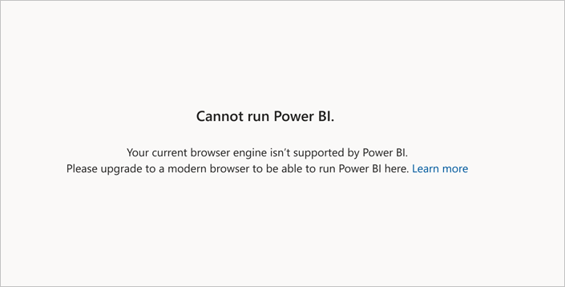
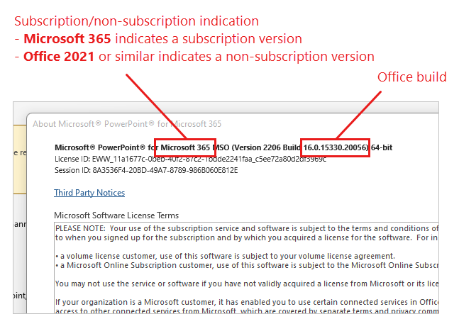

# Troubleshoot the Power BI add-in for PowerPoint

This article describes what to do if you get the following error when trying to use the Microsoft Power BI add-in.



## Why am I getting this error?

The most likely reason for getting this error is that WebView2 isn't installed on your device. The Power BI storytelling add-in requires WebView2 to run Power BI in PowerPoint. If WebView2 isn't installed, you need to install it before you'll be able to use the add-in.

## What is WebView2?

Microsoft Edge WebView2 is a control used to provide web-based features in Microsoft 365 desktop applications such as PowerPoint. It uses Microsoft Edge as the rendering engine, and requires that Microsoft Edge WebView2 Runtime be installed on the device that is running the Office application. 

WebView2 comes standard on recent Windows versions, but may not be included in earlier versions. If your version of Windows doesn't include WebView2, you need to install it manually to be able to use the Power BI add-in.

See [Microsoft Edge WebView2](/deployoffice/webview2-install) and Microsoft 365 Apps to learn more about Office Add-ins runtime and WebView2.

## How to install WebView2?
It takes just a minute to install WebView2. You can get and install it from [Download Microsoft Edge WebView2](https://developer.microsoft.com/microsoft-edge/webview2/consumer/).

When the installation is done, check to make sure WebView2 is installed. Open the add-in side menu, select **Security Info**. The Security Info window will appear.


If the Security Info window says **Runtime: Microsoft Edge**, WebView2 is installed.

>[!NOTE]
> After installing WebView2, you might need to close and re-open all Office applications.

## I installed WebView2, but the Power BI storytelling add-in still doesn't run

If WebView2 is installed but you still can't use the add-in, it may be because the Office build and/or Windows edition on your device don't meet minimum requirements. The minimum system requirements are as follows:

* **Office version**
    * If you have a Microsoft 365 Office subscription: Build number 16.0.13530.20424 or later.
    * If you have a non-subscription version of Office: Office 2021 or later.
* **Windows version**
    * If you have a Microsoft 365 Office subscription: Windows 8.1, Windows 10, or Windows 11.
    * If you have a non-subscription version of Office: Windows 10 and above.

If your system doesn't meet the above requirements, you need to upgrade your [Windows](https://support.microsoft.com/windows/get-the-latest-windows-update-7d20e88c-0568-483a-37bc-c3885390d212#:~:text=To%20check%20for%20updates%2C%20select,can%20choose%20to%20install%20them.) and/or [Office](https://support.microsoft.com/office/install-office-updates-2ab296f3-7f03-43a2-8e50-46de917611c5) versions before you will be able to run the Storytelling add-in.

>[!Note]
>For Office builds 16.0.13530.20424 or later, but earlier than 16.0.14326.xxxxx, a system admin needs to update a registry key as described in [Adding a registry key](#adding-a-registry-key) below. 

The following sections show you how to check your device's Office build and Windows edition.

## Check your Office build and subscription type

In PowerPoint, choose **File > Account**, and then press **About PowerPoint**. The following info box will appear. Take note of the **build number** and the **subscription/non-subscription indication**.



## Check your Windows version

Open **File Explorer**, right-click **This PC**, and choose **Properties**. In the Windows specifications section, note the Windows edition.


## Adding a registry key

If you have a Microsoft 365 Office subscription, and the Office build on your device is 16.0.13530.20424 or later but earlier than 16.0.14326.xxxxx, someone with admin permissions on your device can create the following registry key to enable you to use the add-in.

```HKEY_CURRENT_USER\SOFTWARE\Microsoft\Office\16.0\WEF\Win32WebView2```

The key's value should be set to:

```dword:00000001```

### More resources

* [Browsers used by Office Add-ins](/office/dev/add-ins/concepts/browsers-used-by-office-web-add-ins)


## Next Steps

* [About Power BI in PowerPoint](./service-power-bi-powerpoint-add-in-about.md)
* [Add live Power BI report pages to PowerPoint](./service-power-bi-powerpoint-add-in-install.md)
* [View and present live Power BI report pages in PowerPoint](./service-power-bi-powerpoint-add-in-view-present.md)
* More questions? [Try asking the Power BI Community](https://community.powerbi.com/)