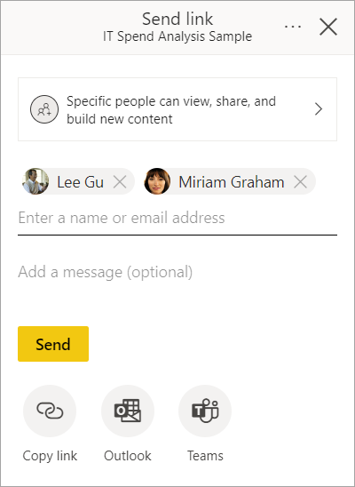
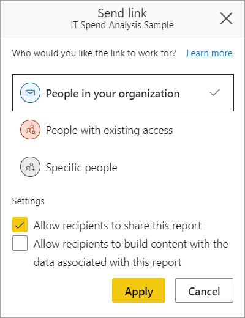
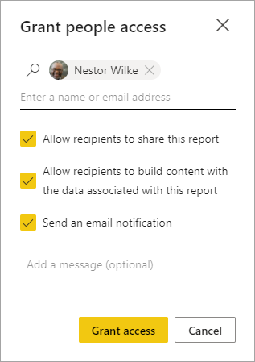
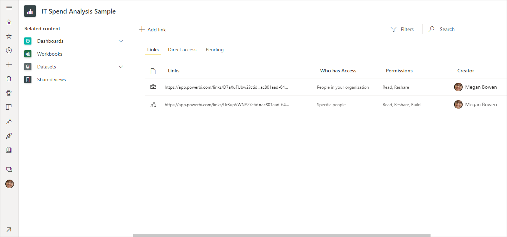
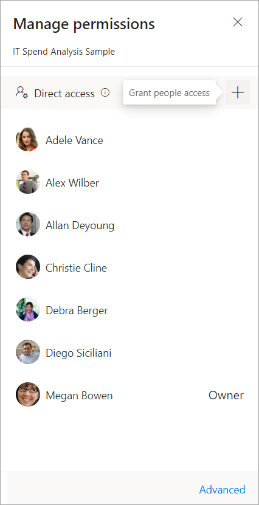
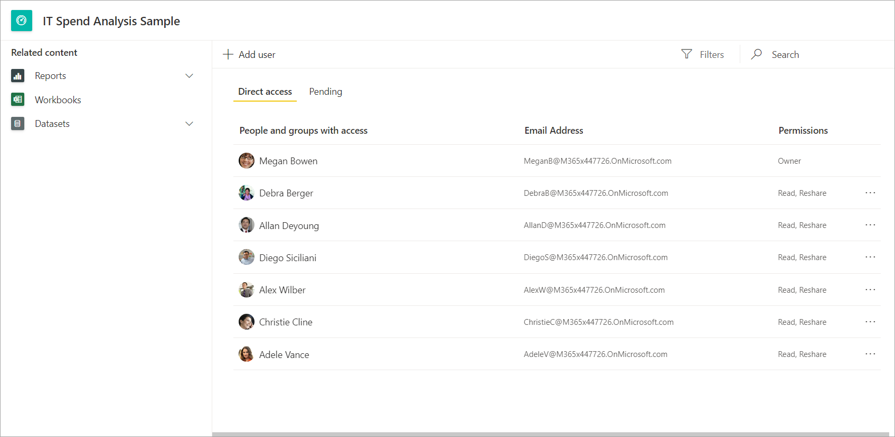

# Share Power BI reports and dashboards with coworkers and others

[!INCLUDE [applies-yes-desktop-yes-service](../includes/applies-yes-desktop-yes-service.md)]

*Sharing* is the easiest way to give people access to your reports and dashboards in the Power BI service. You can share with people inside or outside your organization.

When you share a report or dashboard, the people you share it with can view it and interact with it, but can't edit it. The recipients see the same data that you see in the reports and dashboards. They also get access to the entire underlying semantic model, unless row-level security (RLS) is applied to it.  The coworkers you share with can reshare with their coworkers if you allow them to. 

Some users are unable to share their reports and dashboards with others because they don't have the necessary license or subscription. They can, however, receive reports and dashboards shared by colleagues. To learn more, see [Working with content shared with you](end-user-shared-with-me.md).

The Power BI service offers other ways to collaborate and distribute reports and dashboards, too. Read [Ways to collaborate and share in Power BI](service-how-to-collaborate-distribute-dashboards-reports.md) to see which way works best for your circumstances.

## Video

Sujata demonstrates how to share in the Power BI service.

> [!VIDEO https://www.microsoft.com/videoplayer/embed/RWO30a]

## Prerequisites

- You need a [Power BI Pro or Premium Per User (PPU) license](../fundamentals/service-features-license-type.md), whether you share content inside or outside your organization. 
- Your recipients also need Power BI Pro or Premium Per User (PPU) licenses, unless the content is in a [Premium capacity](../enterprise/service-premium-what-is.md). 
- If you want to allow recipients to edit a shared report, you have to assign the user a workspace role that allows editing. To learn more about role-level permissions and how to assign roles, read [Roles in workspaces](service-roles-new-workspaces.md).

>[!NOTE]
>
>* Only **P SKU**s and **F SKU**s larger than F32 allow users with a Microsoft Fabric free license who have Viewer role on the workspace containing the content to consume Power BI apps and shared content in the Power BI service. Smaller **F SKU**s require a Pro license to consume Power BI content.
>* The **F SKU** is part of Fabric. To read more about *F* SKUs see [Microsoft Fabric licenses](/fabric/enterprise/licenses).

### Where you can share

- You can share reports and dashboards from My Workspace. 
- You can share from workspaces other than My Workspace, if you have the [Admin or Member role](service-roles-new-workspaces.md) in the workspace. If you have the Contributor or Viewer role, you can share if you have Reshare permissions.
- You can [share from the Power BI mobile apps](../consumer/mobile/mobile-share-dashboard-from-the-mobile-apps.md).
- You can [share from Power BI Desktop](../create-reports/desktop-sharepoint-save-share.md) with OneDrive and SharePoint integration. 
- You can [publish reports from Power BI Desktop](../create-reports/desktop-upload-desktop-files.md) to the Power BI service. 

## Share a report via link

In a list of reports, or in an open report, select **Share** :::image type="icon" source="media/service-share-dashboards/power-bi-share.png" border="false":::.

Then in the **Send link** dialog, you'll see the option to copy the sharing link or share it via Outlook, PowerPoint, and Teams to **People in your organization**:

:::image type="content" source="media/service-share-dashboards/power-bi-share-links.png" alt-text="Share link dialog box.":::

You can also change how you share this report.  Select **People in your organization with the link can view and share** and then choose which option works best. For more information, see [Link settings, below](#link-settings).

:::image type="content" source="media/service-share-dashboards/power-bi-share-links-2.png" alt-text="Share link options dialog box.":::

   > [!NOTE] 
   > Your organization may not allow you to create shareable links to **People in your organization**. Learn more about this [tenant setting](/fabric/admin/service-admin-portal-export-sharing#allow-shareable-links-to-grant-access-to-everyone-in-your-organization) in the admin portal documentation.
   
Selecting **Copy link** will automatically generate and copy a shareable link to your clipboard:

You can also choose to directly send the link to **Specific people** or groups (distribution groups or security groups). Just enter their name or email address, optionally type a message, and select **Send**.

After you select **Send**, Power BI sends the link via email to your recipients.

When your recipients receive the email, they can select **Open this report** and automatically get access to the report through the shareable link.

### Link settings
You can choose who your sharing link gives access to and what they can do with the report and associated data:

**People in your organization**

This type of link allows people in your organization to access the report. This link won't work for external users nor guest users. Use this link type when:
* You want to share with someone in your organization,
* You're comfortable with the link being shared with other people inside your organization, 
* And you want to ensure that the link won’t work for external or guest users.

**People with existing access**

This type of link generates a URL to the report, but it doesn't give any access to the report. Use this link type if you just want to send a link to somebody who already has access.

**Specific people**

This type of link allows specific people or groups to access the report. If you select this option, enter the names or email addresses of the people you wish to share with. This link type lets you share to guest users in your organization’s Microsoft Entra ID. You can't share to external users who aren't guests in your organization.

**Settings**

Links that give access to **People in your organization** or **Specific people** will always include at least read access. However, you can also specify if you want the link to include or exclude the following permissions as well:

- Reshare permissions (included by default) – allows recipients to share the report to others
- Build permissions (excluded by default) – allows recipients to build their own reports in other workspaces based on the data associated with the report. Read more about [creating reports based on semantic models from different workspaces](../connect-data/service-datasets-discover-across-workspaces.md).

Links for **People with existing access** don't have any other settings because these links don't give any access to the report.

**Additional considerations**

- Users can't use a link not shared directly with them to access a report. However, the report might be shared with the user via a different link or they may have direct access to the report through a workspace role.
- If your Power BI admin has disabled shareable links to **People in your organization**, you can only copy and share links to **Specific people** or **People with existing access**.
- If you have reshare permissions to the report but you don't have reshare permissions to the report’s underlying data, your shareable links won't give access to the underlying data.
- If you don't have reshare permissions to the report, you can only copy and share links to **People with existing access**.
- Additionally, if you don't have a Power BI Pro license, you can only copy and share links to **People with existing access**. 

## Manage permissions to a report

To manage permissions and manage links that give access to the report, select **More options (...)** in the upper right of the sharing dialog, and then select **Manage permissions**:

The **Manage permissions** pane opens, where you can copy or modify existing links or grant users direct access. To modify a given link, select **More options (...)**.

To grant users direct access to the report select the plus icon (+), enter their name or email address, optionally type a message, and select **Grant access**.

For more access management capabilities, select the **Advanced** option in the footer of the **Manage permissions** pane. On the management page that opens,  you can:
- View, manage, and create **Links**.
- View and manage who has **Direct access** and grant people direct access.
- View and manage **Pending** access requests and invitations.
- View and manage **Related content**.
- Apply **Filters** or **Search** for specific links or people.

   >[!NOTE] 
   > Each report cannot have more than 1,000 sharing links. In the unlikely case that your report hits this max limit, we recommend removing links that give **Specific people** access and instead grant those users direct access.
 
## Share a dashboard
In a list of dashboards, or in an open dashboard, select **Share** :::image type="icon" source="media/service-share-dashboards/power-bi-share.png" border="false":::.

Then in the **Share dashboard** dialog, you'll see the option to grant users or groups direct access to the dashboard:

Enter the name or email address of the user or group, optionally type a message, and select **Grant access**.

Similar to report sharing, you can specify if you want to grant users the following permissions as well:

- Reshare permissions (included by default) – allows recipients to share the dashboard to others
- Build permissions (included by default) – allows recipients to build content with the data associated with the dashboard

You can share the dashboard with guest users whose addresses are outside your organization, but guest users can't reshare dashboards. Read more about [sharing outside your organization](#share-outside-your-organization) in this article.

   >[!NOTE] 
   > The input box supports, at most, 100 separate users or groups. See [Share with more than 100 users](#share-with-more-than-100-separate-users) in this article for ways to share with more people.
 
## Manage permissions to a dashboard
To manage permission to the dashboard, select the **More options**  menu (. . .) in the upper right of the **Share dashboard** dialog, and then select **Manage permissions**:

The **Manage permissions** pane opens, where you can see who has direct access. Select the plus icon (+) to grant more users direct access to the dashboard. 

For more access management capabilities, select the **Advanced** option in the footer of the **Manage permissions** pane. On the management page that opens,  you can:
- View and manage who has **Direct access** and grant people direct access
- View and manage **Pending** access requests and invitations
- View and manage **Related content**
- Apply **Filters** or **Search** for specific people

To remove a user's access to the dashboard, select the ellipsis (**...**) next to that user's permissions and select **Remove access**:
      

In the **Remove access** dialog, decide if you also want to remove access to related content, such as reports and semantic models. It's best to also remove access to related content; otherwise, the related content may not display properly.

 

## Share outside your organization
When you share with people outside your organization, they receive an email with a link to the shared report or dashboard. The recipient has to sign in to Power BI to see what you shared. If they don't have a Power BI Pro or Premium Per User (PPU) license, they can sign up for a license when they select the link.

After people sign in, they see the shared report or dashboard in its own browser window, not in the usual Power BI portal. External recipients should bookmark the link to get back to this report or dashboard later.

Only your direct recipients see the shared report or dashboard. For example, if you sent the email to Vicki@contoso.com, only Vicki sees the dashboard. No one else can see the dashboard, even if Vicki forwards them the link. Vicki must use the same email address to access it; if Vicki signs in with any other email address, Vicki won't have access to the dashboard.

People outside your organization don't see any data at all if role- or row-level security is implemented on on-premises Analysis Services tabular models.

Use a security group, not a distribution group, to share with a group that includes people with external email addresses. People with external emails in a distribution group can't see the content you share, unless they're Microsoft Entra B2B guest users. Learn more about [Microsoft Entra B2B guest users](../enterprise/service-admin-azure-ad-b2b.md).

If you send a link from a Power BI mobile app to people outside your organization, clicking the link opens the dashboard in a browser, not in the Power BI mobile app.

## Share with more than 100 separate users

At most, you can share with 100 users or groups in a single share action. However, you can give more than 500 users access to an item. Here are some suggestions:

- Share multiple times by specifying the users individually.
- Share with a user group that contains all the users. 
- Create the report or dashboard in a workspace, then create an app from the workspace. You can share the app with many more people. Read more about [publishing apps in Power BI](service-create-distribute-apps.md).

## Considerations and limitations

Things to keep in mind about sharing reports and dashboards:
* Both reports and dashboards can be shared to users through direct access; however, only reports can be shared via links that give access to the report and underlying data.
* If you have reshare permissions to the underlying semantic model, when you share a report or dashboard with colleagues you're also sharing the underlying semantic model. Your colleagues get access to the entire semantic model unless [row-level security (RLS)](../enterprise/service-admin-rls.md) limits their access. Report authors may customize user experiences when viewing or interacting with reports. For example, authors may hide columns or limit the actions on visuals. These customized user experiences don't restrict what data users can access in the semantic model. Use [row-level security (RLS)](../enterprise/service-admin-rls.md) in the semantic model so that each person's credentials determine which data they can access.
* Everyone you successfully share your dashboard with can see it and interact with the related reports in [Reading view](../consumer/end-user-reading-view.md#reading-view). In general, they can't create reports or save changes to existing reports. However, if you select **Allow recipients to build content with the data associated with this dashboard**, they can create their own reports in other workspaces based on the semantic model for this dashboard.
* Although no one can see or download the semantic model, they can access the semantic model directly by using the Analyze in Excel feature. An admin can restrict the ability to use Analyze in Excel for everyone in a group. However, the restriction is for everyone in that group and for every workspace the group belongs to.
* Everyone can manually [refresh the data](../connect-data/refresh-data.md).
* You can't share reports that are distributed to you in an app. Ask the app owner to add the person you want to share the report with and republish the app.
* If you use Microsoft Exchange Online for email, you can enter the email address of a distribution group to share with its members. 
* If you don’t want to specify individuals, you can use email-enabled distribution groups or security groups to share with multiple users. Check more about the supported Microsoft 365 groups [here](/power-bi/collaborate-share/end-user-subscribe#use-group-email-aliases) for direct sharing and email subscriptions. 
* Coworkers who share your email domain, and coworkers whose domain is different but registered within the same tenant, can share the dashboard with others. For example, say the domains contoso.com and contoso2.com are registered in the same tenant and your email address is konrads@contoso.com. Both ravali@contoso.com and gustav@contoso2.com can share your dashboard, as long as you give them permission to share.
* If your coworkers already have access to a specific report or dashboard, you can send a direct link by copying the URL when you're on the dashboard or report. For example: `https://app.powerbi.com/reports/g12466b5-a452-4e55-8634-xxxxxxxxxxxx`.

## Related content

- [How should I collaborate on and share dashboards and reports?](service-how-to-collaborate-distribute-dashboards-reports.md)
- [Share from Power BI Desktop](../create-reports/desktop-sharepoint-save-share.md)
- [Troubleshoot sharing dashboards and reports](service-troubleshoot-sharing.md)
- [Sharing for users with free licenses](end-user-shared-with-me.md)
- [Request or grant access to shared dashboards or reports](service-request-access.md)
- [Share a filtered Power BI report](service-share-reports.md)
- Questions? [Try the Power BI Community](https://community.powerbi.com/)
