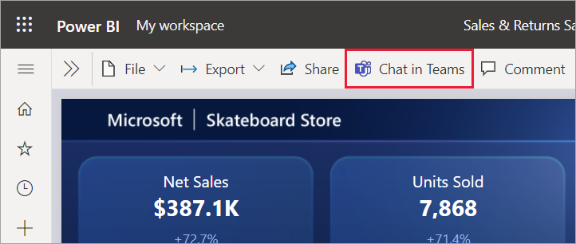
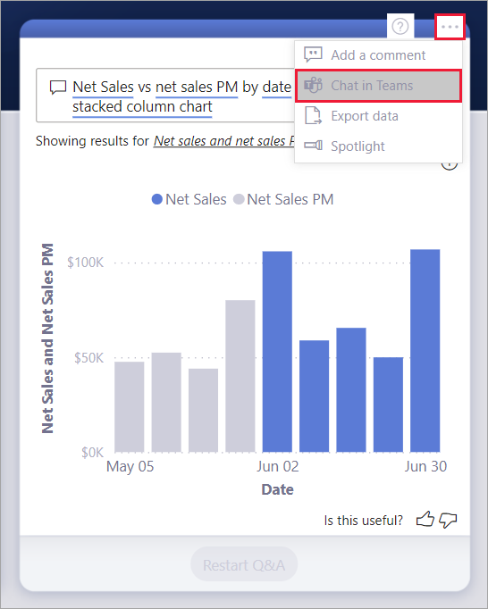
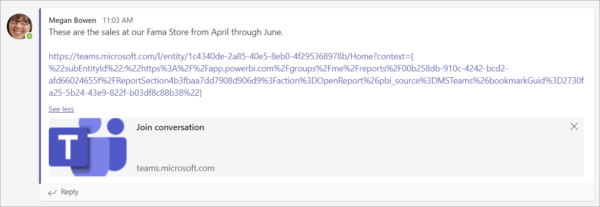

# Chat in Microsoft Teams directly from the Power BI service

You can chat about Power BI dashboards, reports, visuals, and dashboards directly to Microsoft Teams from the Power BI service. Use the **Chat in Teams** feature to quickly start conversations when you view reports, dashboards, and [datasets](../connect-data/service-datasets-hub.md#view-dataset-details-and-explore-related-reports) in the Power BI service.

## Requirements

To use the **Chat in Teams** functionality in Power BI, make sure your Power BI administrator hasn't disabled the **Share to Teams** tenant setting in the Power BI admin portal. This setting allows organizations to hide the **Chat in Teams** buttons. See the [Power BI admin portal](../admin/service-admin-portal.md#microsoft-teams-integration-in-the-power-bi-service) article for details.

See [Collaborate in Microsoft Teams with Power BI](service-collaborate-microsoft-teams.md) for background on how Power BI and Microsoft Teams work together, including other requirements.

## Chat about Power BI content in Microsoft Teams

Follow these steps to share links to reports, dashboards, visuals, and dashboards in the Power BI service, and chat about Microsoft Teams channels and chats.

1. Select one of these options:

   * **Chat in Teams** in the action bar of a dashboard, report, or dataset:

       
    
   * **Chat in Teams** in the context menu for a single visual:
    
      

1. In the **Share to Microsoft Teams** dialog box, select the team or channel you want to send the link to. You can enter a message if you want. You might be asked to sign in to Microsoft Teams first.

    

1. Select **Share** to send the link.
    
1. The link is added to existing conversations or starts a new chat.

    

1. Select the link to open the item in the Power BI service.

1. If you used the contextual menu for a specific visual, the visual is highlighted when the report opens.

    

## Known issues and limitations

- Users without a Power BI license or permission to access the report see a "Content is not available" message.
- The **Chat in Teams** buttons might not work if your browser uses strict privacy settings. Use the **Having trouble? Try opening in a new window** option if the dialog box doesn't open correctly.
- **Chat in Teams** doesn't include a link preview.
- Link previews and **Chat in Teams** don't give users permissions to view the item. Permissions must be managed separately.
- The **Chat in Teams** button isn't available in visual context menus when a report author sets **More options** to **Off** for the visual.
- See the [Known issues and limitations](service-collaborate-microsoft-teams.md#known-issues-and-limitations) section of the "Collaborate in Microsoft Teams" article for other issues.

## Next steps

- [Collaborate in Microsoft Teams with Power BI](service-collaborate-microsoft-teams.md)

More questions? [Try asking the Power BI Community](https://community.powerbi.com/).
