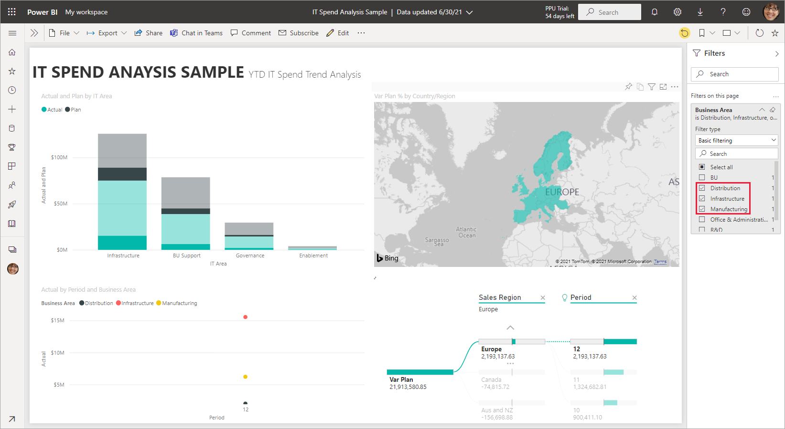
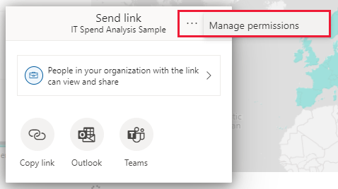
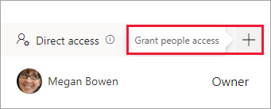
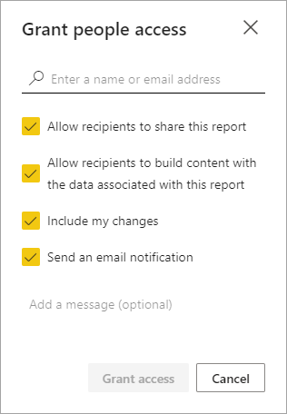
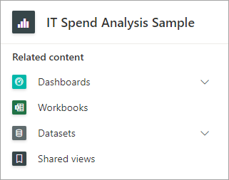
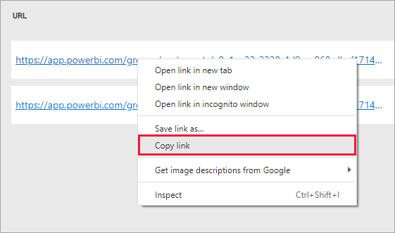

# Filter and share a Power BI report
*Sharing* is a good way to give a few people access to your reports and dashboards. What if you want to share a filtered version of a report? Maybe you want the report to show only data for a specific city or salesperson or year. This article explains how to filter a report and share the filtered version of the report. Another way to share a filtered report is to [add query parameters to the report URL](service-url-filters.md). In both cases, the report is filtered when recipients first open it. They can clear the filter selections in the report. In this example, we're filtering the report page to show only values where **Business Area** equals **Distribution**, **Infrastructure**, or **Manufacturing**.

Power BI also offers [other ways to collaborate and distribute your reports](service-how-to-collaborate-distribute-dashboards-reports.md). With sharing, you and your recipients need a [Power BI Pro license](../fundamentals/service-features-license-type.md), or the content needs to be in a [Premium capacity](../admin/service-premium-what-is.md). 

## Share a filtered report

Open a report in [Reading view](../consumer/end-user-reading-view.md) and apply a filter.

You can share the filtered report in a couple different ways: 
* Chat in Teams
* Direct access sharing

### Share a report in Teams

You can access **Chat in Teams** from the action bar: 

For the **Chat in Teams** dialog, you need provide the name of the Team or Channel that you wish to share to, then click **Share**:

### Share directly

If you prefer to directly share to users, you can also share your filtered report through direct access sharing. 

To share a report with direct access sharing, select **Share** > **More options (...)** > **Manage permissions**: 

Then select the plus icon (+) to **Grant people access**:

In the **Grant people access** dialog, make sure the **Include my changes** option is selected so that filters are included when you share the report with others.

The **Include my changes** setting includes any changes to the following:
- Filters (filter pane or URL filters)
- Slicers
- Personalize visuals
- Cross-filtering or cross-highlighting
- Drill down or drill up
- Applied bookmark
- Spotlight

After you've shared the filtered report, you can also manage the shared view. 
To navigate to the management page, select **Advanced** in the footer of the **Manage Permissions** pane:

Then select **Shared views** in the **Related content** section: 

Here you can see any shared views for the report and when those views were created and when they expire. To copy the link to the view, right-click the URL you want, and select **Copy link**.

When you share this link, recipients with access to the report will see your filtered report.

## Limitations and considerations
Things to keep in mind about sharing reports:

* When you share a dataset by managing permissions, by sharing reports or dashboards, or by publishing an app, you're granting access to the entire dataset unless [row-level security (RLS)](../admin/service-admin-rls.md) limits access. Report authors may use capabilities that customize user experiences when viewing or interacting with reports, for example hiding columns, limiting the actions on visuals, and others. These customized user experiences don't restrict what data users can access in the dataset. Use [row-level security (RLS)](../admin/service-admin-rls.md) in the dataset so that each person's credentials determine which data they can access.
* The shared report view link will automatically expire after 90 days.

## Next steps
* [Ways to share your work in Power BI](service-how-to-collaborate-distribute-dashboards-reports.md)
* [Share a report or dashboard](service-share-dashboards.md)
* More questions? [Try the Power BI Community](https://community.powerbi.com/).
* Have feedback? Go to the [Power BI Community site](https://community.powerbi.com/) with your suggestions.
