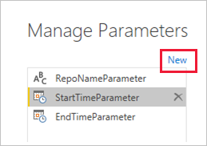
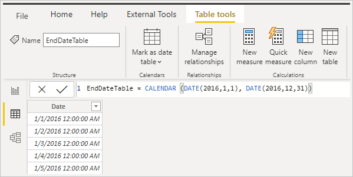
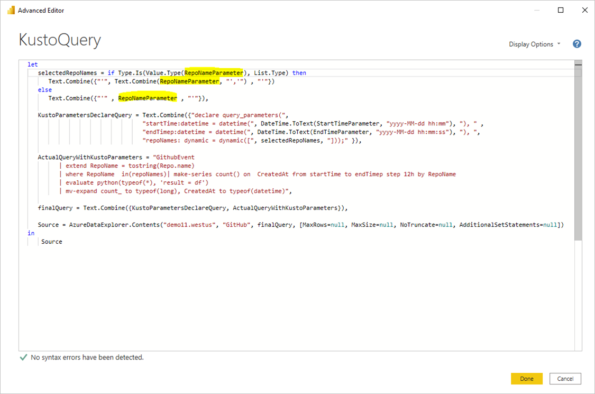
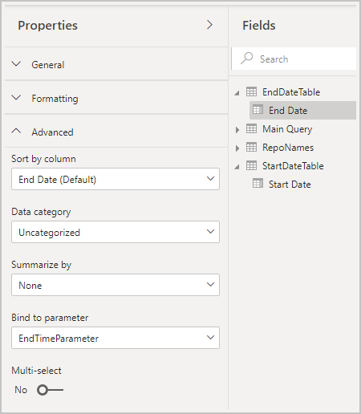
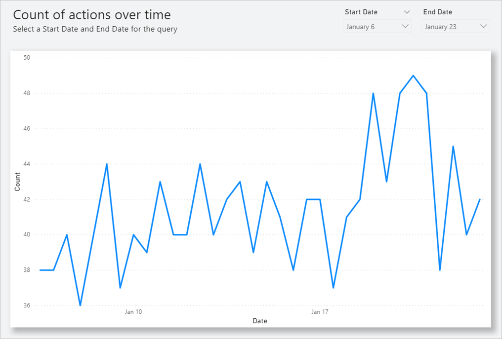
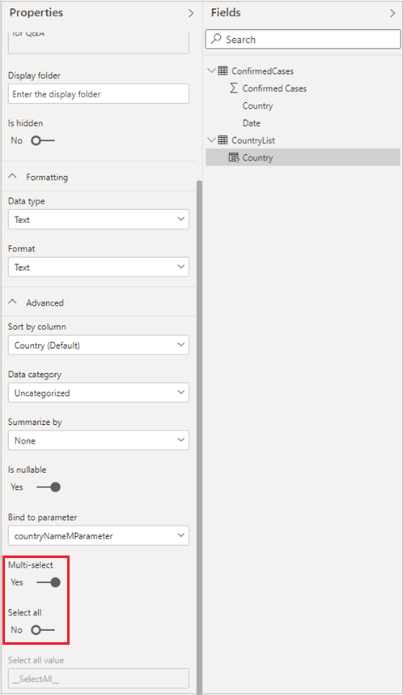
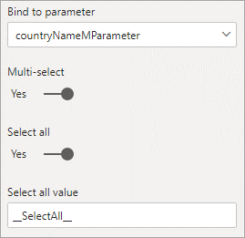
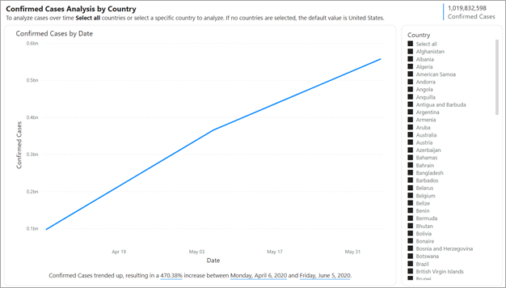

# Dynamic M query parameters in Power BI Desktop

This article describes how to create and use dynamic M query parameters in Power BI Desktop. With dynamic M query parameters, model authors can configure the filters or slicers that report viewers use to set values for an [M query parameter](/power-query/power-query-query-parameters). Dynamic M query parameters give model authors more control over how filter selections incorporate into DirectQuery source queries.

Model authors understand the intended semantics of their filters, and often know how to write efficient queries against their data source. With dynamic M query parameters, model authors can ensure that filter selections are incorporated into source queries at the right point to achieve the intended results with improved performance. Dynamic M query parameters can be especially useful for query performance optimization.

Watch Sujata explain and use dynamic M query parameters, and then try them out yourself.

> [!NOTE]  
> This video might use earlier versions of Power BI Desktop or the Power BI service.

> [!VIDEO https://www.microsoft.com/videoplayer/embed/RE4QLsb]

## Prerequisites

To work through these procedures, you must have a valid [M query](/powerquery-m/quick-tour-of-the-power-query-m-formula-language) that uses one or more DirectQuery tables.

## Create and use dynamic parameters

The following example passes a single value through to a parameter dynamically.

### Add parameters

1. In Power BI Desktop, select **Home** > **Transform data** > **Transform data** to open the Power Query Editor.

1. In the Power Query Editor, select **New Parameters** under **Manage Parameters** in the ribbon.

   

1. In the **Manage Parameters** window, fill out the information about the parameter. For more information, see [Create a parameter](/power-query/power-query-query-parameters#creating-a-parameter).

   

1. Select **New** to add more parameters.

   

1. When you're done adding parameters, select **OK**.

### Reference the parameters in the M query

1. Once you create the parameters, you can reference them in the M query. To modify the M query, while you have the query selected, open the **Advanced editor**.

   

1. Reference the parameters in the M query, as highlighted in yellow in the following image:

   

1. When you're done editing the query, select **Done**.

### Create tables of values

Create a table for each parameter with a column that provides the possible values available to be dynamically set based on filter selection. In this example, you want the `StartTime` and `EndTime` parameters to be dynamic. Since these parameters require a `Date/Time` parameter, generate date inputs to use to dynamically set the date for the parameter.

1. In the Power BI Desktop ribbon, under **Modeling**, select **New Table**.

   

1. Create a table for the values of the `StartTime` parameter, for example:

   ```StartDateTable = CALENDAR (DATE(2016,1,1), DATE(2016,12,31))```

   

1. Create a second table for the values of the `EndTime` parameter, for example:

   ```EndDateTable = CALENDAR (DATE(2016,1,1), DATE(2016,12,31))```

   

   > [!NOTE]
   > Use a column name that's not in an actual table. If you use the same name as an actual table column, the selected value is applied as a filter in the query.

### Bind the fields to the parameters

Now that you created the tables with the `Date` fields, you can bind each field to a parameter. Binding a field to a parameter means that as the selected value for the field changes, the value passes to the parameter and updates the query that references the parameter.

1. To bind a field, in the Power BI Desktop **Model** view, select the newly created field, and in the **Properties** pane, select **Advanced**.

   > [!NOTE]
   > The column data type should match the M parameter data type.

   

1. Select the dropdown under **Bind to parameter** and select the parameter that you want to bind to the field:

   

   Since this example is for setting the parameter to a single value, keep **Multi-select** set to **No**, which is the default:

   

   If you set the mapped column to **No** for **Multi-select**, you must either use a single select mode in the slicer, or require single select in the filter card.

   If your use cases require passing multiple values to a single parameter, set the control to **Yes** and make sure your M query is set up to accept multiple values. Here's an example for `RepoNameParameter`, which allows multiple values:

   

1. Repeat these steps if you have other fields to bind to other parameters.

   

You can now reference this field in a slicer or as a filter:



## Enable Select all

To be able to use the **Select all** option in a slicer or filter card, you must take more steps.

In this example, the Power BI Desktop model has a field called **Country**, which is a list of countries/regions bound to an M parameter called **countryNameMParameter**. This parameter is enabled for **Multi-select**, but isn't enabled for **Select all**. 



To enable **Select all**:

1. Enable the **Select all** toggle to enable the **Select all value** input. Edit the **Select all value** or note the default value.

   

   The **Select all value** passes to the parameter as a list that contains the value you defined. Therefore, when you define this value or use the default value, make sure the value is unique and doesn't exist in the field that's bound to the parameter.
   
1. Launch the Power Query Editor, select the query, and then select **Advanced Editor**. Edit the M query to use the **Select all value** to refer to the **Select all** option.

   

1. In the **Advanced Editor**, add a Boolean expression that evaluates to `true` if the parameter is enabled for **Multi-select** and contains the **Select all value**, and otherwise returns `false`: 

   

1. Incorporate the result of the **Select all** Boolean expression into the source query. The example has a Boolean query parameter in the source query called `includeAllCountries` that is set to the result of the Boolean expression from the previous step. You use this parameter in a filter clause in the query, such that `false` for the Boolean filters to the selected country or region names, and `true` effectively applies no filter.

   

1. Once you update your M query to account for the new **Select all value**, you can use the **Select all** function in slicers or filters.



For reference, here's the full query for the preceding example:

```kusto
let
    selectedcountryNames = if Type.Is(Value.Type(countryNameMParameter), List.Type) then 
      Text.Combine({"'", Text.Combine(countryNameMParameter, "','") , "'"})
    else
      Text.Combine({"'" , countryNameMParameter , "'"}),

    selectAllCountries = if Type.Is(Value.Type(countryNameMParameter), List.Type) then 
      List.Contains(countryNameMParameter, "__SelectAll__")
    else
      false,

    KustoParametersDeclareQuery = Text.Combine({"declare query_parameters(", 
                                 "startTimep:datetime = datetime(", DateTime.ToText(StartTimeMParameter, "yyyy-MM-dd hh:mm"), "), " , 
                                 "endTimep:datetime = datetime(", DateTime.ToText(EndTimeMParameter, "yyyy-MM-dd hh:mm:ss"), "), ",   
                                 "includeAllCountries: bool = ", Logical.ToText(selectAllCountries) ,",",
                                 "countryNames: dynamic = dynamic([", selectedcountryNames, "]));" }),

   ActualQueryWithKustoParameters = 
                                "Covid19
                                | where includeAllCountries or Country in(countryNames)
                                | where Timestamp > startTimep and Timestamp < endTimep
                                | summarize sum(Confirmed) by Country, bin(Timestamp, 30d)",

    finalQuery = Text.Combine({KustoParametersDeclareQuery, ActualQueryWithKustoParameters}),

    Source = AzureDataExplorer.Contents("help", "samples", finalQuery, [MaxRows=null, MaxSize=null, NoTruncate=null, AdditionalSetStatements=null]),
    #"Renamed Columns" = Table.RenameColumns(Source,{{"Timestamp", "Date"}, {"sum_Confirmed", "Confirmed Cases"}})
in
    #"Renamed Columns"
```

## Potential security risk

Report readers who can dynamically set the values for M query parameters may be able to access more data or trigger modifications to the source system by using *injection attacks*. This possibility depends on how you reference the parameters in the M query and what values you pass to the parameters.

For example, you have a parameterized Kusto query constructed as follows:

```kusto
Products
| where Category == [Parameter inserted here] & HasReleased == 'True'
 | project ReleaseDate, Name, Category, Region
 ```

There are no issues with a friendly user who passes an appropriate value for the parameter, for example, `Games`:

```
| where Category == 'Games' & HasReleased == 'True'
```

However, an attacker may be able to pass a value that modifies the query to get access to more data, for example, `'Games'//`:

```
Products
| where Category == 'Games'// & HasReleased == 'True'
| project ReleaseDate, Name, Category, Region
```

In this example, the attacker can get access to information about games that haven't released yet by changing part of the query into a comment.

### Mitigate the risk

To mitigate the security risk, avoid string concatenation of M parameter values within the query. Instead, consume those parameter values in M operations that fold to the source query, so that the M engine and connector construct the final query.

If a data source supports importing stored procedures, consider storing your query logic there and invoking it in the M query. Alternatively, if available, use a parameter passing mechanism that's built in to the source query language and connectors. For example, [Azure Data Explorer](/azure/data-explorer/kusto/query/queryparametersstatement?pivots=azuredataexplorer) has built-in query parameter capabilities that are designed to protect against injection attacks.

Here are some examples of these mitigations:

- Example that uses the M query's filtering operations:
  ```kusto
  Table.SelectRows(Source, (r) =\&gt; r[Columns] = Parameter)
  ```

- Example that declares the parameter in the source query, or passes the parameter value as an input to a source query function:
  ```kusto
  declare query\_parameters (Name of Parameter : Type of Parameter);
  ```

- Example of directly calling a stored procedure:
  ```kusto
  let CustomerByProductFn = AzureDataExplorer.Contents("Help", "ContosoSales"){[Name="CustomerByProduct"]}[Data] in
  CustomerByProductFn({1, 3, 5})
  ```

## Considerations and limitations

There are some considerations and limitations when you use dynamic M query parameters:

- A single parameter can't be bound to multiple fields nor vice-versa.
- Dynamic M query parameters don't support [aggregations](../enterprise/aggregations-auto.md.
- Dynamic M query parameters don't support row-level security (RLS).
- Parameter names can't be DAX reserved words nor contain spaces. You can append `Parameter` to the end of the parameter name to help avoid this limitation.
- Table names can't contain spaces or special characters.
- If your parameter is the `Date/Time` data type, you need to cast it within the M query as `DateTime.Date(<YourDateParameter>)`.
- If you use SQL sources, you might get a confirmation dialog every time the parameter value changes. This dialog is due to a security setting: **Require user approval for new native database queries**. You can find and turn off this setting in the **Security** section of the Power BI Desktop **Options**.

### Unsupported out-of-box parameter types:

- Any
- Duration
- True/False
- Binary

### Unsupported filters:\
- Relative time slicer or filter
- Relative date
- Hierarchy slicer
- Multifield include filter
- Exclude filters / Not filters
- Cross-highlighting
- Drilldown filter
- Cross drill filter
- Top N filter

### Unsupported operations:

- And
- Contains
- Less than
- Greater than
- Starts with
- Does not start with
- Is not
- Does not contain
- Is blank
- Is not blank

## Next steps

For more information about Power BI Desktop capabilities, check out the following resources:

- [DirectQuery in Power BI Desktop](desktop-directquery-about.md)
- [What is Power BI Desktop?](../fundamentals/desktop-what-is-desktop.md)
- [Query overview with Power BI Desktop](../transform-model/desktop-query-overview.md)
- [Data types in Power BI Desktop](desktop-data-types.md)
- [Shape and combine data with Power BI Desktop](desktop-shape-and-combine-data.md)
- [Common query tasks in Power BI Desktop](../transform-model/desktop-common-query-tasks.md)
