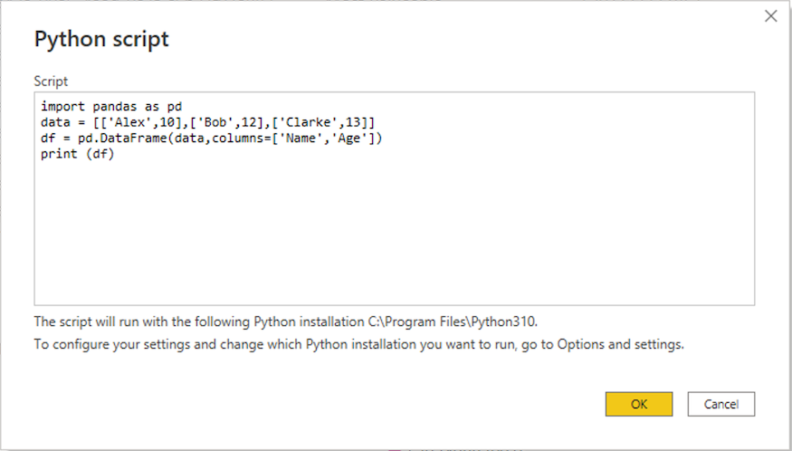
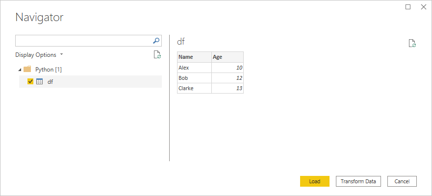
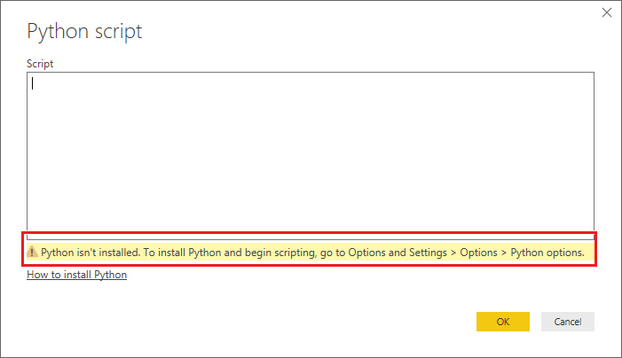

# Run Python scripts in Power BI Desktop

You can run Python scripts directly in Power BI Desktop and import the resulting datasets into a Power BI Desktop data model.

## Install Python

To run Python scripts in Power BI Desktop, you need to install Python on your local machine. You can download Python from the [Python website](https://www.python.org/). The current Python scripting release supports Unicode characters and spaces in the installation path.

### Install required Python packages

The Power BI Python integration requires the installation of two Python packages:

* [Pandas](https://pandas.pydata.org/). A software library for data manipulation and analysis. It offers data structures and operations for manipulating numerical tables and time series. Your imported data must be in a [pandas data frame](https://www.tutorialspoint.com/python_pandas/python_pandas_dataframe.htm). A data frame is a two-dimensional data structure. For example, data is aligned in a tabular fashion in rows and columns.
* [Matplotlib](https://matplotlib.org/). A plotting library for Python and its numerical mathematics extension [NumPy](https://www.numpy.org/). It provides an object-oriented API for embedding plots into applications using general-purpose GUI toolkits, such as Tkinter, wxPython, Qt, or GTK+.

In a console or shell, use the [pip](https://pip.pypa.io/en/stable/) command-line tool to install the two packages. The pip tool is packaged with more recent Python versions.

```CMD
pip install pandas
pip install matplotlib
```

## Enable Python scripting

To enable Python scripting:

1. In Power BI Desktop, select **File** > **Options and settings** > **Options** > **Python scripting**. The **Python script options** page appears.

   

1. If necessary, specify your local Python installation path in **Detected Python home directories**.

   In the above image, the Python's installation local path is *C:\Python*. Make sure the path is for the local Python installation you want Power BI Desktop to use.

1. Select **OK**.

Once you specify your Python installation, you’re ready to begin running Python scripts in Power BI Desktop.

## Run Python scripts

In just a few steps, you can run Python scripts and create a data model. From this model, you can create reports and share them on the Power BI service.

### Prepare a Python script

First, create a script in your local Python development environment and make sure it runs successfully. For example, here's a simple Python script that imports pandas and uses a data frame:

```python
import pandas as pd
data = [['Alex',10],['Bob',12],['Clarke',13]]
df = pd.DataFrame(data,columns=['Name','Age'],dtype=float)
print (df)
```

When run, this script returns:

```python
     Name   Age
0    Alex  10.0
1     Bob  12.0
2  Clarke  13.0
```

When preparing and running a Python script in Power BI Desktop, there are a few limitations:

* Only pandas data frames are imported, so make sure the data you want to import to Power BI is represented in a data frame
* Any Python script that runs longer than 30 minutes times out
* Interactive calls in the Python script, such as waiting for user input, halts the script’s execution
* When setting the working directory within the Python script, you *must* define a full path to the working directory, rather than a relative path
* Nested tables are currently not supported

### Run your Python script and import data

To run your Python Script in Power BI Desktop:

1. In the Home ribbon, select **Get data** > **Other**.

1. Select **Other** > **Python script** as shown in the following image:

   

1. Select **Connect**. Your local latest installed Python version is selected as your Python engine. Copy your script into the **Python script** dialog box that appears. Here, we enter the simple Python script shown before.

   

1. Select **OK**. If the script runs successfully, the **Navigator** appears and you can load the data and use it. For the example, select **df**, as shown in the image, then **Load**.

    

### Troubleshooting

If Python isn't installed or identified, a warning displays. You can also see a warning if you have multiple local machine installations. Revisit and review the previous Install Python and Enable Python scripting sections.



#### Using custom Python distributions

Power BI executes scripts directly by using the python.exe executable from a user-provided directory (provided through the settings page). Distributions that require an extra step to prepare the environment (for example, Conda) might encounter an issue where their execution fails.

We recommend using the official Python distribution from https://www.python.org/ to avoid related issues.

As a possible solution, you can start Power BI Desktop from your custom Python environment prompt.

### Refresh

You can refresh a Python script in Power BI Desktop. To refresh, go to the **Home** ribbon and select **Refresh**. When you refresh a Python script, Power BI Desktop runs the Python script again.

## Known Limitations

Currently you won't be able to use Python scripts in reports created with **Enhanced Metadata (Preview)** feature enabled. Existing reports will continue to work. For more information check out [Using enhanced dataset metadata (preview)](desktop-enhanced-dataset-metadata.md). 

## Next steps

Take a look at the following additional information about Python in Power BI.

* [Create Python Visuals in Power BI Desktop](desktop-python-visuals.md)
* [Use an external Python IDE with Power BI](desktop-python-ide.md)
