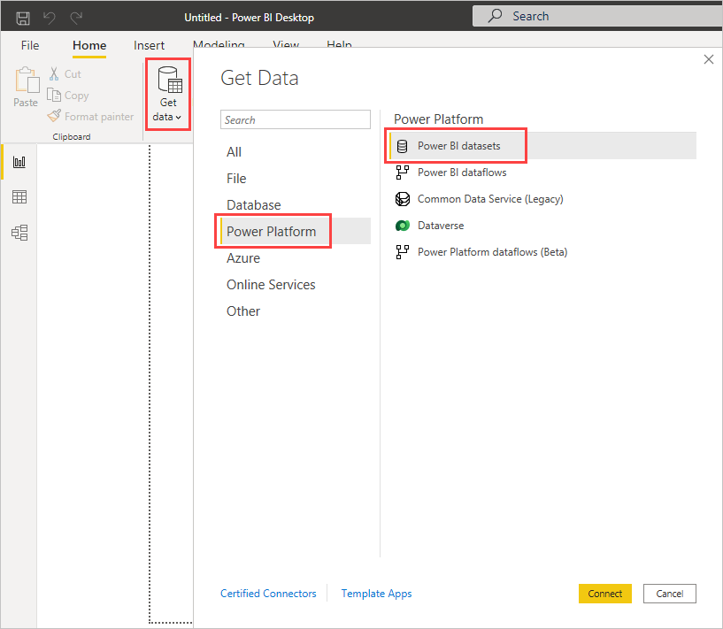
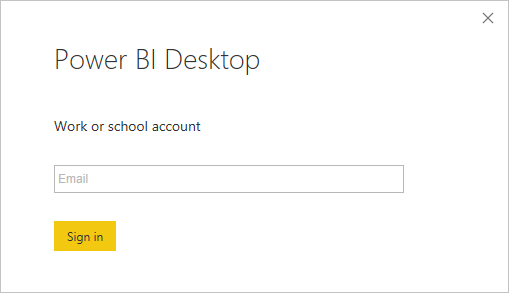
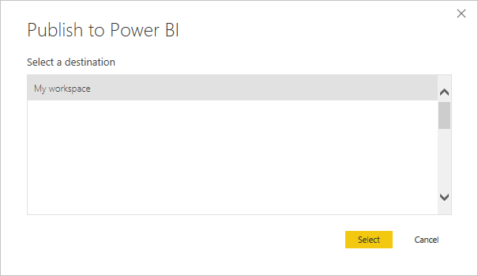
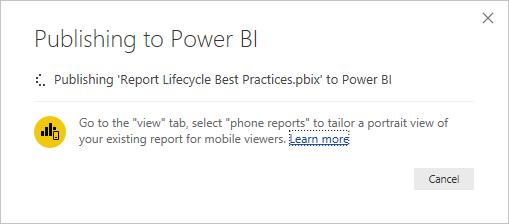
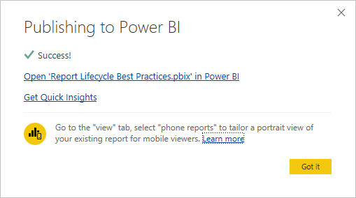
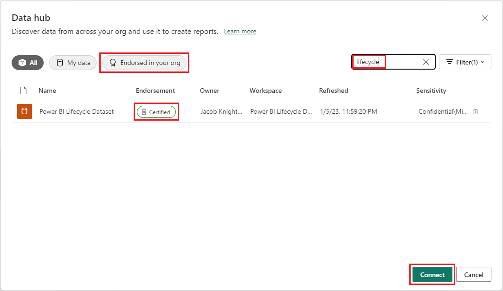
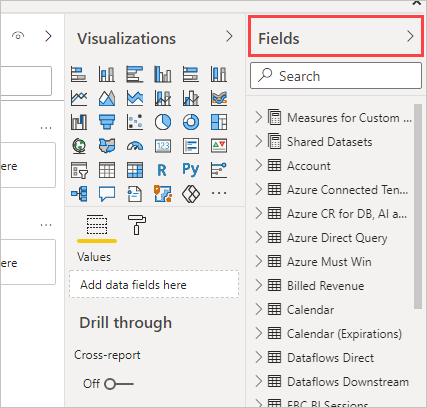

# Connect to datasets in the Power BI service from Power BI Desktop

In Power BI Desktop, you can create a data model and publish it to the Power BI service. Then you and others can establish a live connection to the shared dataset that's in the Power BI service, and create many different reports from that common data model. You can use the *Power BI service live connection* feature to create multiple reports in *.pbix* files from the same dataset, and save them to different workspaces.

This article discusses the benefits, best practices, considerations, and limitations of the Power BI service live connection feature.

## Power BI live connection and report lifecycle management

One challenge with the popularity of Power BI is the resulting proliferation of reports, dashboards, and underlying data models. It's easy to create compelling reports in Power BI Desktop, [publish](../create-reports/desktop-upload-desktop-files.md) those reports in the Power BI service, and create great dashboards from those datasets.

Because report creators often use the same or nearly the same datasets, knowing which dataset a report is based on and the freshness of that dataset becomes a challenge. The Power BI service live connection addresses that challenge by using common datasets to make it easier and more consistent to create, share, and expand on reports and dashboards.

### Create and share a dataset everyone can use

A business analyst on your team who is skilled at creating good data models, also called datasets, can create a dataset and report and then share that report in the Power BI service.

If everyone on the team created their own versions of the dataset and shared their reports with the team, there would be many reports from different datasets in your team's Power BI workspace. It would be hard to tell which report was the most recent, whether the datasets were the same, or what the differences were.

With the Power BI service live connection feature, other team members can use the analyst's published dataset for their own reports in their own workspaces. Everyone can use the same solid, vetted, published dataset to build their own unique reports.

### Connect to the dataset by using a Power BI service live connection

In Power BI Desktop, the team business analyst creates a report and the dataset the report is based on. The analyst then publishes the report to the Power BI service, and the report shows up in the team's workspace. For more information about workspaces, see [Workspaces in Power BI](../collaborate-share/service-new-workspaces.md).

The business analyst can use the Build permission setting to make the report available to everyone in and out of the workspace to see and use. Team members in and out of the team workspace can now establish a live connection to the shared data model by using the Power BI service live connection feature. Team members can create their own unique reports, from the original dataset, in their own workspaces.

The following image shows how one Power BI Desktop report and its data model publish to the Power BI service. Others users connect to the data model by using the Power BI service live connection, and base their own unique reports in their own workspaces on the shared dataset.

## Set up and use a Power BI service live connection

Now you know the usefulness of the Power BI service live connection for report lifecycle management. Learn the steps to get from a great report and dataset to a shared dataset that your teammates can use in Power BI.

### Publish a Power BI report and dataset

The first step in managing the report lifecycle by using a Power BI service live connection is to have a report and dataset for teammates to use.

1. To publish the report, from Power BI Desktop, select **Publish** from the **Home** tab.

   

   If you're not signed in to the Power BI service account, Power BI prompts you to sign in.

   

1. Select the workspace destination to publish the report and dataset to, and choose **Select**. Anyone who has Build permission can then access that dataset. You can set Build permission in the Power BI service after publishing.

   

   The publishing process begins, and Power BI Desktop shows the progress.

   

   Once complete, Power BI Desktop shows success, and provides links to the report in the Power BI service and to quick insights about the report.

   

1. Now that your report with its dataset is in the Power BI service, you can *promote* it, or attest to its quality and reliability. You can also request for the report to be *certified* by a central authority in your Power BI tenant. For more information, see [Endorse your content](../collaborate-share/service-endorse-content.md).

1. The last step is to set Build permission in the Power BI service for the dataset the report is based on. Build permission determines who can see and use your dataset. You can set Build permission in the workspace itself, or when you share an app from the workspace. For more information, see [Build permission for shared datasets](service-datasets-build-permissions.md).

### Establish a Power BI service live connection to the published dataset

Teammates who have access to the workspace where the report and dataset were published can connect to the dataset and build their own reports. To establish a connection to a published report and create your own report based on the published dataset:

1. In Power BI Desktop, on the **Home** tab, select **Get data** > **Power BI datasets**.

   Or, select **Get data**, and on the **Get Data** screen, select **Power Platform** in the left pane, select **Power BI datasets**, and then select **Connect**.

   If you're not signed in, Power BI prompts you to sign in.

1. The **Data hub** shows the workspaces you're a member of, and all the shared datasets you have Build permission for in any workspace.

   To find the dataset you want, you can:

   - Filter the list to **My data** or datasets that are **Endorsed in your org**.
   - Search for a specific dataset or filter by keyword.
   - See dataset name, owner, workspace, last and next refresh time, and sensitivity.

   

1. Select a dataset, and then select **Connect** to establish a live connection to the selected dataset. Power BI Desktop loads the dataset fields and their values in real time.

   

Now you and others can create and share custom reports, all from the same dataset. This approach is a great way to have one knowledgeable person create a well-formed dataset. Many teammates can use that shared dataset to create their own reports.

## Considerations and limitations

When you use the Power BI service live connection, keep a few considerations and limitations in mind.

- Only users with Build permission for a dataset can connect to a published dataset by using the Power BI service live connection.
- Free users only see datasets that are in their **My Workspace** and in Premium-based workspaces.
- Because this connection is live, left navigation and modeling are disabled. You can connect to only one dataset in each report. The behavior is similar to a SQL Server Analysis Services (SSAS) connection. However, a new preview feature in Power BI now makes it possible to combine data from different sources. For more information, see [Use DirectQuery for Power BI datasets and Azure Analysis Services (preview)](../connect-data/desktop-directquery-datasets-azure-analysis-services.md).
- Because this connection is live, row-level security (RLS) and similar connection behaviors are enforced. This behavior is the same as when connected to SSAS.
- If the owner modifies the original shared *.pbix* file, the shared dataset and report in the Power BI service are overwritten. Reports based on the dataset aren't overwritten, but any changes to the dataset reflect in the report.
- Members of a workspace can't replace the original shared report. If you try to do so, you get a prompt to rename the file and publish.
- If you delete the shared dataset in the Power BI service, reports based on that dataset will no longer work properly or display visuals. You can no longer access that dataset from Power BI Desktop.
- Reports that share a dataset on the Power BI service don't support automated deployments that use the Power BI REST API.

## Next steps
For more information on DirectQuery and other Power BI data connection features, check out the following resources:

- [Use DirectQuery in Power BI](desktop-directquery-about.md)
- [Data sources supported by DirectQuery](power-bi-data-sources.md)
- [Using DirectQuery for Power BI datasets and Azure Analysis Services (preview)](../connect-data/desktop-directquery-datasets-azure-analysis-services.md)

For more information about Power BI, see the following articles:

- [What is Power BI Desktop?](../fundamentals/desktop-what-is-desktop.md)
- [Query overview with Power BI Desktop](../transform-model/desktop-query-overview.md)
- [Data types in Power BI Desktop](desktop-data-types.md)
- [Shape and combine data with Power BI Desktop](desktop-shape-and-combine-data.md)
- [Common query tasks in Power BI Desktop](../transform-model/desktop-common-query-tasks.md)
- [Publish datasets and reports from Power BI Desktop](../create-reports/desktop-upload-desktop-files.md)
