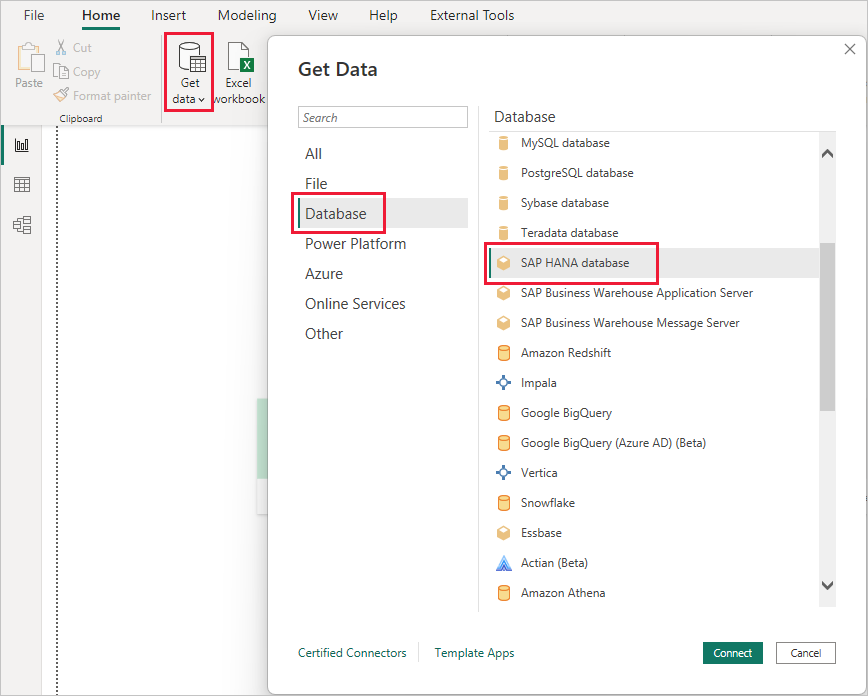

# Connect to SAP HANA databases in Power BI

With Power BI Desktop, you can now access *SAP HANA* databases. To use SAP HANA, you must have the SAP HANA ODBC driver installed on the local client computer for the Power BI Desktop's SAP HANA data connection to work properly. You can download the SAP HANA Client tools from [SAP Development Tools](https://tools.hana.ondemand.com/#hanatools), which contains the necessary ODBC driver. Or you can get it from the [SAP Software Download Center](https://support.sap.com/en/my-support/software-downloads.html). In the Software portal, search for the *SAP HANA CLIENT* for Windows computers. Since the SAP Software Download Center changes its structure frequently, more specific guidance for navigating that site isn't available.

To connect to an SAP HANA database, select **Get data**, choose **Database** > **SAP HANA Database**, and then select **Connect**:

When you connect to an SAP HANA database, specify the server name and specify the port.

In this release, SAP HANA in [DirectQuery](desktop-directquery-sap-hana.md) mode is supported in Power BI Desktop and the Power BI service. You can publish and upload reports that use SAP HANA in DirectQuery mode to the Power BI service. You can also publish and upload reports to the Power BI service when not using SAP HANA in DirectQuery mode.

## Supported features for SAP HANA

This release has many capabilities for SAP HANA, as shown in the following list:

* The Power BI connector for SAP HANA uses the SAP ODBC driver to provide the best user experience.

* SAP HANA supports both DirectQuery and Import options.

* Power BI supports HANA information models, such as Analytic and Calculation Views, and has optimized navigation.

* With SAP HANA, you can also use the direct SQL feature to connect to Row and Column Tables.

* Power BI includes Optimized Navigation for HANA Models.

* Power BI supports SAP HANA Variables and Input parameters.

* Power BI supports HDI-container-based Calculation Views.

  * Support for HDI-container-based Calculation Views is available in Power BI Desktop. To access your HDI-container-based Calculation Views in Power BI, ensure that the HANA database users you use with Power BI have permission to access the HDI runtime container that stores the views you want to access. To grant this access, create a Role that allows access to your HDI container. Then assign the role to the HANA database user that you use with Power BI. This user must also have permission to read from the system tables in the \_SYS\_BI schema, as usual.

    Consult the official SAP documentation for detailed instructions on how to create and assign database roles. [This SAP blog post](https://blogs.sap.com/2018/01/24/the-easy-way-to-make-your-hdi-container-accessible-to-a-classic-database-user/) may be a good place to start.

  * There are currently some limitations for HANA variables attached to HDI-based Calculation Views. These limitations are because of errors on the HANA side.
  
    First, it isn't possible to apply a HANA variable to a shared column of an HDI-container-based Calculation View. To fix this limitation, upgrade to HANA 2 version 37.02 and onwards or to HANA 2 version 42 and onwards.

    Second, multi-entry default values for variables and parameters currently don't show up in the Power BI UI. An error in SAP HANA causes this limitation, but SAP hasn't announced a fix yet.

## Considerations and limitations

When using SAP HANA with Visual Studio, ensure that you've installed compatible versions. For example, when working with Visual Studio 32 bit, make sure you have HANA client 32 bit installed as well.

There are also a few limitations to using SAP HANA:

* NVARCHAR strings are truncated to a maximum length of 4000 Unicode characters.
* SMALLDECIMAL isn't supported.
* VARBINARY isn't supported.
* Valid Dates are between 1899/12/30 and 9999/12/31.
* SAP HANA refresh with SSO is currently not supported for Excel workbook refreshes at the current time. To refresh the data in Power BI, you can use a Power BI report with SAP HANA SSO.

## Next steps

For more information about DirectQuery and SAP HANA, see the following resources:

* [DirectQuery and SAP HANA](desktop-directquery-sap-hana.md)
* [Use DirectQuery in Power BI](desktop-directquery-about.md)
* [Power BI data sources](power-bi-data-sources.md)
* [Enable encryption for SAP HANA](desktop-sap-hana-encryption.md)
