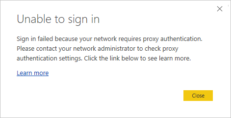
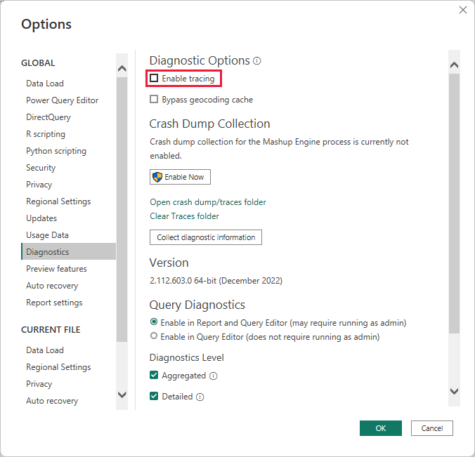

# Troubleshooting sign-in for Power BI Desktop
There may be times when you attempt to sign in to **Power BI Desktop** but run into errors. There are two primary reasons for sign-in trouble: **Proxy Authentication errors** and **Non-HTTPS URL redirect errors**. 

To determine which problem is causing your sign-in issue, the first step is to contact your administrator and provide diagnostic information so that they can determine the cause of the issue. By tracing issues associated with your sign-in problem, administrators can determine which of the following errors apply to you. 

Let's take a look at each of those issues in turn. At the end of this article is a discussion on how to capture a *trace* in Power BI Desktop, which can help track down troubleshooting issues.

## Proxy Authentication Required error

The following screen shows an example of the *Proxy Authentication Required* error.

The following exceptions in *Power BI Desktop* trace files are associated with this error:

* *Microsoft.PowerBI.Client.Windows.Services.PowerBIWebException*
* *HttpStatusCode: ProxyAuthenticationRequired*

When this error occurs, the most likely reason is that a proxy authentication server on your network is blocking the web requests issued by **Power BI Desktop**. 

If your network uses a proxy authentication server, your administrator can fix this issue by adding the following domains to the allow list on the proxy authentication server:

* app.powerbi.com
* api.powerbi.com
* domains in the *.analysis.windows.net namespace

For customers who are part of a government cloud, fixing this issue can be done by adding the following domains to the allow list on the proxy authentication server:

* app.powerbigov.us
* api.powerbigov.us
* domains in the *.analysis.usgovcloudapi.net namespace

## Non-HTTPS URL redirect not supported error

Current versions of **Power BI Desktop** use the current version of the Active Directory Authentication Library (ADAL), which does not allow a redirect to non-secured (non-HTTPS) URLs. 

The following exceptions in *Power BI Desktop* trace files are associated with this error:

* *Microsoft.IdentityModel.Clients.ActiveDirectory.AdalServiceException: Non-HTTPS url redirect is not supported in webview*
* *ErrorCode: non_https_redirect_failed*

If the *ErrorCode: non_https_redirect_failed* occurs, it means that one or more redirect pages or providers in the redirect chain is not an HTTPS protected endpoint, or that a certificate issuer of one or more redirects is not among the device's trusted roots. All providers in any sign-in redirect chain must use an HTTPS URL. To resolve this issue, contact your administrator and request that secured URLs be used for their authentication sites. 

## How to collect a trace in Power BI Desktop

To collect a trace in **Power BI Desktop**, follow these steps:

1. Enable tracing in **Power BI Desktop** by going to **File > Options and settings > Options** and then select **Diagnostics** from the options in the left pane. In the pane that appears, check the box next to **Enable tracing**, as shown in the following image. You may be required to restart **Power BI Desktop**.
   
   

2. Then follow the steps that reproduce the error. When that occurs, **Power BI Desktop** adds events to the tracing log, which is kept on the local computer.

3. Navigate to the Traces folder on your local computer. You can find that folder by selecting the link in the **Diagnostics** where you enabled tracing, shown as *Open crash dump/traces folder* in the previous image. Often this is found on the local computer in the following location:

    `C:\Users/<user name>/AppData/Local/Microsoft/Power BI Desktop/Traces`

There may be many trace files in that folder. Make sure you only send the recent files to your administrator to facilitate quickly identifying the error. 

## Using default system credentials for web proxy

Web requests issued by Power BI Desktop do not use web proxy credentials. In networks that use a proxy server, Power BI Desktop may not be able to successfully make web requests. 

Starting with the March 2020 Power BI Desktop release, system or network administrators can allow the use of default system credentials for web proxy authentication. Administrators can create a registry entry called **UseDefaultCredentialsForProxy**, and set the value to one (1) to enable the use of default system credentials for web proxy authentication.

The registry entry can be placed in either of the following locations:

`[HKEY_LOCAL_MACHINE\SOFTWARE\WOW6432Node\Microsoft\Microsoft Power BI Desktop]`
`[HKEY_LOCAL_MACHINE\SOFTWARE\Microsoft\Microsoft Power BI Desktop]`

It is not necessary to have the registry entry in both locations.

Once the registry entry is created (a reboot may be necessary) the proxy settings defined in Internet Explorer are used when Power BI Desktop makes web requests. 

As with any change to proxy or credential settings, there are security implications to creating this registry entry, so administrators must make sure they have configured the Internet Explorer proxies correctly before enabling this feature.         

### Limitations and considerations for using default system credentials

There are a collection of security implications that administrators should consider before enabling this capability. 

The following recommendations should be followed whenever enabling this feature for clients:

* Only use **Negotiation** as the authentication scheme on the for the proxy server, to ensure only proxy servers that are joined to the Active Directory network are used by the client. 
* Do not use **NTLM fallback** on clients that use this feature.
* If users are not on a network with a proxy when this feature is enabled and configured as recommended in this section, the process of attempting to contact the proxy server and using default system credentials is not used.

[Using default system credentials for web proxy](#using-default-system-credentials-for-web-proxy)

