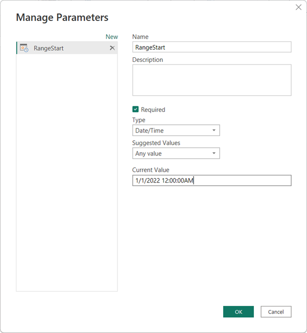
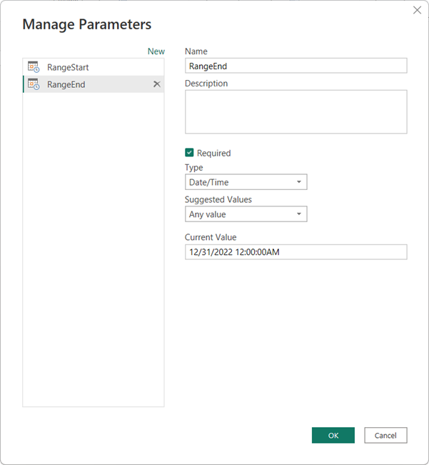
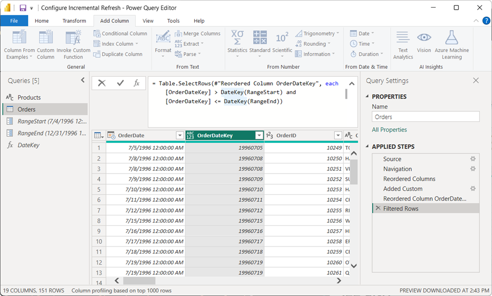

# Configure incremental refresh and real-time data

This article describes how to configure incremental refresh and real-time data for **datasets**. To learn about configuring incremental refresh for dataflows, see [Premium features of dataflows - Incremental refresh](../transform-model/dataflows/dataflows-premium-features.md#incremental-refresh).

Configuring incremental refresh includes creating RangeStart and RangeEnd parameters, applying filters, and defining an incremental refresh policy. After publishing to the service, you perform an initial refresh operation on the dataset. The initial refresh operation, and subsequent refresh operations apply the incremental refresh policy you defined. Before completing these steps, be sure you fully understand the functionality described in [Incremental refresh and real-time data for datasets](incremental-refresh-overview.md).

## Create parameters

In this task, use Power Query Editor to create RangeStart and RangeEnd parameters with default values. The default values apply only when filtering the data to be loaded into the model in Power BI Desktop. The values you enter should include only a small amount of the most recent data from your data source. When published to the service, these values are overridden by the incremental refresh policy.

1. In Power BI Desktop, click **Transform data** to open Power Query Editor.

1. Click **Manage Parameters** > **New Parameter**.

1. In **Manage Parameters** > **Name**, type **RangeStart** (case sensitive), then in **Type**, select **Date/Time**, and then in **Current Value** enter a start date/time value.

    

1. Create a second parameter named **RangeEnd**. In **Type**, select **Date/Time**, and then in **Current Value** enter an end date/time value.

    

Now that you have RangeStart and RangeEnd parameters, you then filter the data to be loaded into the model based on those parameters.

## Filter data

> [!NOTE]
> Before continuing with this task, verify your source table has a date column of Date/Time data type. If not, but has a date column of integer surrogate keys in the form of `yyyymmdd`, follow the steps in [**Convert DateTime to integer**](#convert-datetime-to-integer) later in this article to create a function that converts the date/time value in the parameters to match the integer surrogate key of the source table.

With RangeStart and RangeEnd parameters defined, apply a filter based on *conditions* in the RangeStart and RangeEnd parameters.

1. In Power Query Editor, select the date column you want to filter on, and then click the filter icon > **Date/Time Filters** > **Custom Filter**.

1. In **Filter Rows**, to specify the first condition, select **is after** or **is after or equal to**, then select **Parameter**, and then select **RangeStart**.

    To specify the second condition, if you selected **is after** in the first condition, then select **is before or equal to**, or if you selected **is after or equal to** in the first condition, then select **is before** for the second condition, then select **Parameter**, and then select **RangeEnd**. For example,

    

   **Important:** Verify queries have an equal to (=) on either RangeStart or RangeEnd, but not both. If the equal to (=) exists on both parameters, a row could satisfy the conditions for two partitions, which could lead to duplicate data in the model. For example, `#"Filtered Rows" = Table.SelectRows(dbo_Fact, each [OrderDate] >= RangeStart and [OrderDate] <= RangeEnd)` could result in duplicate data.

    Click **OK** to close.

1. In Power Query Editor, click **Close & Apply**. Power Query will then load data based on the filters defined in the RangeStart and RangeEnd parameters, and any other filters you defined.

    Power Query loads only data specified between the RangeStart and RangeEnd parameters. Depending on the amount of data in that period, load should go quickly. If it seems slow and process intensive, it's likely [the query is not folding](incremental-refresh-troubleshoot.md).

## Define policy

After you've defined RangeStart and RangeEnd parameters, and filtered data based on those parameters, you define an incremental refresh policy. The policy is applied only after the model is published to the service and a manual or scheduled refresh operation is performed.

1. In Data view > **Fields** > open the context menu for the table, and then click **Incremental refresh**.

    

1. In **Incremental refresh and real-time data** > **Select table**, verify or select the table. By default, the Select table listbox defaults to the table you select in Data view.

1. Specify required settings:
    
    In **Set import and refresh ranges** > **Incrementally refresh this table** click the slider to **On**. If the slider is disabled, it means the Power Query expression for the table does not include a filter based on the RangeStart and RangeEnd parameters.

    In **Archive data starting:**, specify the historical *store* period you want to include in the dataset. All rows with dates in this period will be loaded into the dataset in the service, unless other filters apply.

    In **Incrementally refresh data starting:**, specify the *refresh* period. All rows with dates in this period will be refreshed in the dataset each time a manual or scheduled refresh operation is performed.

1. Specify optional settings:

    In **Choose optional settings**, select **Get the latest data in real time with DirectQuery (Premium only)** to include the latest data changes that occurred at the data source after the last refresh period. This setting causes the incremental refresh policy to add a DirectQuery partition to the table.

    Select **Only refresh complete days** to refresh only whole days. If the refresh operation detects a day is not complete, rows for that whole day are not refreshed. This option is automatically enabled if you select **Get the latest data in real time with DirectQuery (Premium only)**.

    Select **Detect data changes** to specify a date/time column used to identify and refresh only the days where the data has changed. A date/time column must exist, usually for auditing purposes, at the data source. This **should not be the same column** used to partition the data with the RangeStart and RangeEnd parameters. The maximum value of this column is evaluated for each of the periods in the incremental range. If it has not changed since the last refresh, the current period is not refreshed. For datasets published to Premium capacities, you can also specify a custom query. To learn more, see [Advanced incremental refresh - Custom queries for detect data changes](incremental-refresh-xmla.md#custom-queries-for-detect-data-changes).
    
    Depending on your settings, your policy should look something like this:

    :::image type="content" source="media/incremental-refresh-overview/incremental-refresh-dialog-02.png" alt-text="Define policy dialog":::

1. Review your settings and then click **Apply** to complete the refresh policy. Source data is not loaded with this step.

## Save and publish to the service

When your RangeStart and RangeEnd parameters, filtering, and refresh policy settings are complete, be sure to save your model, and then publish to the service. If your dataset will become large, be sure to enable [Large dataset storage format](../admin/service-premium-large-models.md) *prior* to invoking the first refresh in the service.

## Refresh dataset

In the service, refresh the dataset. The first refresh will load both new and updated data in the refresh period as well historical data for the entire store period. Depending on the amount of data, this can take quite a long time.  Subsequent refreshes, either manual or scheduled are typically much faster because the incremental refresh policy is applied and only data for the period specified in the refresh policy setting is refreshed.

## Convert DateTime to integer

This task is only required if your table uses integer surrogate keys instead of Date/Time values in the date column you wish to use for the RangeStart/RangeEnd filter definition.

The data type of the RangeStart and RangeEnd parameters must be of date/time data type regardless of the data type of the date column. However, for many data sources, tables don't have a column of date/time data type but instead have a date column of integer surrogate keys in the form of `yyyymmdd`. You typically cannot convert these integer surrogate keys to the Date/Time data type because the result would be a non-folding query expression, but you can create a function that converts the date/time value in the parameters to match the integer surrogate key of the data source table without losing foldability. The function is then called in a filter step. This step is required if the data source table contains *only* a surrogate key as integer data type.

1. In Power Query Editor, click **Get data** > **Blank Query**.

1. In **Query Settings**, type a name, for example, DateKey, and then in the formula editor, enter the following formula:

    `= (x as datetime) => Date.Year(x)*10000 + Date.Month(x)*100 + Date.Day(x)`

    

1. To test the formula, in **Enter Parameter**, enter a date\time value, and then click **Invoke**. If the formula is correct, an integer value for the date is returned. After verifying, delete the invoked function query.

1. In **Queries**, select the table, and then edit the query formula to call the function with the RangeStart and RangeEnd parameters. For example,

    `= Table.SelectRows(#"Sorted Rows", each [OrderDateKey] > DateKey(RangeStart) and [OrderDateKey] <= DateKey(RangeEnd))`

    

## See also

[Troubleshoot configuring incremental refresh](incremental-refresh-troubleshoot.md#configuring-in-power-bi-desktop)  
[Advanced incremental refresh with the XMLA endpoint](incremental-refresh-xmla.md)  
[Configure scheduled refresh](../connect-data/refresh-scheduled-refresh.md)  
