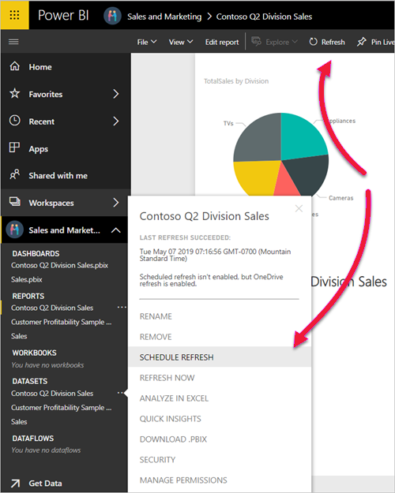
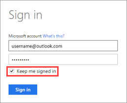

# Refresh a dataset stored on OneDrive or SharePoint Online
Importing files from OneDrive or SharePoint Online into the Power BI service is a great way to make sure your work in Power BI Desktop stays in sync with the Power BI service.

## Advantages of storing a Power BI Desktop file on OneDrive or SharePoint Online
When you store a Power BI Desktop file on OneDrive or SharePoint Online, any data you’ve loaded into your file’s model is imported into the dataset. Any reports you’ve created from the file are loaded into **Reports** in the Power BI service. Let's say you make changes to your file on OneDrive or SharePoint Online. These changes can include adding new measures, changing column names, or editing visualizations. Once you save the file, Power BI service syncs with those changes too, usually within about an hour.

>[!NOTE]
> * On demand and automatic dataset refresh from *.pbix* files stored on OneDrive or SharePoint Online is not supported in the following scenarios, and will fail.
>
>    * Protected live-connected *.pbix* files.
>    * Protected Azure Analysis Services *.pbix* files.
>    * When the *.pbix* file has had a new sensitivity label applied that the dataset owner doesn't have usage rights to.
>    * If the dataset owner's access token for OneDrive/SharePoint has expired.

You can do a one-time, manual refresh right in Power BI Desktop by selecting **Refresh** on the **Home** ribbon. When you select **Refresh**, you refresh the file’s model with updated data from the original data source. This kind of refresh happens entirely from within the Power BI Desktop application itself. It's different from a manual or scheduled refresh in Power BI, and it’s important to understand the distinction.

When you import your Power BI Desktop file from OneDrive or SharePoint Online, you load data and model information into a dataset in Power BI. You'll want to refresh the dataset in the Power BI service because that's what your reports are based on. Because the data sources are external, you can manually refresh the dataset by using **Refresh now** or you can set up a refresh schedule by using **Schedule refresh**. 

When you refresh the dataset, Power BI doesn't connect to the file on OneDrive or SharePoint Online to query for updated data. It uses information in the dataset to connect directly to the data sources and query for updated data. Then, it loads that data into the dataset. This refreshed data in the dataset isn't synchronized back to the file on OneDrive or SharePoint Online.

## What’s supported?
Power BI supports **Refresh** and **Schedule refresh** for datasets created from Power BI Desktop files imported from a local drive where you use **Get data** or **Power Query Editor** to connect to and load data from the following data sources.

> [!NOTE]
> Onedrive refresh for live connection datasets is supported. However, changing the live connection dataset, from one dataset to another in an already published report, is not supported in the OneDrive refresh scenario.

### Power BI Gateway - Personal
* All online data sources shown in Power BI Desktop’s **Get data** and **Power Query Editor**.
* All on-premises data sources shown in Power BI Desktop’s **Get data** and **Power Query Editor** except for Hadoop File (HDFS) and Microsoft Exchange.

<!-- Refresh Data sources-->
[!INCLUDE [refresh-datasources](../includes/refresh-datasources.md)]

> [!NOTE]
> A gateway must be installed and running in order for Power BI to connect to on-premises data sources and refresh the dataset.

## OneDrive or OneDrive for Business. What’s the difference?
If you have both a personal OneDrive and OneDrive for Business, you should keep any files you want to import into Power BI in OneDrive for Business. Here’s why: You likely use two different accounts to sign into them.

When you connect to OneDrive for Business in Power BI, connection is easy because your Power BI account is often the same account as your OneDrive for Business account. With personal OneDrive, you usually sign in with a different [Microsoft account](https://account.microsoft.com).

When you sign in with your Microsoft account, be sure to select **Keep me signed in**. Power BI can then synchronize any updates you make in the file in Power BI Desktop with datasets in Power BI.

If you've changed your Microsoft credentials, you can't synchronize changes between your file on OneDrive and the dataset in Power BI. You need to connect to and import your file again from OneDrive.

## How do I schedule refresh?
When you set up a refresh schedule, Power BI connects directly to the data sources. Power BI uses connection information and credentials in the dataset to query for updated data. Then Power BI loads the updated data into the dataset. It then updates any report visualizations and dashboards based on that dataset in the Power BI service.

For details on how to set up schedule refresh, see [Configure scheduled refresh](refresh-scheduled-refresh.md).

## When things go wrong
When things go wrong, it’s usually because Power BI can’t sign into data sources. Things may also go wrong if the dataset tries to connect to an on-premises data source but the gateway is offline. To avoid these issues, make sure Power BI can sign into data sources. Try signing into your data sources in **Data Source Credentials**. Sometimes the password you use to sign into a data source changes or Power BI gets signed out from a data source.

When you save your changes to the Power BI Desktop file on OneDrive and you don't see those changes in Power BI within an hour or so, it could be because Power BI can't connect to your OneDrive. Try connecting to the file on OneDrive again. If you’re prompted to sign in, make sure you select **Keep me signed in**. Because Power BI wasn't able to connect to your OneDrive to synchronize with the file, you’ll need to import your file again.

Be sure to leave the **Send refresh failure notification email to me** checked. You’ll want to know right away if a scheduled refresh fails.

## Troubleshooting
Sometimes refreshing data may not go as expected. You'll typically run into data refresh issues when you're connected with a gateway. Take a look at the gateway troubleshooting articles for tools and known issues.

[Troubleshooting the On-premises data gateway](service-gateway-onprem-tshoot.md)

[Troubleshooting the Power BI Gateway - Personal](service-admin-troubleshooting-power-bi-personal-gateway.md)

More questions? Try asking the [Power BI Community](https://community.powerbi.com/).
