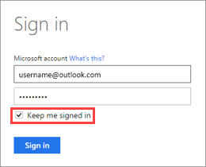
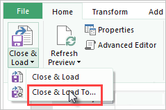

# Refresh a dataset created from an Excel workbook on OneDrive or SharePoint Online

You can import Excel workbooks from your local machine, or from cloud storage such as OneDrive for Business or SharePoint Online. This article explores the advantages of using cloud storage for your Excel files. For more information on how to import Excel files into Power BI, see [Get data from Excel workbook files](service-excel-workbook-files.md).

## What are the advantages?

When you import files from OneDrive, or SharePoint Online, it ensures the work you’re doing in Excel stays in-sync with the Power BI service. Any data that you’ve loaded into your file’s model then imports into the dataset. Any reports you’ve created in the file load into Reports in Power BI. If you make and save changes to your file on OneDrive or SharePoint Online, those changes update in Power BI. For example, if you add new measures, change column names, or edit visualizations, the changes then update in Power BI. Your changes typically update within an hour after you've saved them.

When you import an Excel workbook from your personal OneDrive, any data in the workbook imports into a new dataset in Power BI. For example, tables in worksheets, data loaded into the Excel data model, and the structure of the data model import into a new dataset. Power BI automatically connects to the workbook on OneDrive, or SharePoint Online, approximately every hour to check for updates. If the workbook is changed, Power BI refreshes the dataset and reports in the Power BI service.

You can refresh the dataset in the Power BI service. When you manually refresh or schedule refresh on the dataset, Power BI connects directly to the external data sources to query for any updated data. It then loads updated data into the dataset. Refreshing a dataset from within Power BI doesn't refresh the data in the workbook on OneDrive or SharePoint Online.

## What’s supported?

In Power BI, **Refresh Now** and **Schedule Refresh** are supported for datasets created from Power BI Desktop files imported from a local drive where Get data/Power Query Editor is used to connect to and load data from any of the following data sources:  

### Power BI Gateway - Personal

* All online data sources shown in Power BI Desktop’s Get data and Power Query Editor.
* All on-premises data sources shown in Power BI Desktop’s Get data and Power Query Editor except for Hadoop file (HDFS) and Microsoft Exchange.

<!-- Refresh Data sources-->
[!INCLUDE [refresh-datasources](../includes/refresh-datasources.md)]

> [!NOTE]
> A gateway must be installed and running in order for Power BI to connect to on-premises data sources and refresh the dataset.
>
>

## Difference between OneDrive or OneDrive for Business

If you have both a personal OneDrive and OneDrive for Business, it’s recommended you keep any files you want to import into Power BI in OneDrive for Business. Here’s why: You likely use two different accounts to sign into your accounts.

Connecting to OneDrive for Business in Power BI is typically seamless because the same account you use to sign into Power BI is often the same account used to sign into OneDrive for Business. But, with personal OneDrive, you'll likely sign in with a different [Microsoft account](https://account.microsoft.com).

When you sign in with your Microsoft account, be sure to select **Keep me signed in**. Power BI can then synchronize any updates you make in the file in Power BI Desktop with datasets in Power BI.  

If your Microsoft account credentials have changed, edits to your file on OneDrive can't be synchronized with the dataset or reports in Power BI. You’ll need to reconnect and import the file again from your personal OneDrive.

## Options for connecting to Excel file

When you connect to an Excel workbook in OneDrive for Business, or SharePoint Online, you have two options for getting your workbook into Power BI.

[**Import Excel data into Power BI**](service-excel-workbook-files.md#import-or-connect-to-an-excel-workbook-from-power-bi) – When you import an Excel workbook from your OneDrive for Business, or SharePoint Online, it works as described above.

[**Connect, Manage, and View Excel in Power BI**](service-excel-workbook-files.md#one-excel-workbook--two-ways-to-use-it) – When using this option, you create a connection from Power BI right to your workbook on OneDrive for Business, or SharePoint Online.

When you connect to an Excel workbook this way, a dataset isn't created in Power BI. But the workbook appears in the Power BI service under Reports with an Excel icon next to the name. Unlike with Excel Online, when you connect to your workbook from Power BI, if your workbook has connections to external data sources that load data into the Excel data model, you can set up a refresh schedule.

When you set up a refresh schedule this way, the only difference is refreshed data goes into the workbook’s data model on OneDrive, or SharePoint Online, rather than a dataset in Power BI.

## How do I make sure data is loaded to the Excel data model?

When you use Power Query (**Get & Transform** in Excel 2016) to connect to a data source, you have several options where to load the data. To make sure you load data into the data model, you must select the **Add this data to the Data Model** option in the **Load To** dialog box.

> [!NOTE]
> The images here show Excel 2016.
>
>

In **Navigator**, select **Load To…**  

Or, If you select **Edit** in **Navigator**, you’ll open the Query Editor. There you can select **Close & Load To….**  

Then in **Load To**, make sure you select **Add this data to the Data Model**.  

### What if I use Get External Data in Power Pivot?

No problem. Whenever you use Power Pivot to connect to and query data from an on-premises or online data source, the data is automatically loaded to the data model.

## How do I schedule refresh?

When you set up a refresh schedule, Power BI connects directly to the data sources using connection information and credentials in the dataset to query for updated data, then loads the updated data into the dataset. Any visualizations in reports and dashboards based on that dataset in the Power BI service are also updated.

For details on how to set up scheduled refresh, see [Configure scheduled refresh](refresh-scheduled-refresh.md).

## When things go wrong

When things go wrong, it’s usually because Power BI can’t sign into data sources. Or it's because the dataset connects to an on-premises data source and the gateway is offline. Be sure Power BI can sign into data sources. If a password you use to sign into a data source changes, or Power BI gets signed out from a data source, be sure to sign into your data sources again in Data Source Credentials.

Be sure to leave the **Send refresh failure notification email to me** selected. You’ll want to know right away if a scheduled refresh fails.

## Important notes

Refresh isn't supported for OData feeds connected to and queried from Power Pivot. When using an OData feed as a data source, use Power Query.

## Troubleshooting

Sometimes refreshing data might not go as expected. Typically, a problem with refreshing is an issue with the data gateway. Take a look at the following gateway troubleshooting articles for tools, tips, and known issues.

- [Troubleshoot the On-premises data gateway](service-gateway-onprem-tshoot.md)
- [Troubleshoot the Power BI Gateway - Personal](service-admin-troubleshooting-power-bi-personal-gateway.md)

More questions? [Try the Power BI Community](https://community.powerbi.com/).
