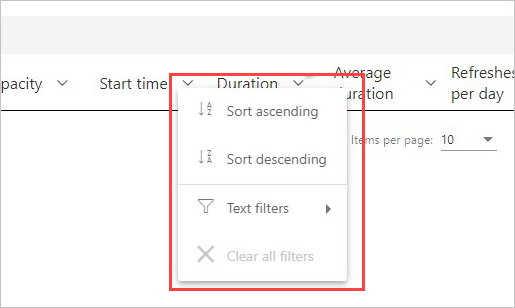

# Refresh summaries for Power BI

The Power BI **Refresh summary** page, found in the Power BI Admin portal, provides control and insight into your refresh schedules, capacities, and potential refresh schedule overlaps. You can use the refresh summary page to determine whether you should adjust refresh schedules, learn error codes associated with refresh issues, and properly manage your data refresh scheduling.

The refresh summaries page has two views:

- **History**. Displays the refresh summary history for Power BI Premium capacities for which you're an administrator.
- **Schedule**. Shows the schedule view for scheduled refresh, which also can uncover issues with time slots that are oversubscribed.

You can also export information about a refresh event to a *.csv* file, which can provide significant information and insight into refresh events or errors that can be impacting the performance or completion of scheduled refresh events.

The following sections look at each of these views in turn.

## Refresh history

You can select the **History** view by clicking on **History** in the refresh summaries page.

:::image type="content" source="media/refresh-summaries/refresh-summaries-01a.png" alt-text="Screenshot shows the History view in Refresh summary in the Power BI admin portal." lightbox="media/refresh-summaries/refresh-summaries-01a.png":::

The **History** provides an overview of the outcomes of recently scheduled refreshes on the capacities for which you have admin privilege. You can sort the view by any column by selecting the column. You can choose to sort the view by the column selected by ascending order, descending, or by using text filters.

In history view, the data associated with a given refresh is based on up 60 most recent records for each scheduled refresh.

You can also export information for any scheduled refresh to a *.csv* file, which includes detailed information including error messages for each refresh event. Exporting to a *.csv* file lets you sort the file based on any of the columns, search for words, sort based on error codes or owners, and so on. The following image shows an example exported *.csv* file.

:::image type="content" source="media/refresh-summaries/refresh-summaries-05.jpg" alt-text="Screenshot shows an example export file." lightbox="media/refresh-summaries/refresh-summaries-05.jpg":::

With the information in the exported file, you can review the capacity, duration, and any error messages recorded for the instance of refresh.

## Refresh schedule

You can select the **Schedule** view by selecting **Schedule** in refresh summaries. The **Schedule** view displays scheduling information for the week, broken down into 30-minute time slots.

:::image type="content" source="(media/refresh-summaries/refresh-summaries-02a.png" alt-text="Screenshot shows the schedule tab of the Refresh schedule page in close up." lightbox="(media/refresh-summaries/refresh-summaries-02a.png":::

The **Schedule** view is very useful in determining whether the refresh events scheduled are properly spaced, allowing for all refreshes to complete without overlap, or whether you have scheduled refresh events that are taking too long and creating resource contention. If you find such resource contention, you should adjust your refresh schedules to avoid the conflicts or overlap, so your scheduled refreshes can complete successfully.

:::image type="content" source="media/refresh-summaries/refresh-summaries-02.png" alt-text="Screenshot shows the schedule tab of the Refresh schedule page." lightbox="media/refresh-summaries/refresh-summaries-02.png":::

The **Refresh time booked (minutes)** column is a calculation of the average of up to 60 records for each associated dataset. The numeric value for each 30-minute time slot is the sum of minutes calculated for all scheduled refreshes scheduled to start on the time slot *and* any scheduled refreshes set to start on the *previous* time slot, but whose average duration overflows into the time slot that's selected.

The **Refresh time available (minutes)** column is a calculation of the minutes available for refresh in each time slot, minus whatever refresh is already scheduled for that time slot. For example, if your P2 subscription provides 12 concurrently running refreshes, you have 12 30-minute slots, so 12 refreshes x 30 minutes each = 360 minutes available for refresh in that time slot. If you have one refresh booked in that slot that takes 20 minutes, your **Refresh time available (minutes)** in that slot is 340 minutes (360 total minutes available, minus 20 minutes already booked = 340 minutes still available).

You can select a time slot and then select the associated **details** button to see which scheduled refresh events contribute to the refresh time booked, their owners, and how long they take to complete.

Let's look at an example, to see how this works. The following dialog is displayed when we select the 8:30 PM time slot for Sunday, and select **details**.

:::image type="content" source="media/refresh-summaries/refresh-summaries-04.png" alt-text="Screenshot shows details for the refreshes for a selected time." lightbox="media/refresh-summaries/refresh-summaries-04.png":::

There are three scheduled refresh events occurring in this time slot.

Scheduled refresh #1 and #3 are both scheduled for this 8:30 PM time slot, which we can determine by looking at the value in the **Scheduled time slot** column. Their average durations are 4:39 and six seconds (0:06) respectively. All is good there.

However, scheduled refresh #2 is scheduled for the 8:00 PM time slot, but because it takes an average of over 48 minutes to complete (seen in the **Average duration** column), that refresh event overflows into the next 30-minute time slot.

That's not good. The administrator in this case should contact the owners of that scheduled refresh instance and suggest they find a different time slot for that scheduled refresh, or reschedule the other refreshes so there's no overlap, or find some other solution to prevent such overlap.

## Next steps

- [Data refresh in Power BI](refresh-data.md)  
- [Power BI Gateway - Personal](service-gateway-personal-mode.md)  
- [On-premises data gateway (personal mode)](service-gateway-onprem.md)  
- [Troubleshooting the On-premises data gateway](service-gateway-onprem-tshoot.md)  
- [Troubleshooting the Power BI Gateway - Personal](service-admin-troubleshooting-power-bi-personal-gateway.md)  

More questions? [Try asking the Power BI Community](https://community.powerbi.com/)