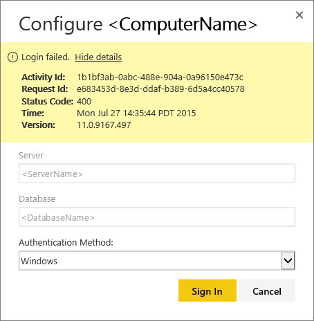
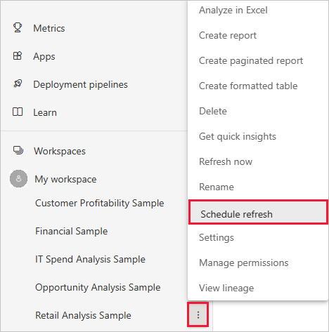
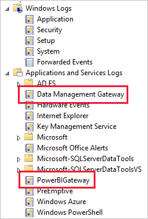
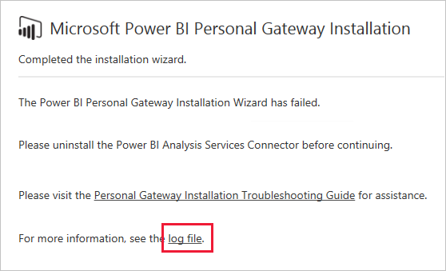

# Troubleshoot Power BI gateway (personal mode)

[!INCLUDE [gateway-rewrite](../includes/gateway-rewrite.md)]

The following sections go through some common issues you might come across when you use the Power BI on-premises data gateway (personal mode).

## Update to the latest version

The current version of the gateway for personal use is the on-premises data gateway (personal mode). Update your installation to use that version.

Many issues can surface when the gateway version is out of date. It's a good general practice to make sure you're on the latest version. If you haven't updated the gateway for a month or longer, consider installing the latest version of the gateway. Then see if you can reproduce the issue.

## Installation

**Gateway (personal mode) operates on 64-bit versions:** If your computer is a 32-bit version, you can't install the gateway (personal mode). Your operating system has to be a 64-bit version. Install a 64-bit version of Windows or install the gateway (personal mode) on a 64-bit computer.

**Operation timed out:** This message is common if the computer, physical or virtual machine, on which you’re installing the gateway (personal mode) has a single core processor. Close any applications, turn off any non-essential processes, and try installing again.

**Data management gateway or Analysis Services connector can't be installed on the same computer as gateway (personal mode):** If you already have an Analysis Services connector or a data management gateway installed, you must first uninstall the connector or the gateway. Then, try installing the gateway (personal mode).

> [!NOTE]
> If you encounter an issue during installation, the setup logs can provide information to help you resolve the issue. For more information, see [Setup logs](#SetupLogs).

**Proxy configuration:** You might see issues with configuring the gateway (personal mode) if your environment needs the use of a proxy. To learn more about how to configure proxy information, see [Configure proxy settings for the on-premises data gateway](/data-integration/gateway/service-gateway-proxy).

## Schedule refresh

**Error: The credential stored in the cloud is missing.**

You might get this error in settings for a dataset if you have a scheduled refresh and then you uninstalled and reinstalled the gateway (personal mode). When you uninstall a gateway (personal mode), the data source credentials for a dataset that was configured for refresh are removed from the Power BI service.

**Solution:** In the Power BI service, go to the refresh settings for a dataset. In **Manage Data Sources**, for any data source with an error, select **Edit credentials**. Then sign in to the data source again.

**Error: The credentials provided for the dataset are invalid. Please update the credentials through a refresh or in the Data Source Settings dialog to continue.**

**Solution:** If you get a credentials message, it could mean:

- The usernames and passwords that you used to sign in to data sources aren't up to date. In the Power BI service, go to refresh settings for the dataset. In **Manage Data Sources**, select **Edit credentials** to update the credentials for the data source.
- Mashups between a cloud source and an on-premises source, in a single query, fail to refresh in the gateway (personal mode) if one of the sources is using OAuth for authentication. An example of this issue is a mashup between CRM Online and a local SQL Server instance. The mashup fails because CRM Online requires OAuth.
  
  This error is a known issue, and it's being looked at. To work around the problem, have a separate query for the cloud source and the on-premises source. Then, use a merge or append query to combine them.

**Error: Unsupported data source.**

**Solution:** If you get an unsupported data source message in **Schedule Refresh** settings, it could mean:

- The data source isn't currently supported for refresh in the Power BI service.
- The Excel workbook doesn't contain a data model, only worksheet data. The Power BI service currently only supports refresh if the uploaded Excel workbook contains a data model. When you import data by using Power Query in Excel, choose the **Load** option to load data to a data model. This option ensures that data is imported into a data model.

**Error: [Unable to combine data] \<query part>/\<…>/\<…> is accessing data sources that have privacy levels, which cannot be used together. Please rebuild this data combination.**

**Solution:** This error is because of the privacy-level restrictions and the types of data sources you're using.

**Error: Data source error: We cannot convert the value "\[Table\]" to type Table.**

**Solution:** This error is because of the privacy-level restrictions and the types of data sources you're using.

**Error: There is not enough space for this row.**

**Solution:** This error occurs if you have a single row greater than 4 MB in size. Find the row from your data source, and attempt to filter it out or reduce the size for that row.

## Data sources

**Missing data provider:** The gateway (personal mode) operates on 64-bit versions only. It requires a 64-bit version of the data providers to be installed on the same computer where the gateway (personal mode) is installed. For example, if the data source in the dataset is Microsoft Access, you must install the 64-bit ACE provider on the same computer where you installed the gateway (personal mode).

> [!NOTE]
> If you have a 32-bit version of Excel, you can't install a 64-bit version ACE provider on the same computer.

**Windows authentication is not supported for Access database:** The Power BI service currently only supports Anonymous authentication for the Access database.

**Error: Sign-in error when you enter credentials for a data source:** If you get an error like this one when you enter Windows credentials for a data source:

You might still be on an older version of the gateway (personal mode).

**Solution:** For more information, see [Install the latest version of Power BI gateway (personal mode)](https://powerbi.microsoft.com/gateway/).

**Error: Sign-in error when you select Windows authentication for a data source using ACE OLEDB:** If you get the following error when you enter data source credentials for a data source using an ACE OLEDB provider:

The Power BI service doesn't currently support Windows authentication for a data source using an ACE OLEDB provider.

**Solution:** To work around this error, select **Anonymous authentication**. For a legacy ACE OLEDB provider, anonymous credentials are equal to Windows credentials.

## Tile refresh

If you receive an error when dashboard tiles refresh, see [Troubleshooting tile errors](refresh-troubleshooting-tile-errors.md).

## Tools for troubleshooting

### Refresh history

With **Refresh history**, you can see what errors occurred and find useful data if you need to create a support request. You can view both scheduled and on-demand refreshes. Here's how you get to **Refresh history**.

1. In the Power BI service navigation pane, in **Datasets**, select a dataset. Open the **More options (...)** menu, and select **Schedule refresh**.

   

1. In **Settings for...**, select **Refresh history**. 

   

   

### Event logs

Several event logs can provide information. The first two, **Data Management Gateway** and **PowerBIGateway**, are present if you're an admin on the machine. If you're not an admin, and you're using the data gateway (personal mode), you'll see the log entries within the **Application** log.

The **Data Management Gateway** and **PowerBIGateway** logs are present under **Application and Services Logs**.

### Fiddler trace

[Fiddler](https://www.telerik.com/fiddler) is a free tool from Telerik that monitors HTTP traffic. You can see the communication with the Power BI service from the client machine. This communication might show errors and other related information.

### Setup logs

If the gateway (personal mode) fails to install, you'll see a link to show the setup log. The setup log can show you details about the failure. These logs are Windows Install logs, also known as MSI logs. They can be fairly complex and hard to read. Typically, the resulting error is at the bottom, but determining the cause of the error isn't trivial. It could be a result of errors in a different log. It could also be a result of an error higher up in the log.

Or, you can go to your Temp folder (*%temp%*) and look for files that start with *Power\_BI\_*.

> [!NOTE]
> Going to *%temp%* might take you to a subfolder of Temp. The *Power\_BI\_* files are in the root of the Temp directory. You might need to go up a level or two.

## Next steps

- [Configure proxy settings for the on-premises data gateway](/data-integration/gateway/service-gateway-proxy)
- [Data refresh in Power BI](refresh-data.md)  
- [Use personal gateways in Power BI](service-gateway-personal-mode.md)  
- [Troubleshooting tile errors](refresh-troubleshooting-tile-errors.md)  
- [Troubleshoot gateways - Power BI](service-gateway-onprem-tshoot.md)

More questions? Try asking the [Power BI Community](https://community.powerbi.com/).
