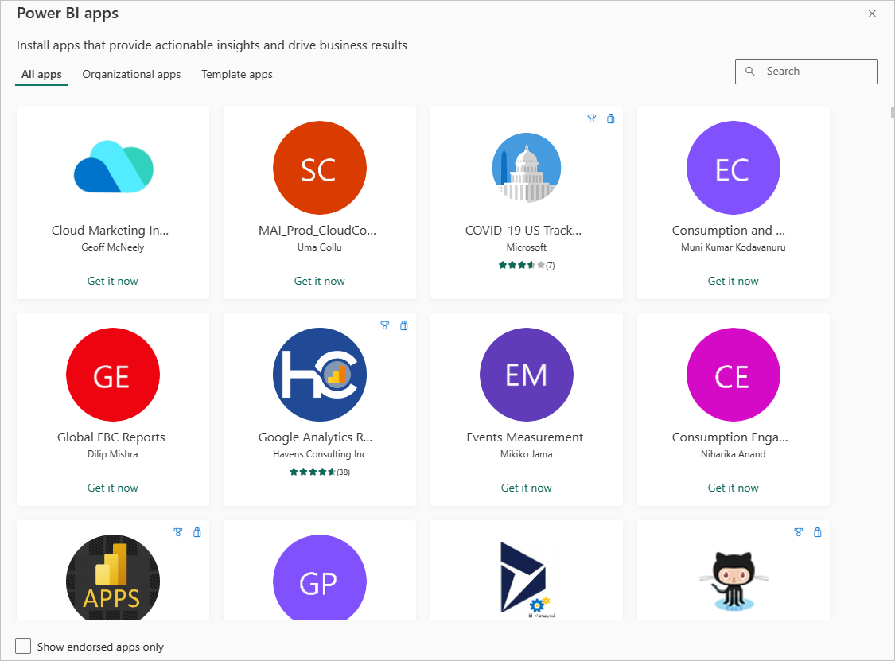
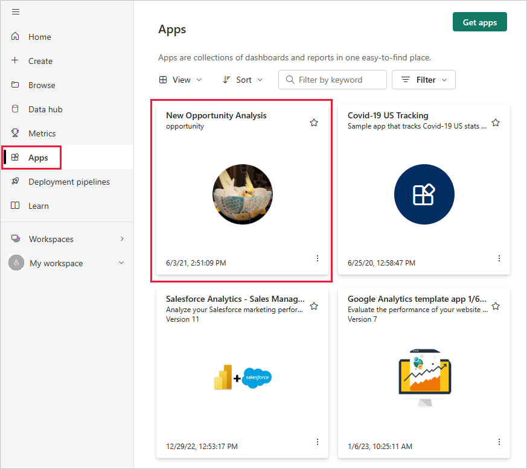
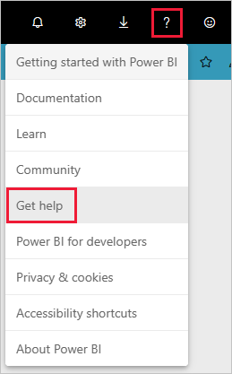

# Connect to the services you use with Power BI

With Power BI, you can connect to many of the services you use to run your business, such as Salesforce, Microsoft Dynamics, and Google Analytics. Power BI starts by using your credentials to connect to the service. It creates a Power BI *workspace* with a dashboard and a set of Power BI reports that automatically show your data and provide visual insights about your business.

Sign in to Power BI to view all of the services you can connect to. Select **Apps** > **Get apps**.

After you install the app, you can view the dashboard and reports in the app and the workspace in the Power BI service ([https://powerbi.com](https://powerbi.com)). You can also view them in the Power BI mobile apps. In the workspace, you can modify the dashboard and reports to meet the needs of your organization, and then distribute them to your colleagues as an *app*.

## Get started

[!INCLUDE [powerbi-service-apps-get-more-apps](../includes/powerbi-service-apps-get-more-apps.md)]

## Edit the dashboard and reports

When the import is complete, the new app appears on the Apps page.

1. Select **Apps** in the navigation pane, then choose the app.

   

2. You can ask a question by typing in the Q&A box, or select a tile to open the underlying report.

   

   Change the dashboard and report to fit the needs of your organization. Then [distribute your app to your colleagues](../collaborate-share/service-create-distribute-apps.md)

## What's included

After connecting to a service, you see a newly created app and workspace with a dashboard, reports, and semantic model. The data from the service is focused on a specific scenario and might not include all the information from the service. The data is scheduled to refresh automatically once per day. You can control the schedule by selecting the semantic model.

You can also [connect to many services in Power BI Desktop](desktop-data-sources.md), such as Google Analytics, and create your own customized dashboards and reports.  

For more information on connecting to specific services, see the individual help pages.

## Troubleshooting

**Empty tiles:** While Power BI is first connecting to the service, you might see an empty set of tiles on your dashboard. If you still see an empty dashboard after two hours, it's likely the connection failed. If you didn't see an error message with information on correcting the issue, file a support ticket.

* Select the question mark icon (**?**) in the upper-right corner >  **Get help**.

  

**Missing information:** The dashboard and reports include content from the service focused on a specific scenario. If you're looking for a specific metric in the app and don't see it, add an idea on the [Power BI Support](https://support.powerbi.com/forums/265200-power-bi) page.

## Suggesting services

Do you use a service you'd like to suggest for a Power BI app? Go to the [Power BI Support](https://support.powerbi.com/forums/265200-power-bi) page and let us know.

If you're interested in creating template apps to distribute yourself, see [Create a template app in Power BI](service-template-apps-create.md). Power BI partners can build Power BI apps with little or no coding, and deploy them to Power BI customers.

## Next steps

* [Distribute apps to your colleagues](../collaborate-share/service-create-distribute-apps.md)
* [Create workspaces in Power BI](../collaborate-share/service-create-the-new-workspaces.md)
* Questions? [Try asking the Power BI Community](https://community.powerbi.com/)
