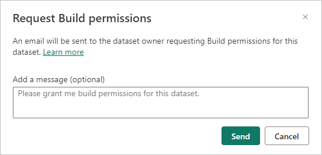
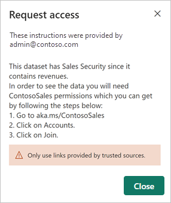

# Build permission for shared datasets

When you create a report in Power BI Desktop, the data in that report is stored in a *data model*. When you publish your reports to the Power BI service, you're also publishing the data as a *dataset*. You can give others *Build permission* for that report, so they can discover and reuse the dataset you've shared. This article explains how you control access to the data by using the Build permission.

Build permission applies to datasets. When you give users Build permission, they can build new content on your dataset, such as reports, dashboards, pinned tiles from Q&A, paginated reports, and Insights Discovery. 

Users also need Build permissions to work with the data *outside* Power BI:

- To export the underlying data.
- To build new content on the dataset such as with [Analyze in Excel](../collaborate-share/service-analyze-in-excel.md).
- To access the data via the XMLA endpoint.

## Ways to give Build permission

You give Build permission for a dataset in a few different ways:

- Members of a workspace with at least a Contributor role automatically have Build permission for datasets in that workspace, and permission to copy a report. Read more about [roles in the new workspaces](../collaborate-share/service-new-workspaces.md#roles-in-the-new-workspaces).
 
- Members of the workspace where the dataset resides can assign the permission to specific users or security groups in the Permission center. If you're a member of the workspace, select **More options** (...) next to a dataset > **Manage Permissions**.

    

    That opens the Permission center for that dataset, where you can set and change permissions.

    

- An admin or member of the workspace where the dataset resides can decide during app publishing that users with permission for the app also get Build permission for the underlying datasets. See [Share a dataset](service-datasets-share.md) for details.

- Say you have Reshare and Build permission on a dataset. When you share a report or dashboard built on that dataset, you can specify that the recipients also get Build permission for the underlying dataset.

    

You can remove a person's Build permission for a dataset. If you do, they can still see the report built on the shared dataset, but they can no longer edit it. See the next section for details.

## Remove Build permission for a dataset

At some point, you may need to remove Build permission for some users of a shared dataset. 

1. In a workspace, go to the **Datasets** list page. 
1. Select **More options** (...) next to the dataset > **Manage permission**.

    

1. Select **More options** (...) next to a name > **Remove build**.

    

    They can still see the report built on the shared dataset, but they can no longer edit it.

### Remove Build permission for a dataset in an app

Say you've distributed an app from a workspace to a group of people. Later, you decide to remove access to the app for some people. Removing their access to the app doesn't automatically remove their build and reshare permissions. That's an extra step. 

1. In a workspace list page, select **Update app**. 

    

1. On the **Permissions** tab, select the **X** to delete the person or group. 

    
1. Select **Update app**.

    You see a message explaining that you need to go to **Manage permissions** to remove Build permission for users with existing access. 

    

1. Select **Update**.

1. In the workspace, go to the **Datasets** list page. 
1. Select **More options** (...) next to the dataset > **Manage permission**.

    

1. Select **More options** (...) next to their name > **Remove build**.

    

    They can still see the report built on the shared dataset, but they can no longer edit it.

## Configure how users request Build permission

Certain actions, such as creating a report on top of a dataset or accessing the details page of a dataset in the datasets hub, require [Build permission](service-datasets-build-permissions.md) on the dataset. By default, when a user who doesn't have this permission tries to do such an action, they get a dialog that enables them to send a request for Build permission by email to the dataset owner. The email will include the user's details, the name of the dataset they’re requesting access to, and any other information they optionally provide.

 
### Changing the access request behavior

If you have an [Admin, Member, or Contributor role](../collaborate-share/service-new-workspaces.md#roles-in-the-new-workspaces) on the workspace where the dataset is located, you can change the default access request behavior using the Request access options that are available in the dataset settings.

 
The first option is the default option described at the beginning of this article. Requests for Build permission on the dataset will come to you via email. When you get the request, you are responsible for acting on the request and notifying the requestor.

The second option allows you to provide instructions about how to get Build permission, rather than receiving requests via email. You might choose this option, for example, if your organization uses an automated system for handling access requests. When users try to perform an action that they need Build permission for, if they don’t have that permission, they will see a message containing the instructions you provide. The image below is an example of such a message.

 
Type only plain text in the text box in the Request access settings. HTML code snippets and any other type of code formatting will render as plain text rather than the intended format.

>[!NOTE]
> When you to provide specific instructions, your email address is also visible to users requesting access as shown in the illustration above.

## More granular permissions

Power BI provides the Build permission as a complement to the existing permissions, Read and Reshare. All users who already had Read permission for datasets via app permissions, sharing, or workspace access at that time also got Build permission for those same datasets. They got Build permission automatically because Read permission already granted them the right to build new content on top of the dataset, by using Analyze in Excel or Export.

With this more granular Build permission, you can choose who can only view the content in the existing report or dashboard and who can create content connected to the underlying datasets.

If your dataset is being used by a report outside the dataset workspace, you can't delete that dataset. Instead, you see an error message.

You can remove Build permission. If you do, the people whose permissions you have revoked can still see the report, but can no longer edit the report or export underlying data. Users with only read permission can still export summarized data. 

## Next steps

* [Use datasets across workspaces](service-datasets-across-workspaces.md)
* [Share a dataset](service-datasets-share.md)
* [Roles in the new workspaces](../collaborate-share/service-new-workspaces.md#roles-in-the-new-workspaces)
* Questions? [Try asking the Power BI Community](https://community.powerbi.com/)
