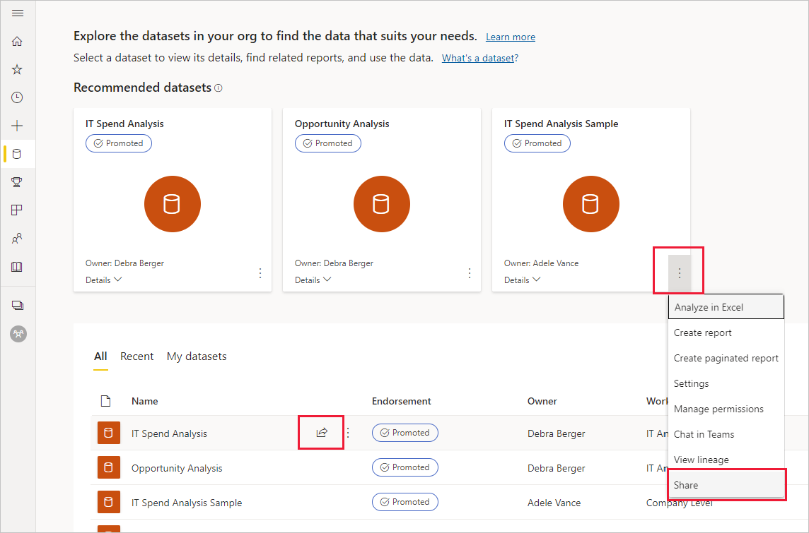
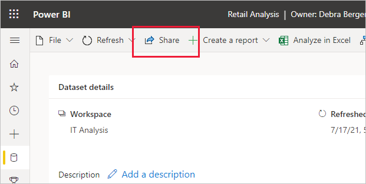
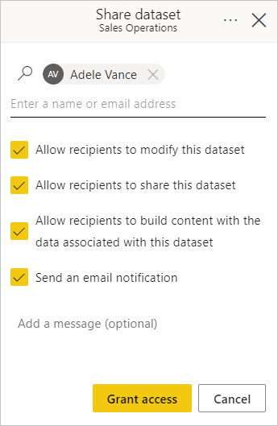

# Share access to a dataset

To make it possible for other users to take advantage of your dataset, you can grant them access to it sharing it. 

This document shows you how to grant access to your dataset using the **Share dataset** dialog. Besides the Share dataset dialog, there are a number of other ways users might get access to your dataset:

To share your dataset

1. On either the [datasets hub page](service-datasets-hub.md#find-the-dataset-you-need) or on the [dataset info page](service-datasets-hub.md#view-dataset-details-and-explore-related-reports), choose **Share** as follows:

    * **Datasets hub**: In the datasets list, click the **Share** icon. On a recommended dataset tile, choose **Share** on the **More options (…)** menu.

        

    * **Dataset info page**: Click the **Share** icon on the action bar at the top of the page.

        

1. In the **Share dataset** dialog that appears, enter the names of the users and/or security groups you want to grant access to, then choose the types of access you wish to grant.

    

    * **Allow recipients to share this dataset**: This option allows the recipients to grant access to other users via sharing.
    * **Allow recipients to build content with the data associated with this dataset**: This option allows the recipients to build new reports, datasets, and dashboards based on the data associated with this dataset.

        If you clear this checkbox, the user will get **read-only** permission on the dataset. Read-only permission allows them to explore the dataset on the [dataset's info page](service-datasets-hub.md#view-dataset-details-and-explore-related-reports) but doesn't allow them to build new content based on the dataset.
    * **Send an email notification**: Send an email to the recipients notifying them that they have been granted access to the dataset. You can add an optional message to the email message.

1. Click **Grant access**.

To monitor, change, or remove user access to your dataset, see [Manage dataset access permissions](service-datasets-manage-access-permissions.md).

Other ways users can have access to your dataset:

* Via [admin, member, or contributor roles](../collaborate-share/service-roles-new-workspaces.md) on the workspace where the dataset it located.
* Via [links that are generated for sharing reports](../collaborate-share/service-share-dashboards.md). Such links can enable access to the dataset underlying the shared report.
* Via an [app that allows you to connect to the underlying dataset](../collaborate-share/service-create-distribute-apps.md#publish-your-app).

You can monitor and modify access to your dataset on the [dataset access management page](service-datasets-manage-access-permissions.md).

## Next steps

* [Manage dataset access permissions](service-datasets-manage-access-permissions.md)
* [Use datasets across workspaces](service-datasets-across-workspaces.md)
* Questions? [Try asking the Power BI Community](https://community.powerbi.com/)
