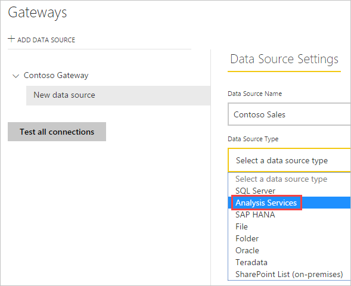
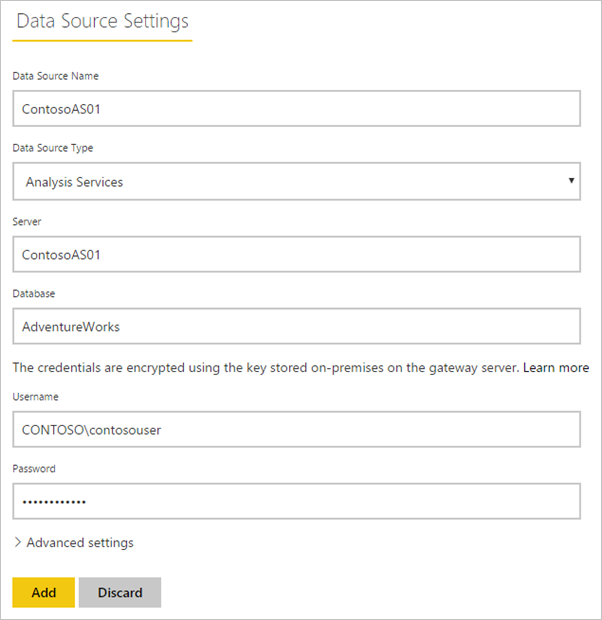
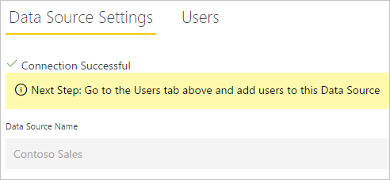
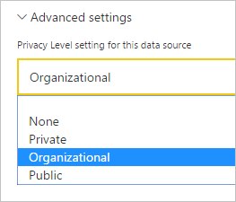
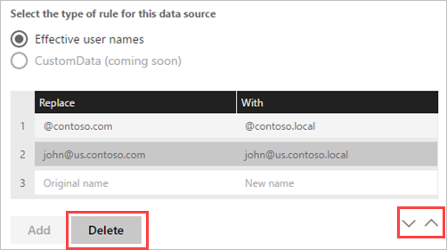
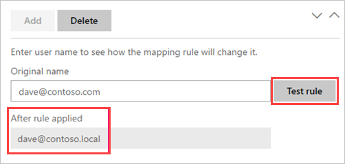
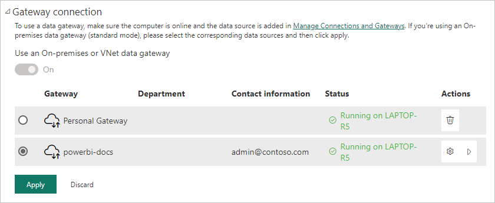

# Manage your data source - Analysis Services

[!INCLUDE [gateway-rewrite](../includes/gateway-rewrite.md)]

After you [install the on-premises data gateway](/data-integration/gateway/service-gateway-install), you need to [add data sources](service-gateway-data-sources.md#add-a-data-source) that can be used with the gateway. This article looks at how to work with gateways and SQL Server Analysis Services (SSAS) data sources that are used either for scheduled refresh or for live connections.

To learn more about how to set up a live connection to Analysis Services, [watch this video](https://www.youtube.com/watch?v=GPf0YS-Xbyo&feature=youtu.be).

> [!NOTE]
> If you have an Analysis Services data source, you need to install the gateway on a computer joined to the same forest/domain as your Analysis Services server.

> [!NOTE]
> The gateway only supports Windows authentication for Analysis Services.

## Add a data source

For information about how to add a data source, see [Add a data source](service-gateway-data-sources.md#add-a-data-source). Select **Analysis Services** for **Data Source Type** if you're connecting to either a multidimensional or tabular server.



Fill in the information for the data source, which includes **Server** and **Database**. The information that you enter for **Username** and **Password** is used by the gateway to connect to the Analysis Services instance.

> [!NOTE]
> The Windows account you enter must be a member of the Server Administrator role on the Analysis Services instance you're connecting to. If this account’s password is set to expire, users could get a connection error if the password isn’t updated for the data source. To learn more about how credentials are stored, see [Store encrypted credentials in the cloud](service-gateway-data-sources.md#store-encrypted-credentials-in-the-cloud).




After you fill in everything, select **Add**. You can now use this data source for scheduled refresh or live connections against an Analysis Services instance that's on-premises. You see *Connection Successful* if it succeeded.



### Advanced settings

Optionally, you can configure the privacy level for your data source. This setting controls how data can be combined. It's only used for scheduled refresh. The privacy-level setting doesn't apply to live connections. To learn more about privacy levels for your data source, see [Privacy levels (Power Query)](https://support.office.com/article/Privacy-levels-Power-Query-CC3EDE4D-359E-4B28-BC72-9BEE7900B540).



## User names with Analysis Services

<iframe width="560" height="315" src="https://www.youtube.com/embed/Qb5EEjkHoLg" frameborder="0" allowfullscreen></iframe>

Each time a user interacts with a report connected to Analysis Services, the effective user name is passed to the gateway and then passed on to your on-premises Analysis Services server. The email address that you use to sign in to Power BI is passed to Analysis Services as the effective user. It's passed in the connection property [EffectiveUserName](/analysis-services/instances/connection-string-properties-analysis-services#bkmk_auth). 

The email address must match a defined user principal name (UPN) within the local Active Directory domain. The UPN is a property of an Active Directory account. The Windows account must be present in an Analysis Services role. If a match can't be found in Active Directory, the sign-in isn't successful. To learn more about Active Directory and user naming, see [User naming attributes](/windows/win32/ad/naming-properties).

You can also [map your Power BI sign-in name with a local directory UPN](service-gateway-enterprise-manage-ssas.md#map-user-names-for-analysis-services-data-sources).

## Map user names for Analysis Services data sources

<iframe width="560" height="315" src="https://www.youtube.com/embed/eATPS-c7YRU" frameborder="0" allowfullscreen></iframe>

Power BI allows for mapping user names for Analysis Services data sources. You can configure rules to map a user name signed in with Power BI to a name that's passed for EffectiveUserName on the Analysis Services connection. The map user names feature is a great way to work around when your user name in Azure Active Directory (Azure AD) doesn't match a UPN in your local Active Directory instance. For example, if your email address is nancy@contoso.onmicrsoft.com, you map it to nancy@contoso.com and that value is passed to the gateway.

You can map user names for Analysis Services in two different ways:

* Manual user remapping
* On-premises Active Directory property lookup to remap Azure AD UPNs to Active Directory users (Active Directory lookup mapping)

It's possible to perform manual mapping by using the second approach, but doing so is time consuming and difficult to maintain. It's especially difficult when pattern matching doesn't suffice. Examples are when domain names are different between Azure AD and on-premises Active Directory or when user account names are different between Azure AD and Active Directory. That's why manual mapping with the second approach isn't recommended.

We describe these two approaches, in order, in the following two sections.

### Manual user name remapping

For Analysis Services data sources, you can configure custom UPN rules. Custom rules help you if your Power BI service sign-in names don't match your local directory UPN. For example, if you sign in to Power BI with john@contoso.com but your local directory UPN is john@contoso.local, you can configure a mapping rule to have john@contoso.local passed to Analysis Services.

To get to the UPN mapping screen, follow these steps.

1. Go to the gear icon, and select **Manage Gateways**.
2. Expand the gateway that contains the Analysis Services data source. Or, if you haven't created the Analysis Services data source, you can do that at this point.
3. Select the data source, and then select the **Users** tab.
4. Select **Map user names**.

    

You see options to add rules and test for a given user.

> [!NOTE]
> You might change a user that you didn't intend to change. For example, if **Replace (original value)** is contoso.com and **With (New name)** is @contoso.local, all users with a sign-in that contains @contoso.com are then replaced with @contoso.local. Also, if **Replace (Original name)** is dave@contoso.com and **With (New name)** is dave@contoso.local, a user with the sign-in of v-dave@contoso.com is sent as v-dave@contoso.local.

### Active Directory lookup mapping

To perform on-premises Active Directory property lookup to remap Azure AD UPNs to Active Directory users, follow the steps in this section. To begin with, let's review how this works.

In the Power BI service, the following occurs:

* For each query by a Power BI Azure AD user to an on-premises SSAS server, a UPN string is passed along, such as
       firstName.lastName@contoso.com.

> [!NOTE]
> Any manual UPN user mappings defined in the Power BI data source configuration are still applied *before* the user name string is sent to the on-premises data gateway.

In the on-premises data gateway with configurable custom user mapping, follow these steps.

1. Find Active Directory to search. You can use automatic or configurable.
2. Look up the attribute of the Active Directory person, such as Email, from the Power BI service. The attribute is based on an incoming UPN string like firstName.lastName@contoso.com.
3. If the Active Directory lookup fails, it attempts to use the passed-along UPN as EffectiveUser to SSAS.
4. If the Active Directory lookup succeeds, it retrieves UserPrincipalName of that Active Directory person.
5. It passes the UserPrincipalName email as EffectiveUser to SSAS, such as Alias@corp.on-prem.contoso.

To configure your gateway to perform the Active Directory lookup:

1. [Download and install the latest gateway](/data-integration/gateway/service-gateway-install).

2. In the gateway, change the on-premises data gateway service to run with a domain account instead of a local service account. Otherwise, the Active Directory lookup won’t work properly at runtime. Go to the [on-premises data gateway app](/data-integration/gateway/service-gateway-app) on your machine, and then go to **Service settings** > **Change service account**. Make sure you have the recovery key for this gateway because you need to restore it on the same machine unless you want to create a new gateway instead. Restart the gateway service for the change to take effect.

3. Go to the gateway’s installation folder, *C:\Program Files\On-premises* data gateway, as an administrator to ensure that you have write permissions. Open the *Microsoft.PowerBI.DataMovement.Pipeline.GatewayCore.dll.config* file.

4. Edit the following two configuration values according to *your* Active Directory attribute configurations for your Active Directory users. The following configuration values are examples. Specify the values based on your Active Directory configuration. These configurations are case sensitive, so make sure they match the values in Active Directory.

    

    If no value is provided for the ADServerPath configuration, the gateway uses the default global catalog. You can also specify multiple values for the ADServerPath. Each value must be separated by a semicolon, as shown in the following example:

    ```xml
    <setting name="ADServerPath" serializeAs="String">
        <value> >GC://serverpath1; GC://serverpath2;GC://serverpath3</value>
    </setting>
    ```

    The gateway parses the values for ADServerPath from left to right until it finds a match. If no match is found, the original UPN is used. Make sure the account that runs the gateway service (PBIEgwService) has query permissions to all Active Directory servers that you specify in ADServerPath.

    The gateway supports two types of ADServerPath, as shown in the following examples:

    **WinNT**

    ```xml
    <value="WinNT://usa.domain.corp.contoso.com,computer"/>
    ```

    **GC**

    ```xml
    <value> GC://USA.domain.com </value>
    ```

5. Restart the on-premises data gateway service for the configuration change to take effect.

### Work with mapping rules

To create a mapping rule, enter a value for **Original name** and **New name** and then select **Add**.

| Field | Description |
| --- | --- |
| Replace (Original name) |The email address that you used to sign in to Power BI. |
| With (New name) |The value you want to replace it with. The result of the replacement is what is passed to the EffectiveUserName property for the Analysis Services connection. |


When you select an item in the list, you can choose to reorder it by using the chevron icons. Or, you can delete the entry.



### Use a wildcard

You can use a wildcard (*) for your **Replace (Original name)** string. It can only be used on its own and not with any other string part. Use a wildcard if you want to take all users and pass a single value to the data source. This approach is useful when you want all users in your organization to use the same user in your local environment.

### Test a mapping rule

To validate what an original name is replaced with, enter a value for **Original name**. Select **Test rule**.



> [!NOTE]
> Rules that are saved take a few minutes before the service starts to use them. The rule works immediately in the browser.

### Limitations for mapping rules

Mapping is for the specific data source that's being configured. It's not a global setting. If you have multiple Analysis Services data sources, you have to map the users for each data source.

## Authentication to a live Analysis Services data source

Each time a user interacts with Analysis Services, the effective user name is passed to the gateway and then on to your on-premises Analysis Services server. The UPN, which is typically the email address you use to sign in to the cloud, is passed to Analysis Services as the effective user. The UPN is passed in the connection property EffectiveUserName. 

This email address should match a defined UPN within the local Active Directory domain. The UPN is a property of an Active Directory account. That Windows account must be present in an Analysis Services role to have access to the server. If no match is found in Active Directory, the sign-in won't be successful.

Analysis Services can also provide filtering based on this account. The filtering can occur with either role-based security or row-level security.

## Role-based security

Models provide security based on user roles. Roles are defined for a particular model project during authoring in SQL Server Data Tools – Business Intelligence or, after a model is deployed, by using SQL Server Management Studio. Roles contain members by Windows user name or by Windows group. Roles define the permissions a user has to query or perform actions on the model. Most users belong to a role with read permissions. Other roles are meant for administrators with permissions to process items, manage database functions, and manage other roles.

## Row-level security

Row-level security is specific to Analysis Services row-level security. Models can provide dynamic, row-level security. Unlike having at least one role that users belong to, dynamic security isn't required for any tabular model. At a high level, dynamic security defines a user’s read access to data right down to a particular row in a particular table. Similar to roles, dynamic row-level security relies on a user’s Windows user name.

A user’s ability to query and view model data is determined by:

- The roles that their Windows user account belong to as a member.
- Dynamic row-level security, if it's configured.

Implementing role and dynamic row-level security in models are beyond the scope of this article. To learn more, see [Roles (SSAS tabular)](/analysis-services/tabular-models/roles-ssas-tabular) and [Security roles (Analysis Services - Multidimensional data)](/analysis-services/multidimensional-models/olap-logical/security-roles-analysis-services-multidimensional-data) on MSDN. For the most in-depth understanding of tabular model security, download and read the [Securing the tabular BI semantic model whitepaper](https://download.microsoft.com/download/D/2/0/D20E1C5F-72EA-4505-9F26-FEF9550EFD44/Securing%20the%20Tabular%20BI%20Semantic%20Model.docx).

## What about Azure AD?

Microsoft cloud services use [Azure AD](/azure/active-directory/fundamentals/active-directory-whatis) to take care of authenticating users. Azure AD is the tenant that contains user names and security groups. Typically, the email address a user signs in with is the same as the UPN of the account.

## What is the role of my local Active Directory instance?

For Analysis Services to determine if a user connecting to it belongs to a role with permissions to read data, the server needs to convert the effective user name passed from Azure AD to the gateway and on to the Analysis Services server. The Analysis Services server passes the effective user name to a Windows Active Directory domain controller (DC). The Active Directory DC then validates that the effective user name is a valid UPN on a local account. It returns that user’s Windows user name back to the Analysis Services server.

EffectiveUserName can't be used on a non-domain-joined Analysis Services server. The Analysis Services server must be joined to a domain to avoid any sign-in errors.

## How do I tell what my UPN is?

You might not know what your UPN is, and you might not be a domain administrator. You can use the following command from your workstation to find out the UPN for your account.

```dos
whoami /upn
```

The result looks similar to an email address, but it's the UPN that's on your domain account. If you use an Analysis Services data source for live connections, and if this UPN doesn't match the email address you use to sign in to Power BI, you might want to look at how to [map user names](#map-user-names-for-analysis-services-data-sources).

## Synchronize an on-premises Active Directory with Azure AD

If you plan to use Analysis Services live connections, your local Active Directory accounts must match Azure AD. The UPN must match between the accounts.

The cloud services only know about accounts within Azure AD. It doesn’t matter if you added an account in your local Active Directory instance. If the account doesn’t exist in Azure AD, it can't be used. There are different ways that you can match your local Active Directory accounts with Azure AD:

- You can add accounts manually to Azure AD.

   You can create an account on the Azure portal, or within the Microsoft 365 admin center, and the account name matches the UPN of the local Active Directory account.

- You can use the [Azure AD Connect](/azure/active-directory/hybrid/how-to-connect-sync-whatis) tool to synchronize local accounts to your Azure AD tenant.

   The Azure AD Connect tool provides options for directory synchronization and setting up authentication. Options include password hash sync, pass-through authentication, and federation. If you're not an admin or a local domain administrator, contact your IT admin to help with configuration.

   Using Azure AD Connect ensures that the UPN matches between Azure AD and your local Active Directory instance.

> [!NOTE]
> Synchronizing accounts with the Azure AD Connect tool creates new accounts within your Azure AD tenant.

## Use the data source

After you create the data source, it's available to use with either live connections or through scheduled refresh.

> [!NOTE]
> The server and database name must match between Power BI Desktop and the data source within the on-premises data gateway.

The link between your dataset and the data source within the gateway is based on your server name and database name. These names must match. For example, if you supply an IP address for the server name within Power BI Desktop, you must use the IP address for the data source within the gateway configuration. If you use *SERVER\INSTANCE* in Power BI Desktop, you also must use it within the data source configured for the gateway.

This requirement is the case for both live connections and scheduled refresh.

### Use the data source with live connections

Make sure that the server and database name matches between Power BI Desktop and the configured data source for the gateway. You also need to make sure your user is listed in the **Users** tab of the data source to publish live connection datasets. The selection for live connections occurs within Power BI Desktop when you first import data.

After you publish, either from Power BI Desktop or **Get Data**, your reports should start to work. It might take several minutes after you create the data source within the gateway for the connection to be usable.

### Use the data source with scheduled refresh

If you're listed in the **Users** tab of the data source configured within the gateway and the server and database name match, you see the gateway as an option to use with scheduled refresh.



### Limitations of Analysis Services live connections

You can use a live connection against tabular or multidimensional instances.

| **Server version** | **Required SKU** |
| --- | --- |
| 2012 SP1 CU4 or later |Business Intelligence and Enterprise SKU |
| 2014 |Business Intelligence and Enterprise SKU |
| 2016 |Standard SKU or higher |

* Cell level formatting and translation features aren't supported.
* Actions and named sets aren't exposed to Power BI. You can still connect to multidimensional cubes that also contain actions or named sets and create visuals and reports.

## Next steps

* [Troubleshooting the on-premises data gateway](/data-integration/gateway/service-gateway-tshoot)
* [Troubleshoot gateways - Power BI](service-gateway-onprem-tshoot.md)

More questions? Try the [Power BI Community](https://community.powerbi.com/).
