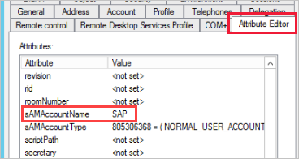
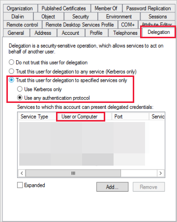
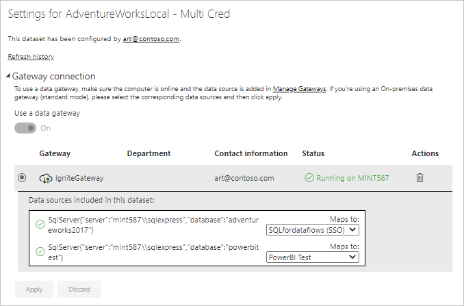
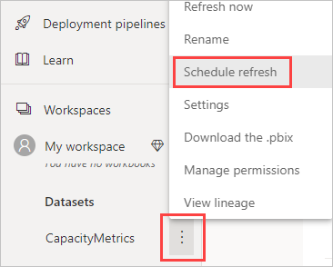

# Troubleshoot gateways - Power BI

[!INCLUDE [gateway-rewrite](../includes/gateway-rewrite.md)]

This article discusses some common issues when you use the on-premises data gateway with Power BI. If you encounter an issue that isn't listed here, you can use the Power BI [Community](https://community.powerbi.com) site. Or, you can create a [support ticket](https://powerbi.microsoft.com/support).

## Configuration

### Error: Power BI service reported local gateway as unreachable. Restart the gateway and try again.

At the end of configuration, the Power BI service is called again to validate the gateway. The Power BI service doesn't report the gateway as live. Restarting the Windows service might allow the communication to be successful. To get more information, you can collect and review the logs as described in [Collect logs from the on-premises data gateway app](/data-integration/gateway/service-gateway-tshoot#collect-logs-from-the-on-premises-data-gateway-app).

## Data sources

> [!NOTE]
> Not all data sources have dedicated articles detailing their connection settings or configuration. For many data sources and non-Microsoft connectors, connection options may vary between Power BI Desktop, and **Manage gateways > Data source settings** configurations in the Power BI service. In such cases, the default settings provided are the currently supported scenarios for Power BI. 

### Error: Unable to Connect. Details: "Invalid connection credentials"

Within **Show details**, the error message that was received from the data source is displayed. For SQL Server, you see a message like the following:

```output
Login failed for user 'username'.
```

Verify that you have the correct username and password. Also, verify that those credentials can successfully connect to the data source. Make sure the account that's being used matches the authentication method.

### Error: Unable to Connect. Details: "Cannot connect to the database"

You were able to connect to the server but not to the database that was supplied. Verify the name of the database and that the user credential has the proper permission to access that database.

Within **Show details**, the error message that was received from the data source is displayed. For SQL Server, you see something like the following:

```output
Cannot open database "AdventureWorks" requested by the login. The login failed. Login failed for user 'username'.
```

### Error: Unable to Connect. Details: "Unknown error in data gateway"

This error might occur for different reasons. Be sure to validate that you can connect to the data source from the machine that hosts the gateway. This situation could be the result of the server not being accessible.

Within **Show details**, you can see an error code of **DM_GWPipeline_UnknownError**.

You can also look in **Event Logs** > **Applications and Services Logs** > **On-premises data gateway Service** for more information.

### Error: We encountered an error while trying to connect to \<server\>. Details: "We reached the data gateway, but the gateway can't access the on-premises data source."

You were unable to connect to the specified data source. Be sure to validate the information provided for that data source.

Within **Show details**, you can see an error code of **DM_GWPipeline_Gateway_DataSourceAccessError**.

If the underlying error message is similar to the following, this means that the account you're using for the data source isn't a server admin for that Analysis Services instance. For more information, see [Grant server admin rights to an Analysis Services instance](/sql/analysis-services/instances/grant-server-admin-rights-to-an-analysis-services-instance).

```output
The 'CONTOSO\account' value of the 'EffectiveUserName' XML for Analysis property is not valid.
```

If the underlying error message is similar to the following, it could mean that the service account for Analysis Services might be missing the [token-groups-global-and-universal](/windows/win32/adschema/a-tokengroupsglobalanduniversal) (TGGAU) directory attribute.

```output
The username or password is incorrect.
```

Domains with pre-Windows 2000 compatibility access have the TGGAU attribute enabled. Most newly created domains don't enable this attribute by default. For more information, see [Some applications and APIs require access to authorization information on account objects](https://support.microsoft.com/kb/331951).

To confirm whether the attribute is enabled, follow these steps.

1. Connect to the Analysis Services machine within SQL Server Management Studio. Within the Advanced connection properties, include EffectiveUserName for the user in question and see if this addition reproduces the error.
2. You can use the dsacls Active Directory tool to validate whether the attribute is listed. This tool is found on a domain controller. You need to know what the distinguished domain name is for the account and pass that name to the tool.

   ```console
   dsacls "CN=John Doe,CN=UserAccounts,DC=contoso,DC=com"
   ```

    You want to see something similar to the following in the results:

   ```console
   Allow BUILTIN\Windows Authorization Access Group
                                   SPECIAL ACCESS for tokenGroupsGlobalAndUniversal
                                   READ PROPERTY
   ```

To correct this issue, you must enable TGGAU on the account used for the Analysis Services Windows service.

#### Another possibility for "The username or password is incorrect."

This error could also be caused if the Analysis Services server is in a different domain than the users and there isn't a two-way trust established.

Work with your domain administrators to verify the trust relationship between domains.

#### Unable to see the data gateway data sources in the Get Data experience for Analysis Services from the Power BI service

Make sure that your account is listed in the **Users** tab of the data source within the gateway configuration. If you don't have access to the gateway, check with the administrator of the gateway and ask them to verify. Only accounts in the **Users** list can see the data source listed in the Analysis Services list.

### Error: You don't have any gateway installed or configured for the data sources in this semantic model.

Ensure that you've added one or more data sources to the gateway, as described in [Add a data source](service-gateway-data-sources.md#add-a-data-source). If the gateway doesn't appear in the admin portal under **Manage gateways**, clear your browser cache or sign out of the service and then sign back in.

### Error: Your data source can't be refreshed because the credentials are invalid. Please update your credentials and try again.

You were able to connect and refresh the semantic model, with no runtime errors for the connection, yet in the Power BI service this error bar appears. When the user attempts to update the credentials with known-good credentials, an error appears stating that the credentials supplied were invalid. 

This error can occur when the gateway attempts a test connection, even if the credentials supplied are acceptable and the refresh operation is successful. This occurs because when the gateway performs a connection test, it does not include any optional parameters during the connection attempt, and some data connectors (such as Snowflake, for example) require optional connection parameters in order to connect.

When your refresh is completing properly and you do not experience runtime errors, you can ignore these test connection errors for data sources that requires optional parameters. 


## Datasets

### Error: There is not enough space for this row.

This error occurs if you have a single row greater than 4 MB in size. Determine what the row is from your data source, and attempt to filter it out or reduce the size for that row.

### Error: The server name provided doesn't match the server name on the SQL Server SSL certificate.

This error can occur when the certificate common name is for the server's fully qualified domain name (FQDN), but you supplied only the NetBIOS name for the server. This situation causes a mismatch for the certificate. To resolve this issue, make the server name within the gateway data source and the PBIX file use the FQDN of the server.

### Error: You don't see the on-premises data gateway present when you configure scheduled refresh.

A few different scenarios could be responsible for this error:

- The server and database name don't match what was entered in Power BI Desktop and the data source configured for the gateway. These names must be the same. They aren't case sensitive.
- Your account isn't listed in the **Users** tab of the data source within the gateway configuration. You need to be added to that list by the administrator of the gateway.
- Your Power BI Desktop file has multiple data sources within it, and not all of those data sources are configured with the gateway. You need to have each data source defined with the gateway for the gateway to show up within scheduled refresh.

### Error: The received uncompressed data on the gateway client has exceeded the limit.

The exact limitation is 10 GB of uncompressed data per table. If you're hitting this issue, there are good options to optimize and avoid it. In particular, reduce the use of highly constant, long string values and instead use a normalized key. Or, removing the column if it's not in use helps.

### Error: DM_GWPipeline_Gateway_SpooledOperationMissing

A few different scenarios could be responsible for this error

- Gateway process may have restarted when the semantic model refresh was in progress.
- The gateway machine is cloned where gateway is running. We should not clone gateway machine.

## Reports

### Error: Report could not access the data source because you do not have access to our data source via an on-premises data gateway.

This error is usually caused by one of the following:

- The data source information doesn't match what's in the underlying semantic model. The server and database name need to match between the data source defined for the on-premises data gateway and what you supply within Power BI Desktop. If you use an IP address in Power BI Desktop, the data source for the on-premises data gateway needs to use an IP address as well.
- There's no data source available on any gateway within your organization. You can configure the data source on a new or existing on-premises data gateway.

### Error: Data source access error. Please contact the gateway administrator.

If this report makes use of a live Analysis Services connection, you could encounter an issue with a value being passed to EffectiveUserName that either isn't valid or doesn't have permissions on the Analysis Services machine. Typically, an authentication issue is due to the fact that the value being passed for EffectiveUserName doesn't match a local user principal name (UPN).

To confirm the effective username, follow these steps.

1. Find the effective username within the [gateway logs](/data-integration/gateway/service-gateway-tshoot#collect-logs-from-the-on-premises-data-gateway-app).
2. After you have the value being passed, validate that it's correct. If it's your user, you can use the following command from a command prompt to see the UPN. The UPN looks like an email address.

   ```console
   whoami /upn
   ```

Optionally, you can see what Power BI gets from Azure Active Directory.

1. Browse to [https://developer.microsoft.com/graph/graph-explorer](https://developer.microsoft.com/graph/graph-explorer).
2. Select **Sign in** in the upper-right corner.
3. Run the following query. You see a rather large JSON response.

   ```http
   https://graph.windows.net/me?api-version=1.5
   ```

4. Look for **userPrincipalName**.

If your Azure Active Directory UPN doesn't match your local Active Directory UPN, you can use the [Map user names](service-gateway-enterprise-manage-ssas.md#map-user-names-for-analysis-services-data-sources) feature to replace it with a valid value. Or, you can work with either your Power BI admin or local Active Directory admin to get your UPN changed.

## Kerberos

If the underlying database server and on-premises data gateway aren't appropriately configured for [Kerberos constrained delegation](service-gateway-sso-kerberos.md), enable [verbose logging](/data-integration/gateway/service-gateway-performance#slow-performing-queries) on the gateway. Then, investigate based on the errors or traces in the gateway’s log files as a starting point for troubleshooting. To collect the gateway logs for viewing, see [Collect logs from the on-premises data gateway app](/data-integration/gateway/service-gateway-tshoot#collect-logs-from-the-on-premises-data-gateway-app).

### ImpersonationLevel

The ImpersonationLevel is related to the SPN setup or the local policy setting.

```
[DataMovement.PipeLine.GatewayDataAccess] About to impersonate user DOMAIN\User (IsAuthenticated: True, ImpersonationLevel: Identification)
```

**Solution**

Follow these steps to solve the issue.

1. Set up an SPN for the on-premises gateway.
2. Set up constrained delegation in your Active Directory.

### FailedToImpersonateUserException: Failed to create Windows identity for user userid

The FailedToImpersonateUserException happens if you're unable to impersonate on behalf of another user. This error could also happen if the account you're trying to impersonate is from another domain than the one the gateway service domain is on. This is a limitation.

**Solution**

* Verify that the configuration is correct as per the steps in the previous "ImpersonationLevel" section.
* Ensure that the user ID it's trying to impersonate is a valid Active Directory account.

### General error: 1033 error while you parse the protocol

You get the 1033 error when your external ID that's configured in SAP HANA doesn't match the sign-in if the user is impersonated by using the UPN (alias@domain.com). In the logs, you see "Original UPN 'alias@domain.com' replaced with a new UPN 'alias@domain.com'" at the top of the error logs, as seen here:

```
[DM.GatewayCore] SingleSignOn Required. Original UPN 'alias@domain.com' replaced with new UPN 'alias@domain.com.'
```

**Solution**

* SAP HANA requires the impersonated user to use the sAMAccountName attribute in Active Directory (user alias). If this attribute isn't correct, you see the 1033 error.

    

* In the logs, you see the sAMAccountName (alias) and not the UPN, which is the alias followed by the domain (alias@doimain.com).

    

```xml
      <setting name="ADUserNameReplacementProperty" serializeAs="String">
        <value>sAMAccount</value>
      </setting>
      <setting name="ADServerPath" serializeAs="String">
        <value />
      </setting>
      <setting name="CustomASDataSource" serializeAs="String">
        <value />
      </setting>
      <setting name="ADUserNameLookupProperty" serializeAs="String">
        <value>AADEmail</value>
```

### [SAP AG][LIBODBCHDB DLL][HDBODBC] Communication link failure:-10709 Connection failed (RTE:[-1] Kerberos error. Major: "Miscellaneous failure [851968]." Minor: "No credentials are available in the security package."

You get the "-10709 Connection failed" error message if your delegation isn't configured correctly in Active Directory.

**Solution**

* Make sure that you have the SAP Hana server on the delegation tab in Active Directory for the gateway service account.

   

## Export logs for a support ticket

Gateway logs are required for troubleshooting and creating a support ticket. Use the following steps for extracting these logs.

1. Identify the gateway cluster.

    If you're a semantic model owner, first check the gateway cluster name associated with your semantic model. In the following image, *IgniteGateway* is the gateway cluster.

    

2. Check the gateway properties.

    The gateway admin should then check the number of gateway members in the cluster and if load balancing is enabled.

    If load balancing is enabled, then step 3 should be repeated for all gateway members. If it's not enabled, then exporting logs on the primary gateway is sufficient.

3. Retrieve and export the gateway logs.

    Next, the gateway admin, who is also the administrator of the gateway system, should do the following steps:

    a. Sign in to the gateway machine, and then launch the [on-premises data gateway app](/data-integration/gateway/service-gateway-app) to sign in to the gateway.
    
    b. Enable [additional logging](/data-integration/gateway/service-gateway-performance#slow-performing-queries).
    
    c. Optionally, you can [enable the performance monitoring features](/data-integration/gateway/service-gateway-performance#enable-performance-logging) and include performance logs to provide additional details for troubleshooting.
    
    d. Run the scenario for which you're trying to capture gateway logs.
    
    e. [Export the gateway logs](/data-integration/gateway/service-gateway-tshoot#collect-logs-from-the-on-premises-data-gateway-app).


## Refresh history

When you use the gateway for a scheduled refresh, **Refresh history** can help you see what errors occurred. It can also provide useful data if you need to create a support request. You can view scheduled and on-demand refreshes. The following steps show how you can get to the refresh history.

1. In the Power BI nav pane, in **Datasets**, select a semantic model. Open the menu, and select **Schedule refresh**.

    

2. In **Settings for...**, select **Refresh history**.

    

    

For more information about troubleshooting refresh scenarios, see [Troubleshoot refresh scenarios](refresh-troubleshooting-refresh-scenarios.md).

## Fiddler trace

[Fiddler](https://www.telerik.com/fiddler) is a free tool from Telerik that monitors HTTP traffic. You can see the back and forth with the Power BI service from the client machine. This traffic list might show errors and other related information.


## Next steps

* [Troubleshoot the on-premises data gateway](/data-integration/gateway/service-gateway-tshoot)
* [Configure proxy settings for the on-premises data gateway](/data-integration/gateway/service-gateway-proxy)  
* [Manage your data source - Analysis Services](service-gateway-enterprise-manage-ssas.md)  
* [Manage your data source - SAP HANA](service-gateway-enterprise-manage-sap.md)  
* [Manage your data source - SQL Server](service-gateway-enterprise-manage-sql.md)  
* [Manage your data source - Import/scheduled refresh](service-gateway-enterprise-manage-scheduled-refresh.md)  

More questions? Try the [Power BI Community](https://community.powerbi.com/).
