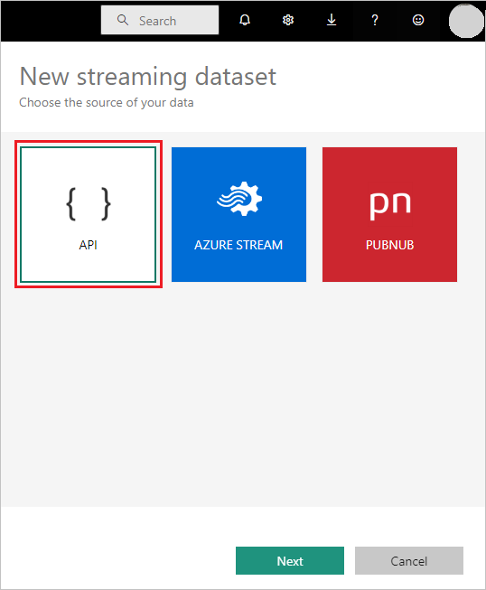
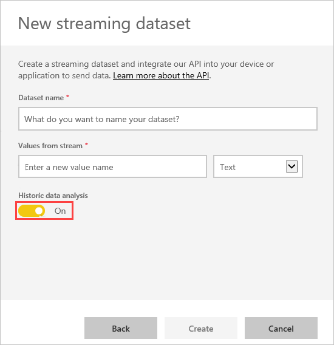
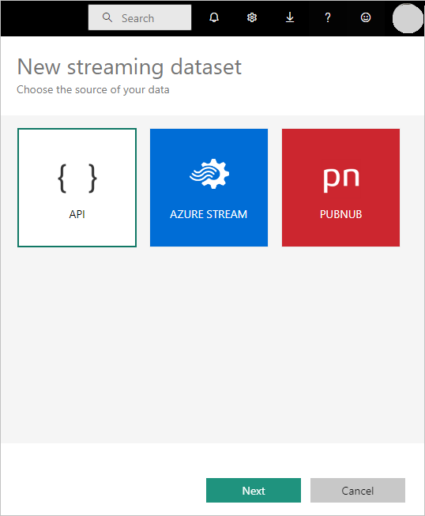
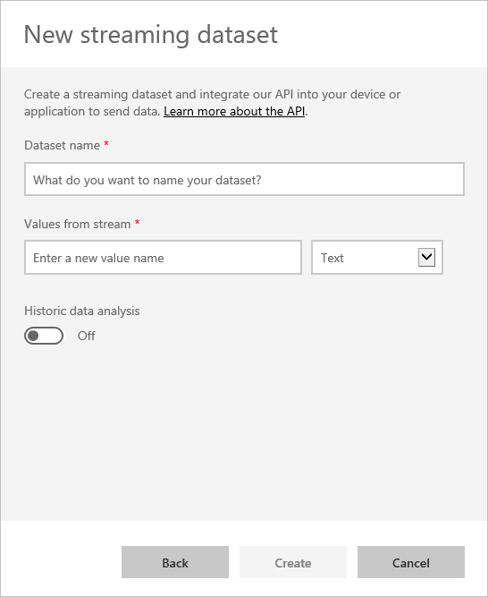

# Real-time streaming in Power BI
Power BI with real-time streaming helps you stream data and update dashboards in real time. Any visual or dashboard created in Power BI can display and update real-time data and visuals. The devices and sources of streaming data can be factory sensors, social media sources, service usage metrics, or many other time-sensitive data collectors or transmitters.

This article shows you how to set up and use real-time streaming datasets in Power BI.

## Types of real-time datasets
First, it's important to understand the types of real-time datasets that are designed to display in tiles and dashboards, and how those datasets differ.

The following three types of real-time datasets are designed for display on real-time dashboards:

* Push dataset
* Streaming dataset
* PubNub streaming dataset

This section explains how these datasets differ from one another. Later sections describe how to push data into those each of these datasets.

### Push dataset
With a *push dataset*, data is pushed into the Power BI service. When the dataset is created, the Power BI service automatically creates a new database in the service to store the data. Because there's an underlying database that stores the data as it arrives, you can create reports with the data. These reports and their visuals are just like any other report visuals. You can use all of Power BI's report building features to create visuals, such as Power BI visuals, data alerts, and pinned dashboard tiles.

Once you create a report using the push dataset, you can pin any of the report visuals to a dashboard. On that dashboard,  visuals update in real time whenever the data is updated. Within the service, the dashboard triggers a tile refresh every time new data is received.

There are two considerations to note about pinned tiles from a push dataset:

- Pinning an entire report by using the *pin live page* option won't result in the data automatically being updated.
- Once you pin a visual to a dashboard, you can use **Q&A** to ask questions about the push dataset in natural language. After you make a **Q&A** query, you can pin the resulting visual back to the dashboard, and that dashboard will also update in real time.

### Streaming dataset
A *streaming dataset* also pushes data into the Power BI service, with an important difference: Power BI stores the data only into a temporary cache, which quickly expires. The temporary cache is used only to display visuals that have some transient sense of history, such as a line chart that has a time window of one hour.

A streaming dataset has no underlying database, so you can't build report visuals by using the data that flows in from the stream. Therefore, you can't use report functionality such as filtering, Power BI visuals, and other report functions.

The only way to visualize a streaming dataset is to add a tile and use the streaming dataset as a *custom streaming data source*. The custom streaming tiles that are based on a streaming dataset are optimized for quickly displaying real-time data. There's little latency between pushing the data into the Power BI service and updating the visual, because there's no need for the data to be entered into or read from a database.

In practice, it's best to use streaming datasets and their accompanying streaming visuals in situations when it's critical to minimize the latency between pushing and visualizing data. Have the data pushed in a format that can be visualized as-is, without any more aggregations. Examples of data that's ready as-is include temperatures and pre-calculated averages.

### PubNub streaming dataset
With a *PubNub streaming dataset*, the Power BI web client uses the PubNub SDK to read an existing PubNub data stream. The Power BI service stores no data. Because the web client makes this call directly, you have to list traffic to PubNub as allowed if you only allow approved outbound traffic from your network. For instructions, see [Can I whitelist IPs for PubNub traffic?](https://support.pubnub.com/hc/en-us/articles/360051496672)

As with the streaming dataset, with the PubNub streaming dataset there's no underlying Power BI database, so you can't build report visuals against the data that flows in, and can't use report functionality like filtering or Power BI visuals. You can visualize a PubNub streaming dataset only by adding a tile to the dashboard and configuring a PubNub data stream as the source.

Tiles based on a PubNub streaming dataset are optimized for quickly displaying real-time data. Since Power BI is directly connected to the PubNub data stream, there is little latency between pushing the data into the Power BI service and updating the visual.

### Streaming dataset matrix
The following table describes the three types of datasets for real-time streaming and lists their capabilities and limitations.

|Capability|Push|Streaming|PubNub|
|----------|----|---------|------|
|Dashboard tiles update in real time as data is pushed in|**Yes.** For visuals built via reports and then pinned to dashboard.|**Yes.** For custom streaming tiles added directly to the dashboard.|**Yes.** For custom streaming tiles added directly to the dashboard.|
|Dashboard tiles update with smooth animations|**No.**|**Yes.**|**Yes.**|
|Data stored permanently in Power BI for historic analysis|**Yes.**|**No.** Data is temporarily stored for one hour to render visuals.|**No.**|
|Build Power BI reports on top of the data|**Yes.**|**No.**|**No.**|
|Max rate of data ingestion|**1 requests** **16 MB/request**|**5 requests** **15 KB/request**|**N/A** Data isn't being pushed into Power BI.|
|Limits on data throughput|**1M rows/hour**|None.|**N/A** Data isn't being pushed into Power BI.|

## Push data to datasets
This section describes how to create and push data into the three primary types of real-time datasets that you can use in real-time streaming.

You can push data into a dataset by using the following three primary methods:

* The Power BI REST APIs
* The Streaming Dataset UI
* Azure Stream Analytics

### Use Power BI REST APIs to push data
You can use *Power BI REST APIs* to create and send data to push datasets and to streaming datasets. When you create a dataset by using Power BI REST APIs, the `defaultMode` flag specifies whether the dataset is push or streaming. If no `defaultMode` flag is set, the dataset defaults to a push dataset. If the `defaultMode` value is set to `pushStreaming`, the dataset is both a push and streaming dataset, and provides the benefits of both dataset types.

> [!NOTE]
> When you use datasets with the `defaultMode` flag set to `pushStreaming`, if a request exceeds the 15Kb size restriction for a streaming dataset, but is less than the 16MB size restriction for a push dataset, the request succeeds and the data updates in the push dataset. However, any streaming tiles temporarily fail.

Once a dataset is created, use the REST APIs to push data by using the [PostRows API](/rest/api/power-bi/pushdatasets/datasets_postrows).

All requests to REST APIs are secured by using *Azure Active Directory (Azure AD) OAuth*.

### Use the Streaming Dataset UI to push data
In the Power BI service, you can create a dataset by selecting the **API** approach, as shown in the following screenshot:

When you create the new streaming dataset, you can enable **Historic data analysis** as shown in the following screenshot. This selection has a significant impact.

When **Historic data analysis** is disabled, as it is by default, you create a streaming dataset as described earlier. When **Historic data analysis** is enabled, the dataset you create becomes both a streaming dataset and a push dataset. This setting is equivalent to using the Power BI REST APIs to create a dataset with its `defaultMode` set to `pushStreaming`, as described earlier.

> [!NOTE]
> Streaming datasets created by using the Power BI service UI don't require Azure AD authentication. In such datasets, the dataset owner receives a URL with a *rowkey*, which authorizes the requestor to push data into the dataset without using an Azure AD OAuth bearer token. However, the Azure AD approach still works to push data into the dataset.

### Use Azure Stream Analytics to push data
You can add Power BI as an output within Azure Stream Analytics, and then visualize those data streams in the Power BI service in real time. This section describes the technical details of that process.

Azure Stream Analytics uses the Power BI REST APIs to create its output data stream to Power BI, with `defaultMode` set to `pushStreaming`. The resulting dataset can use both push and streaming. When you create the dataset, Azure Stream Analytics sets the `retentionPolicy` flag to `basicFIFO`. With that setting, the database that supports the push dataset stores 200,000 rows, and drops rows in a first-in first-out (FIFO) fashion.

> [!IMPORTANT]
> If your Azure Stream Analytics query results in very rapid output to Power BI, for example once or twice per second, Azure Stream Analytics begins batching the outputs into a single request. This batching might cause the request size to exceed the streaming tile limit, and streaming tiles might fail to render. In this case, the best practice is to slow the rate of data output to Power BI. For example, instead of a maximum value every second, request a maximum value over 10 seconds.

## Set up your real-time streaming dataset in Power BI
To get started with real-time streaming, you choose one of the following ways to consume streaming data in Power BI:

- *Tiles* with visuals from streaming data
- *Datasets* created from streaming data that persist in Power BI

With either option, you need to set up streaming data in Power BI. To get your real-time streaming dataset working in Power BI:

1. In either an existing or a new dashboard, select **Add a tile**, and then select **Custom streaming data**.

   

1. On the **Add a custom streaming data tile** page, you can select an existing dataset, or select **Manage datasets** to import your streaming dataset if you already created one. If you don't have streaming data set up yet, select **Add streaming dataset** to get started.

   

1. On the **New streaming dataset** page, select **API**, **Azure Stream**, or **PubNub**, and then select **Next**.

   

## Create a streaming dataset 
There are three ways to create a real-time streaming data feed that Power BI can consume and visualize:

- Power BI REST API using a real-time streaming endpoint
- Azure Stream
- PubNub

This section describes the Power BI REST API and PubNub options, and explains how to create a streaming tile or dataset from the streaming data source. You can then use the dataset to build reports. For more information about the Azure Stream option, see [Power BI output from Azure Stream Analytics](/azure/stream-analytics/power-bi-output).

### Use the POWER BI REST API
The Power BI REST API makes real-time streaming easier for developers. After you select **API** on the **New streaming dataset** screen and select **Next**, you can provide entries that enable Power BI to connect to and use your endpoint. For more information about the API, see [Use the Power BI REST APIs](/rest/api/power-bi).

If you want Power BI to store the data this data stream sends, so you can do reporting and analysis on the collected data, enable **Historic data analysis**.

After you successfully create your data stream, you get a REST API URL endpoint. Your application can call the endpoint by using `POST` requests to push your streaming data to the Power BI dataset. In your `POST` requests, ensure that the request body matches the sample JSON that the Power BI user interface provided. For example, wrap your JSON objects in an array.

> [!IMPORTANT]
> For streaming datasets you create in the Power BI service UI, the dataset owner gets a URL that includes a *resource key*. This key authorizes the requestor to push data into the dataset without using an Azure AD OAuth bearer token. Keep in mind the implications of having a secret key in the URL when you work with this type of dataset and method.

### Use PubNub
The integration of PubNub streaming with Power BI helps you create and use your low-latency PubNub data streams in Power BI. When you select **PubNub** on the **New streaming dataset** screen and select **Next**, you see the following screen:

> [!IMPORTANT]
> You can secure PubNub channels by using a PubNub Access Manager (PAM) authentication key. This key is shared with all users who have access to the dashboard. For more information about PubNub access control, see [Manage Access](https://www.pubnub.com/docs/web-javascript/pam-security).

PubNub data streams are often high volume, and aren't always suitable for storage and historical analysis in their original form. To use Power BI for historical analysis of PubNub data, you can aggregate the raw PubNub stream and send it to Power BI. One way to do that process is with [Azure Stream Analytics](https://azure.microsoft.com/services/stream-analytics).

## Example of using real-time streaming in Power BI
Here's an example of how real-time streaming in Power BI works. Follow along with this sample to see the value of real-time streaming.

This sample uses a publicly available stream from PubNub. Here are the steps:

1. In the Power BI service, select or create a new dashboard. At the top of the screen, select **Edit** > **Add a tile**. 

1. On the **Add a tile** screen, select **Custom Streaming Data**, and then select **Next**.
   
   
   
1. On the **Add a custom streaming data tile** page, select **Add streaming dataset**.

   

1. On the **New streaming dataset** page, select **PubNub**, and then select **Next**.

1. On the next screen, enter a **Dataset name**, enter the following values into the next two fields, and then select **Next**:
   
   **Sub-key:** *sub-c-99084bc5-1844-4e1c-82ca-a01b18166ca8*
   **Channel name:** *pubnub-sensor-network*
   
   
   
1. On the next screen, keep the automatically populated data, and select **Create**.
   
   
   
1. In your Power BI workspace, create a new dashboard, and at the top of the screen, select **Edit** > **Add a tile**.

1. Select **Custom Streaming Data**, and select **Next**.

1. On the **Add a custom streaming data tile** page, select your new streaming dataset, and then select **Next**.

   Play around with the sample dataset. By adding value fields to line charts and adding other tiles, you can get a real-time dashboard that looks like the following screenshot:
   
   

Go on to create your own datasets and stream live data to Power BI.

> [!NOTE]
> The color saturation option isn't supported for real-time tiles. If you try to add color saturation, you get an error. Leave the option empty for the visual to work correctly.

## Questions and answers

Here are some common questions and answers about real-time streaming in Power BI.

#### Can you use filters on push or streaming datasets?
Streaming datasets don't support filtering. For push datasets, you can create a report, filter the report, and then pin the filtered visuals to a dashboard. However, there's no way to change the filter on the visual once it's on the dashboard.

You can pin the live report tile to the dashboard separately, and then you can change the filters. However, live report tiles won't update in real time as data is pushed in. You have to manually update the visual by using the **Refresh dashboard tiles** option in the **More options** menu.

When you apply filters to push datasets with `DateTime` fields with millisecond precision, equivalence operators aren't supported. Operators such as greater than \> or less than \< operate properly.

#### How do you see the latest value on push or streaming datasets?
Streaming datasets are designed to display the latest data. You can use the **Card** streaming visual type to easily see the latest numeric values. The card doesn't support `DateTime` or `Text` data types.

For push datasets, if you have a timestamp in the schema, you can try creating a report visual with the last `N` filter.

#### How can you do any modeling on real-time datasets?
Modeling isn't possible on a streaming dataset, because the data isn't stored permanently. For a push dataset, you can use the [create dataset REST API](/rest/api/power-bi/push-datasets/datasets-post-dataset) to create a dataset with relationship and measures, and use the [update table REST APIs](/rest/api/power-bi/push-datasets/datasets-put-table) to add measures to an existing table.

#### How can you clear all the values on a push or streaming dataset?
On a push dataset, you can use the [delete rows REST API](/rest/api/power-bi/push-datasets/datasets-delete-rows) call. There's no way to clear data from a streaming dataset, although the data will clear itself after an hour.

#### If you set up an Azure Stream Analytics output to Power BI but don't see it in Power BI, what's wrong?
Take these steps to troubleshoot the issue:

1. Restart the Azure Stream Analytics job.
2. Try reauthorizing your Power BI connection in Azure Stream Analytics.
3. Make sure that you're checking the same workspace in the Power BI service that you specified for the Azure Stream Analytics output.
4. Make sure the Azure Stream Analytics query explicitly outputs to the Power BI output by using the `INTO` keyword.
5. Determine whether the Azure Stream Analytics job has data flowing through it. The dataset is created only when data is being transmitted.
6. Look into the Azure Stream Analytics logs to see if there are any warnings or errors.

## Automatic page refresh

You can use automatic page refresh at a report page level to set a refresh interval for visuals that's only active when the page is being consumed. Automatic page refresh is available only for DirectQuery data sources. The minimum refresh interval depends on the type of workspace where the report is published and capacity admin settings for Premium workspaces.

For more information about automatic page refresh, see [Automatic page refresh in Power BI](../create-reports/desktop-automatic-page-refresh.md).

## Next steps

- [Overview of the Power BI REST API with real-time data](/rest/api/power-bi)
- [Load data in a Power BI streaming dataset and build a dataflows monitoring report with Power BI](/power-query/dataflows/load-dataflow-metadata-into-power-bi-dataset)
