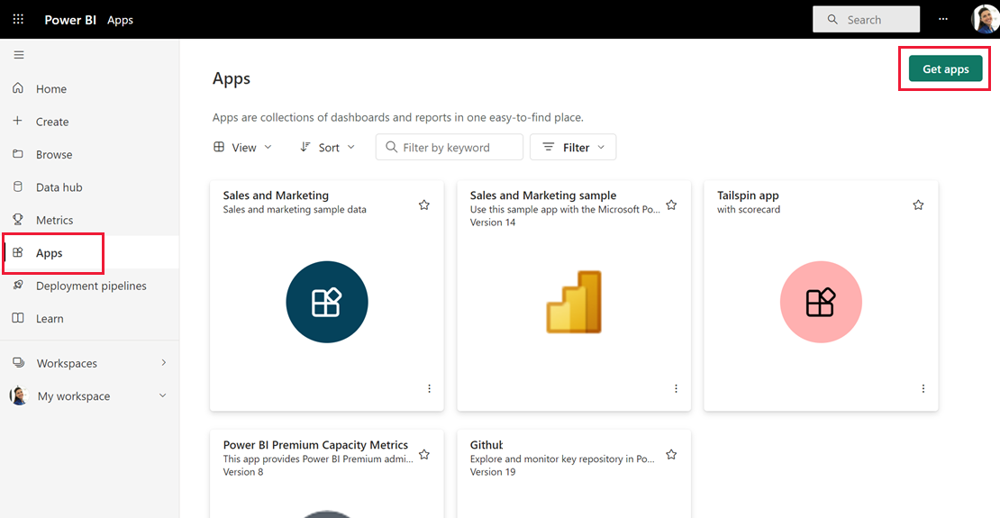
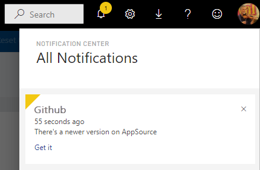
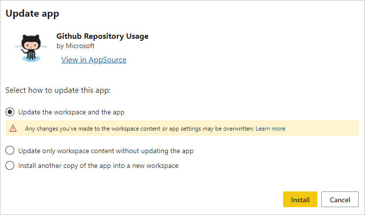
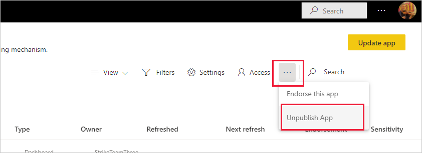

# Install, share, and update template apps in your organization

Are you a Power BI analyst? If so, this article explains how you can  install [template apps](service-template-apps-overview.md) to connect to many of the services you use to run your business, such as Salesforce, Microsoft Dynamics, and Google Analytics. You can then modify the template app's pre-built dashboard and reports to suit the needs of your organization, and distribute them to your colleagues as [apps](../consumer/end-user-apps.md). 

If you're interested in creating template apps yourself for distribution outside your organization, see [Create a template app in Power BI](service-template-apps-create.md). With little or no coding, Power BI partners can build Power BI apps and make them available to Power BI customers. 

## Prerequisites  

To install, customize, and distribute a template app, you need: 

* A [Power BI pro license](../fundamentals/service-self-service-signup-for-power-bi.md).
* Permissions to install template apps on your tenant.
* A valid installation link for the app, which you get either from AppSource or from the app creator.
* A good familiarity with the [basic concepts of Power BI ](../fundamentals/service-basic-concepts.md).

## Install a template app

1. In the nav pane in the Power BI service, select **Apps** > **Get apps**.

    

1. In the Power BI apps marketplace that appears, select **Template apps**. All the template apps available in AppSource will be shown. Browse to find the template app you're looking for, or get a filtered selection by using the search box. Typing part of the name of the template app, or of a category such as finance, analytics, marketing, etc., will make it easier to find the item you're looking for.

    

1. When you find the template app you're looking for, click it. The template app offer will display. Click **GET IT NOW**.

   

1. In the dialog box that appears, select **Install**.

    
    
    The app is installed, along with a workspace of the same name that has all the artifacts needed for further [customization](#customize-and-share-the-app).

    > [!NOTE]
    > If you use an installation link for an app that isn't listed on AppSource, a validation dialog box will ask you to confirm your choice.
    >
    >To be able to install a template app that is not listed on AppSource, you need to request the relevant permissions from your admin. See the [Template app settings](../admin/service-admin-portal-template-app.md) in Power BI admin portal for details.

    When the installation finishes successfully, a notification tells you that your new app is ready.

    

## Connect to data

1. Select **Go to app**.

   The app opens, showing sample data.

1. Select the **Connect your data** link on the banner at the top of the page.

   

    This opens the parameters dialog, where you change the data source from the sample data to your own data source (see [known limitations](service-template-apps-overview.md#known-limitations)), followed by the authentication method dialog. You may have to redefine the values in these dialogs. See the documentation of the specific template app you're installing for details.

   

    Once you've finished filling out the connection dialogs, the connection process starts. A banner informs you that the data is being refreshed, and that in the meantime you are viewing sample data.

    

   Your report data will automatically refresh once a day, unless you disabled this during the sign-in process. You can also [set up your own refresh schedule](./refresh-scheduled-refresh.md) to keep the report data up to date if you so desire.

## Customize and share the app

After you've connected to your data and data refresh is complete, you can customize any of the reports and dashboards the apps includes, as well as share the app with your colleagues. Remember, however that any changes you make will be overwritten when you update the app with a new version, unless you save the items you changed under different names. [See details about overwriting](#overwrite-behavior).

To customize and share your app, select the pencil icon at the top right corner of the page.

For information about editing artifacts in the workspace, see
* [Tour the report editor in Power BI](../create-reports/service-the-report-editor-take-a-tour.md)
* [Basic concepts for designers in the Power BI service](../fundamentals/service-basic-concepts.md)

Once you are done making any changes you wish to the artifacts in the workspace, you are ready to publish and share the app. See [Publish your app](../collaborate-share/service-create-distribute-apps.md#create-and-publish-your-app) to learn how to do this.

## Update a template app

From time to time, template app creators release new improved versions of their template apps, via either AppSource, direct link, or both.

If you originally downloaded the app from AppSource, when a new version of the template app becomes available, you get notified in two ways:
* An update banner appears in the Power BI service informing you that a new app version is available.
  
* You receive a notification in Power BI's notification pane.

  

>[!NOTE]
>If you originally got the app via direct link rather than through AppSource, the only way to know when a new version is available is to contact the template app creator.

  To install the update, either click **Get it** on the notification banner or in the notification center, or find the app again in AppSource and choose **Get it now**. If you got a direct link for the update from the Template app creator, simply click the link.
  
  You will be asked how you want the update to affect your currently installed app.

  

* **Update the workspace and the app:** Updates both the workspace and the app, and republishes the app to your organization. Choose this option if you haven’t made any changes to the app or its content and want to overwrite the old app. Your connections will be reestablished, and the new version of the app will include any updated app branding, such as app name, logo, and navigation, as well as the latest publisher improvements to content.

* **Update only workspace content without updating the app:** Updates the reports, dashboards, and dataset in the workspace. After updating the workspace, you can choose what you want to include in the app, and then you need to update the app to republish it to your organization with the changes.

* **Install another copy of the app into a new workspace:** Installs a fresh version of the workspace and app. Choose this option if you don’t want to change your current app at all.

### Overwrite behavior

* Overwriting updates the reports, dashboards, and dataset in the workspace, not the app. Overwriting doesn't change app navigation, setup, and permissions.
* If you chose the second option above, after you've updated the workspace **you need to update the app to apply changes from the workspace to the app**.
* Overwriting keeps configured parameters and authentication. After update, an automatic dataset refresh starts. **During this refresh, the app, reports, and dashboards present sample data**.

  

* Overwriting always presents sample data until the refresh is complete. If the template app author made changes to the dataset or parameters, users of the workspace and app will not see the new data until the refresh is complete. Rather, they will continue to see sample data during this time.
* Overwriting never deletes new reports or dashboards you've added to the workspace. It only overwrites the original reports and dashboards with changes from the original author.

>[!IMPORTANT]
>Remember to [update the app](#customize-and-share-the-app) after overwriting to apply changes to the reports and dashboard for your organizational app users.

## Delete a template app

An installed template app consists of the app and its associated workspace. If you want to remove the template app, you have two options:
* **Completely remove the app and its associated workspace**: To completely remove template app and its associated workspace, go to the app tile on the Apps page, select the trash icon, and then click **Delete** in the dialog that appears.
* **Unpublish the app**: This option removes the app but keeps its associated workspace. This option is useful if, for instance, there are customizations that you made that you want to keep.

    To unpublish the app:
    1. Open the app.
    1. Click the edit app pencil icon to open the template app's workspace.
    1. In the template app workspace, select **More option (...)**, and then choose **Unpublish App**.

        

## Next steps

[Create workspaces with your colleagues in Power BI](../collaborate-share/service-create-the-new-workspaces.md)
