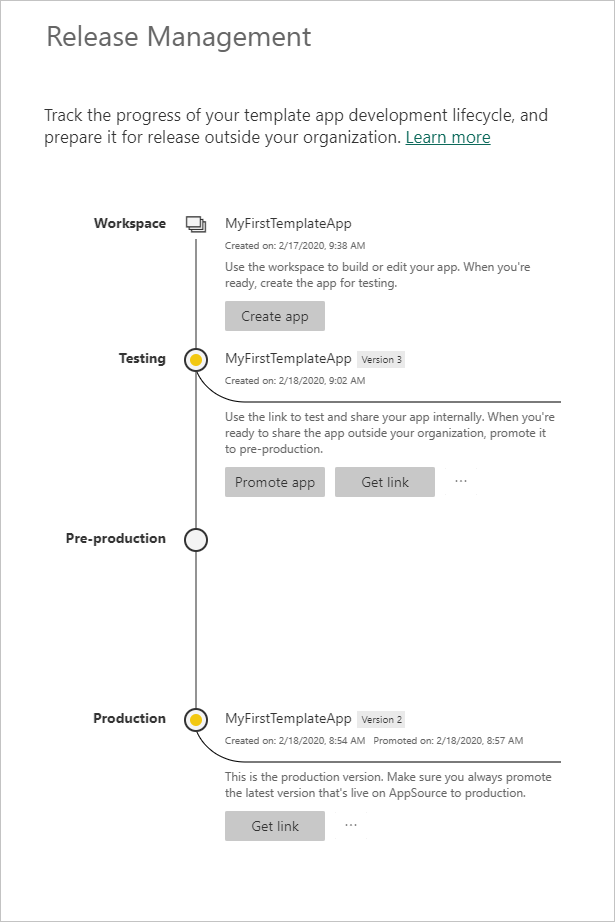
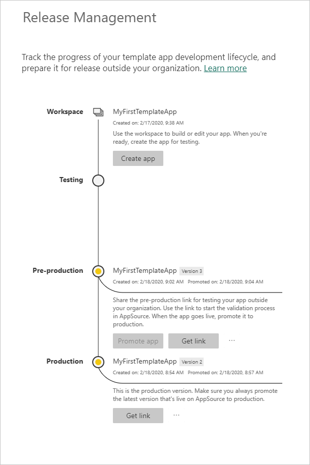
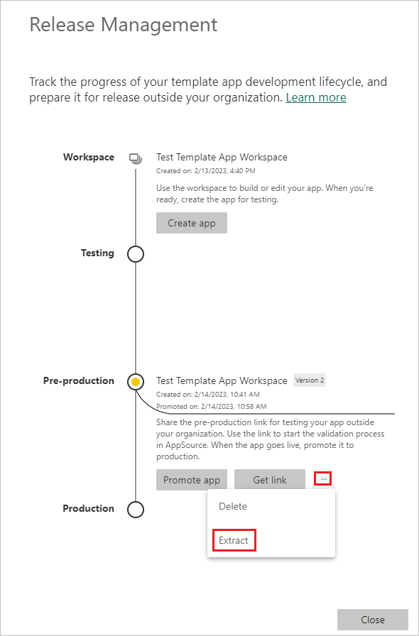
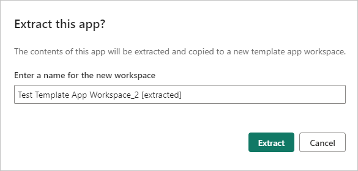
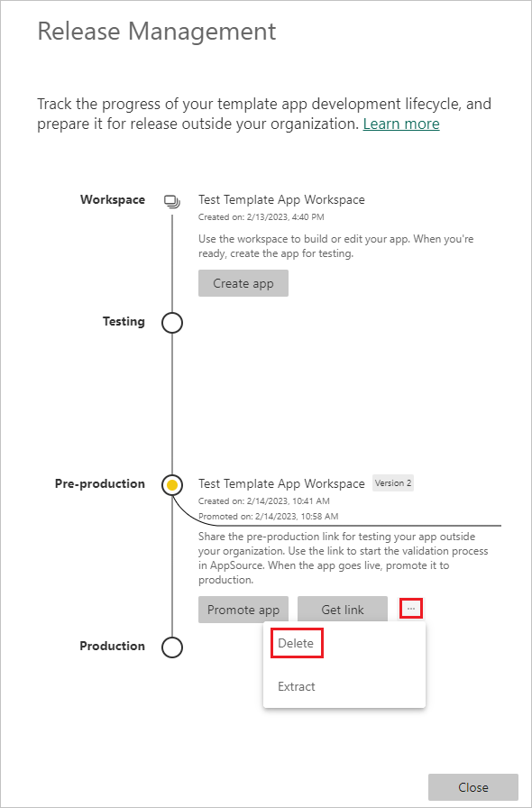

# Manage your published template app

Now that your app is in production, when you want to make changes to the app, you can start over in the test phase, without interfering with the app in production.

## Update your app

Go to the template app workspace. Then, if you made your changes in Power BI Desktop, start at Step 1. If you did not make any changes in Power BI Desktop, start at Step 2.

1. Upload your updated dataset and **make sure to overwrite the existing dataset**.
    * If the *.pbix* file you're uploading has the same name as the dataset and report used in the app, uploading will overwrite the existing dataset.
    * If you're changing the name of the dataset and report used in the app, and the *.pbix* file you want to upload has a different name than the dataset and report used in the app, do the following:
        * Rename the dataset and report used in the app so that their names exactly match the name of your updated *.pbix* file.
        * Upload the your *.pbix* file and overwrite the existing dataset and report that you just renamed.
    
    In either case, when you upload, you must get to a dialog that asks for your permission to overwrite the dataset used in the app. If you do not overwrite the existing dataset, users will not be able to install your updated app.

    >[!WARNING]
    > Never delete the dataset used in the app. Doing so will make it impossible for users to update their apps.

    The following animation shows how to upload a local *.pbix* file to the service, overwriting the currently used dataset. Start by choosing **New > Dataset**
    
    

1. In the **Release management** pane, select **Create app**.
1. Go back through the app creation process. If you changed the changed the name of the dataset and report used in the app, you may want to rename the app as well.
1. After you've set **Branding**, **Content**, **Control**, and **Access**, select **Create app** again.
1. Select **Close** and go back to **Release management**.

   You see you have two versions now: The version in production, plus a new version in testing.

    

1. When you're ready to promote your app to pre-production for further testing outside your tenant, go back to the Release Management pane and select **Promote app** next to **Testing**.

   You now have a version in production and a version in pre-production.

   

   Your link is now live. **Note that the Promote app button at the pre-production stage is greyed out**. This is to prevent accidentally overwriting the live production link to the current app version before the Cloud Partner Portal has validated and approved the new app version.

1. Submit your link again to the Cloud Partner Portal (CPP) by following the steps at [Power BI App offer update](/azure/marketplace/cloud-partner-portal/power-bi/cpp-update-existing-offer). In the Cloud Partner Portal, you must **publish** your offer again and have it validated and approved. If you've changed the name of the app, be sure to change the name in the Cloud Partner Portal as well.

   When your offer is approved, the Promote app button will become active again. 
1. Promote your app to the production stage.
   
### Update behavior

1. Updating the app will allow the installer of the template app to [Update a template app](service-template-apps-install-distribute.md#update-a-template-app) in the already installed workspace without losing the connection configuration.
1. See installer [overwrite behavior](service-template-apps-install-distribute.md#overwrite-behavior) to learn how changes in the dataset affect the installed template app.
1. When updating (overwriting) a template app, it first reverts back to sample data and will automatically reconnect with user's configuration (parameters & authentication). Until refresh is complete, the reports, dashboards, and org app will present the sample data banner.
1. If you added a new query parameter to the updated dataset that requires users input - you must check the *required* check box. This will prompt the installer with the connection string after updating the app.
 

## Extract workspace
Rolling back to the previous version of a template app is now easier than ever with the extract capability. The following steps will extract a specific app version from various release stages into a new workspace:

1. In the release management pane, press more **(...)** and then **Extract**.

    
    
2. In dialog box, enter the name for extracted workspace. a new workspace will be added.

Your new workspace versioning resets and you can continue to develop and distribute the template app from the newly extracted workspace.

## Delete template app version
A template workspace is the source of an active distributed template app. To protect the template app users, it's not possible to delete a workspace without first removing all the created app versions in the workspace.
Deleting an app version also deletes the app url that will no longer work.

1. In the release management pane, press select the ellipsis **(...)** and then **Delete**.
 
 

>[!NOTE]
>Make sure not to delete app version which are being used by customers or **AppSource** or they will no longer work.

## Next steps

See how your customers interact with your template app in [Install, customize, and distribute template apps in your organization](service-template-apps-install-distribute.md).

See the [Power BI Application offer](/azure/marketplace/cloud-partner-portal/power-bi/cpp-power-bi-offer) for details on distributing your app.