# Add comments to a dashboard or report

[!INCLUDE[consumer-appliesto-ynny](../includes/consumer-appliesto-ynny.md)]

Add a personal comment or start a conversation about a dashboard or report with your colleagues. The **comment** feature is just one of the ways a *business user* can collaborate with others.

> [!NOTE]
> Collaborating with others, including adding comments to shared reports, requires a Power BI Pro license or for the content to be hosted in Power BI Premium capacity. [Which license type do I have?](end-user-license.md)

## How to use the Comments feature
Comments can be added to an entire dashboard, individual visuals on a dashboard, a report page, a paginated report, and individual visuals on a report page. Add a general comment or add a comment targeted at specific colleagues. Comments can be up to 2000 characters, including @mentions of other users and spaces.

When you add a comment to a report, Power BI captures the current filter and slicer values, and creates a [bookmark](end-user-bookmarks.md). So, when you select or respond to a comment, the report page or report visual may change to show you the filter and slicer selections that were active when the comment was first added.  

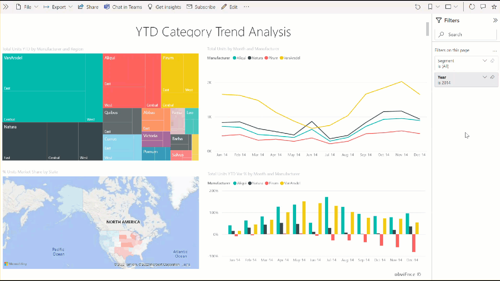

Why is this feature important? Say a colleague applied a filter that revealed an interesting insight that they want to share with the team. Without that filter selected, the comment might not make sense.

If you're using a paginated report, you may only leave a general comment about your report.  Support for leaving comments on individual paginated report visuals isn't available.

### Add a general comment to a dashboard or report
The process for adding comments to a dashboard or report is similar.  In this example, we're using a dashboard. 

1. Open a Power BI dashboard or report and select the **Comment** icon. This action opens the Comments dialog.

    

    Here we see that the dashboard creator has already added a general comment.  Anyone with access to this dashboard can see this comment.

    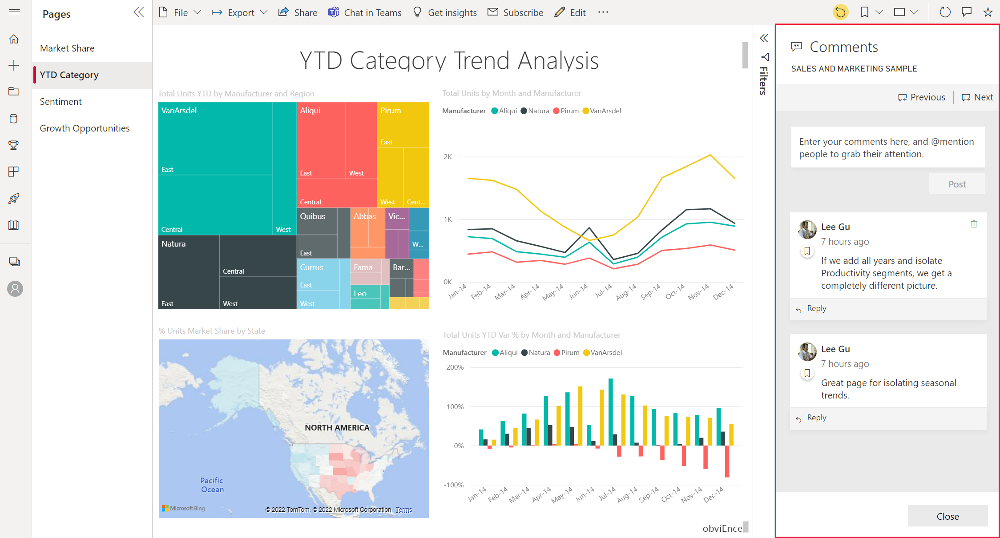

2. To respond, select **Reply**, type your response, and select **Post**.  

    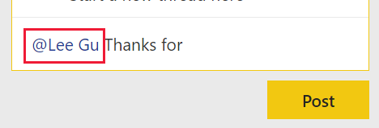

    By default, Power BI directs your response to the colleague who started the comment thread, in this case Aaron. 

    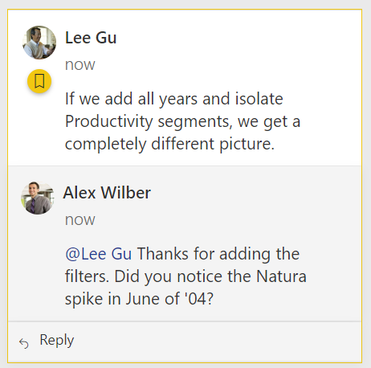

 3. If you want to add a comment that isn't part of an existing thread, enter your comment in the upper text field.

    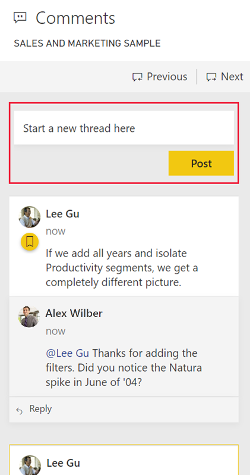

    The comments for this dashboard now look like this.

    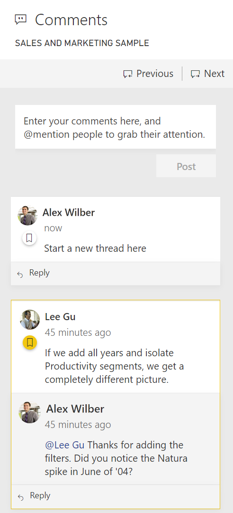

### Add a comment to a specific dashboard or report visual
In addition to adding comments to an entire dashboard or to an entire report page, you can add comments to individual dashboard tiles and individual report visuals. The processes are similar, and in this example we're using a report.

1. Hover over the visual and select **More options** (...).    
2. From the menu, select **Add a comment**.

    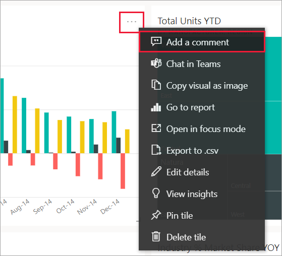  

3. The **Comments** dialog opens, and the other visuals on the page are greyed out. This visual doesn't have any comments yet. 

    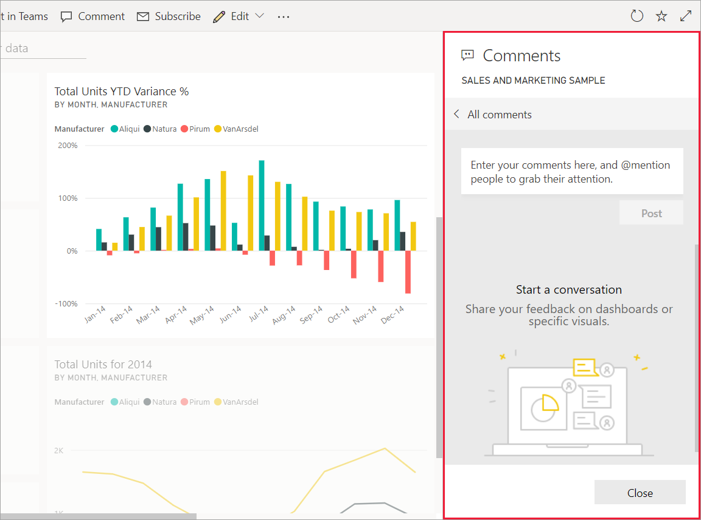  

4. Type your comment and select **Post**.

    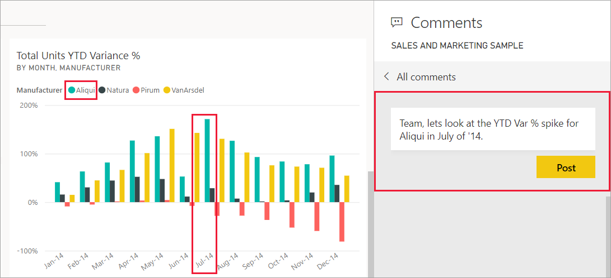  

    - On a report page, selecting a comment that was made on a visual highlights that visual (see below).

    - On a dashboard, the chart icon  lets us know that a comment is tied to a specific visual. Comments that apply to the entire dashboard don't have a special icon. Selecting the chart icon highlights the related visual on the dashboard.
    

    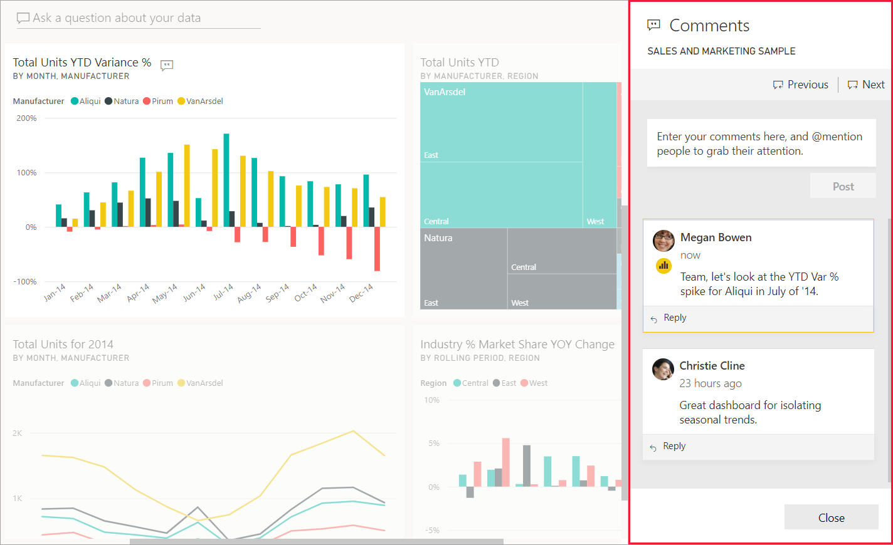

5. Select **Close** to return to the dashboard or report.

### Get your colleagues attention by using the @ symbol
Whether you're creating a dashboard, report, tile, or visual comment, grab your colleagues' attention by using the "\@" symbol.  When you type the "\@" symbol, Power BI opens a dropdown where you can search for and select individuals from your organization. Any verified name prefaced with the "\@" symbol appears in blue font. The @mentioned individuals will immediately receive an e-mail in their inbox, and if they're using a Power BI Mobile app, they'll receive a push notification on their device. They can open the report or dashboard directly from the notification, see the comment, view the data, and reply accordingly.

Here's a conversation I'm having with the visualization *designer*. They're using the @ symbol to ensure I see the comment. I receive a notification and select the link to open this dashboard and the relevant conversation.  

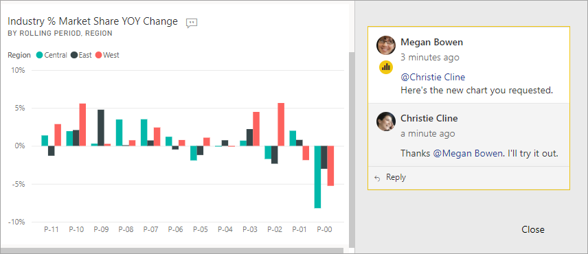  

## Considerations and troubleshooting

- Comments are limited to 2000 characters, including @mentions of other users and spaces.
- The maximum number of conversations on a dashboard or report is 100. The maximum number of comments per conversation is 1000. To add a new conversation or comment, delete prior conversations or comments.
- Bookmarks aren't captured when you reply to a conversation. Only the first comment in a conversation creates a bookmark.
- If you're using a paginated report, you may only leave a general comment about your report.  Support for leaving comments on individual paginated report visuals isn't available.

## Next steps
Back to [visualizations for business users](end-user-visualizations.md)    
[Select a visualization to open a report](end-user-report-open.md)
