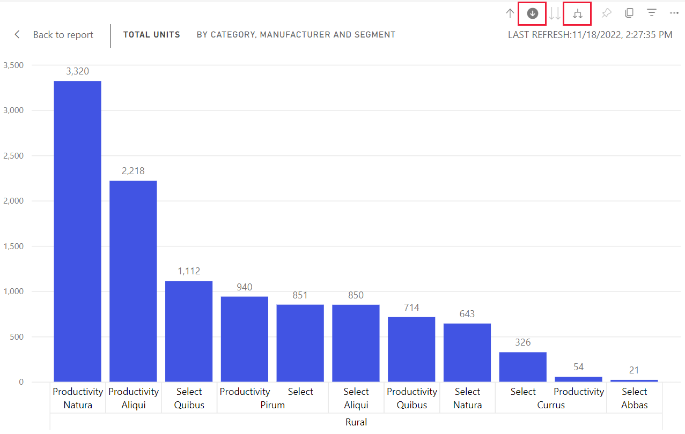
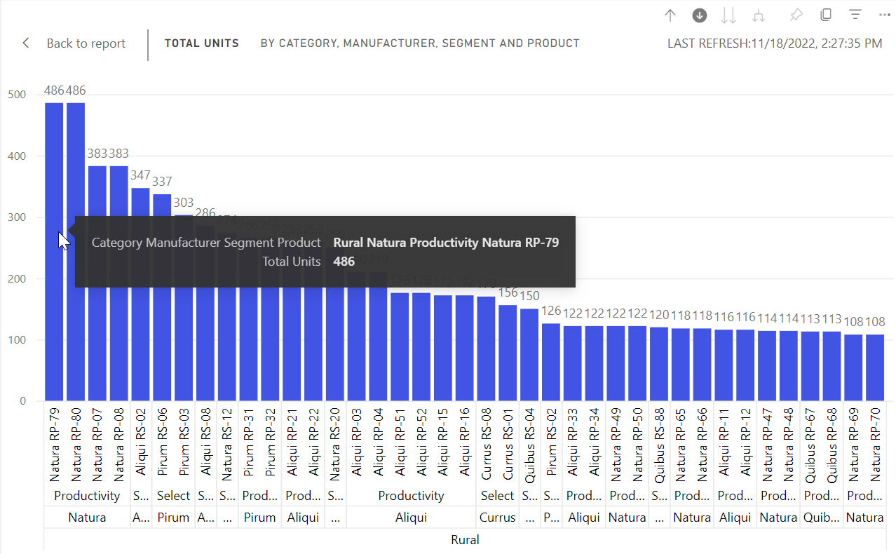

# Drill mode in the Power BI service

[!INCLUDE[consumer-appliesto-yyny](../includes/consumer-appliesto-yyny.md)]

This article shows you how to use the *drill mode* in the Microsoft Power BI service. You can explore in-depth details about your data by using the drill-down, drill-up, and expand features on your visual.

## Drill mode requirements

To use the drill mode, the Power BI visual must have a hierarchy. For example, you might have a visual that shows the number of medals won in a sports competition. The hierarchy in this example is the sport, specific types of the sport, and the events. By default, the visual shows the medal count by sport, like gymnastics, skiing, aquatics, etc. Then, you can select one of the visual elements, like a bar, line, or bubble, to display the individual sports. For example, selecting the aquatics element shows you data for swimming, diving, and water polo. Then, selecting the diving element opens the next level in the hierarchy and shows you details for springboard, platform, and synchronized diving events.

Report designers often add date hierarchies to visuals. A common date hierarchy is one that contains fields for the year, quarter, month, and day.

You can tell if a visual has a hierarchy by hovering over it. If the drill control options appear in the action bar, your visual has a hierarchy.

## Get started

The following example is a treemap that has a hierarchy made up of territory, city, postal code, and store name. The treemap shows the total number of units sold this year by territory. Territory is the top level of the hierarchy. The chart is filtered by the territories of Kentucky and Tennessee.

  

## Ways to access the drill features

There are two ways to access the drill-down, drill-up, and expand features for visuals.

One way is to hover over a visual to use the icons in the action bar. Turn on the drill-down option by selecting the single downward arrow. The grey background indicates that the drill-down option is turned on.

Another way to access the drill features is by right-clicking a data point on the visual to open a menu with available options.

## Drill down all fields at once

There are many ways to drill into your visual. Selecting the double arrow drill-down icon  takes you to the next level in the hierarchy. For example, if you're at the territory level for Kentucky and Tennessee, you can drill down to the city level, then the postal code level, and, finally, the store name level for both states. Each step in the path shows you new information.

:::image type="content" source="./media/end-user-drill/power-bi-drill-path.png" alt-text="Diagram showing the steps of the drill pathway." lightbox="./media/end-user-drill/power-bi-drill-path.png#lightbox":::

To go up a level in the hierarchy, select the drill-up icon  .

## Drill down one field at a time

The double arrow drill-down icon drills down all fields on the canvas at once. This example shows how to drill down one field at a time.

1. From the territory level, where the chart shows just Kentucky and Tennessee, select the drill-down icon  to turn it on.

    Now you have the option of drilling down **one field at a time** by selecting a visual element, like a bar, bubble, or leaf.

    

    > [!NOTE]
    > If you don't turn on the drill-down option and you select a visual element, it cross-filters the other charts on the report page rather than drilling down.

2. Select the leaf for Tennessee. The treemap now shows all the cities and territories in Tennessee that have a store.

    

3. At this point, you can:

    a. Continue drilling down for Tennessee.

    b. Drill down for a particular city in Tennessee.

    c. Expand.

    Continue to drill down one field at a time by selecting **Knoxville, TN**. The treemap now shows the postal code for the store in Knoxville.

    

    Notice that the title changes to show which level you are on as you drill down and back up again.

4. Drill down to the store name by selecting the postal code **37919** leaf. Now you are at the store name level.

    

## Expand fields

The **Expand** option adds another hierarchy level to the current view. If you're at the territory level, showing Kentucky and Tennessee, you can expand all current leaves (boxes) at the same time. The first time you expand, city data is added for both Kentucky and Tennessee. Expand again and, in addition to the city data, postal code data is added for both Kentucky and Tennessee. Each step in the path shows the previous information and adds on one level of new information.

:::image type="content" source="./media/end-user-drill/power-bi-expand-path.png" alt-text="Diagram showing the steps of the expand pathway." lightbox="./media/end-user-drill/power-bi-expand-path.png#lightbox":::

## Expand all fields at once

The following example shows how to use this feature to expand all fields at one time.

1. From the previous step, select the drill-up arrow until you reach the second level, **Total Units This Year by Territory and City**.

    

2. Confirm that the drill-down option  is still turned on and select the expand down icon . The treemap shows the same number of leaves, but each leaf has more detail. It now shows city, state, and postal code.

    

3. Select the expand down icon  one more time to display all four hierarchy levels of detail for Tennessee. Hover over a leaf to see more detail.

    

## Expand one field at a time

To get detailed data for one field, you can expand down one level in the hierarchy.

1. From the previous step, select the drill-up icon until you reach the postal code level.
2. Select the expand down icon  . The treemap now shows two levels of the hierarchy, postal code and store name.

    

When you drill down, you only go to the next level of the hierarchy. When you expand, you go to the next level of the hierarchy while also preserving the data of the level you're on.

## Show the data in a table as you drill

Use **Show as a table** to get a look behind the scenes. Each time you drill or expand, **Show as a table** displays the data that's used to build the visual. This feature makes it easier to see how hierarchies, drill, and expand work together to build visuals.

1. In the upper right corner, select **More actions** (...), and then select **Show as a table**.

    

    The data that makes up the treemap displays below the visual.

    

2. Select the double arrow icon to drill down all fields at once. Watch the data in the table change to reflect the data that's being used to create the treemap. The following table shows the results of drilling down all fields at once from the territory level to the store name level.  

    The first table represents the top level of the hierarchy. It shows the territories Kentucky and Tennessee. The next three tables represent the treemap's data as you drill down all levels at once, from territory to city to postal code to store name.

    :::image type="content" source="./media/end-user-drill/power-bi-show-data.png" alt-text="Screenshot of showing data for all four levels of drilling down." lightbox="./media/end-user-drill/power-bi-show-data.png#lightbox":::

    Notice that the totals are the same for City, PostalCode, and Name. Totals don't always match, but for this data, there's only one store in each postal code and in each city.  

## Considerations and limitations

- By default, drilling doesn't filter other visuals in a report, but the report designer can change this setting. As you drill, look to see if the other visuals on the page are cross-filtering or cross-highlighting.

- To view a report that has been shared with you, a Power BI Pro or Premium license is required, or the report must be stored in Power BI Premium capacity. For more information, see [Find out which licenses you have](end-user-license.md#find-out-which-licenses-you-have).

## Next steps

[Visuals in Power BI reports](../visuals/power-bi-report-visualizations.md)

[Power BI reports](end-user-reports.md)

[Power BI - Basic Concepts](end-user-basic-concepts.md)

More questions? [Visit the Power BI Community](https://community.powerbi.com/)
