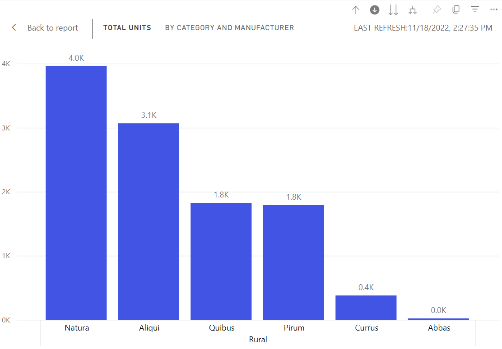
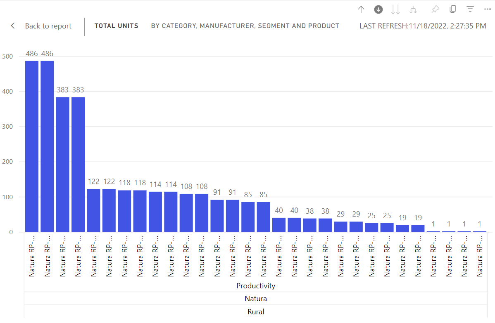
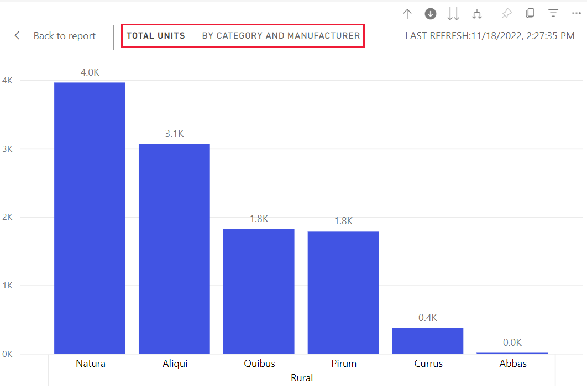
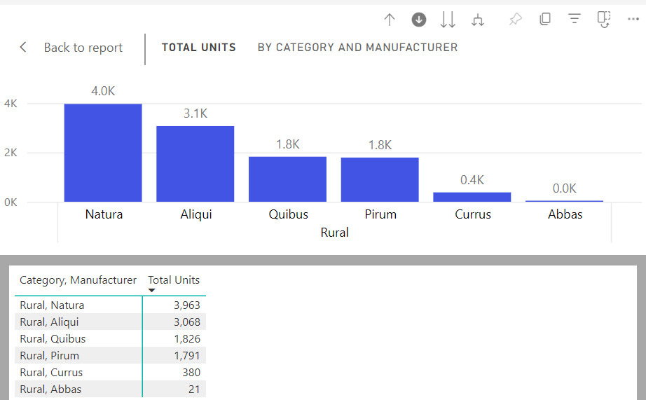
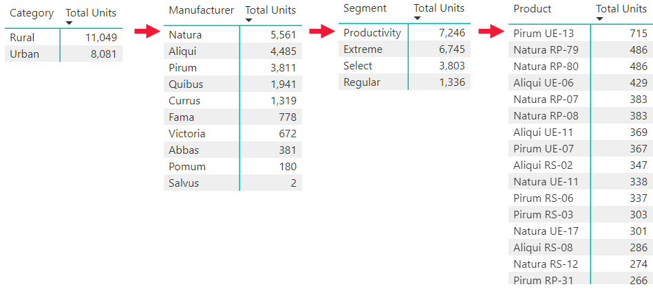

# Drill mode in the Power BI service

[!INCLUDE[consumer-appliesto-yyny](../includes/consumer-appliesto-yyny.md)]

This article shows how to use the *drill mode* in the Microsoft Power BI service. You can explore in-depth details about your data by using drill down, drill up, and expand on your visual's data points.

## Drill mode requirements

To use the drill mode, the Power BI visual must have a hierarchy. For example, you might have a visual that looks at the Olympic medal count with a hierarchy of sport, specific types of the sport, and event. By default, the visual shows medal count by sport (gymnastics, skiing, aquatics, etc.). Then, you can select one of the visual elements, like a bar, line, or bubble, to display the individual sports. For example, selecting the aquatics element shows you data for swimming, diving, and water polo. Then, selecting the diving element takes you to the next level in the hierarchy and shows you details for springboard, platform, and synchronized diving events.

Dates are a unique type of hierarchy. Report designers often add date hierarchies to visuals. A common date hierarchy is one that contains fields for the year, quarter, month, and day.

You can tell if a visual has a hierarchy by hovering over it. If the drill control options appear in the action bar, your visual has a hierarchy.

## Get started

In this example, we're using a treemap that has a hierarchy made up of territory, city, postal code, and store name. The default chart looks at total units sold this year by territory. Territory is the top level of the hierarchy. Find this information in the **Filters** menu on the action bar.

  

## Ways to access the drill features

You have two ways to access the drill down, drill up, and expand features for visuals that have hierarchies.

- Hover over a visual to see and use the icons. First, turn on the drill down option by selecting the single downward arrow. The grey background indicates that the drill down option is enabled. Now you can select the drill up or expand options, or select a data point on the visual to drill down.

    

- Or, you can right-click a data point on the visual and select drill down, drill up, or expand.

    

## Drill down all fields at once

You have several ways to drill into your visual. Select the double arrow drill down icon  to go to the next level in the hierarchy. For example, if you're at the territory level for Kentucky and Tennessee, you can drill down to the city level, then the postal code level, and, finally, the store name level for both states. Each step in the path shows you new information.

:::image type="content" source="./media/end-user-drill/power-bi-drill-path.png" alt-text="Diagram showing the steps of the drill pathway." lightbox="./media/end-user-drill/power-bi-drill-path.png#lightbox":::

To get back to the territory level, select the drill up icon  three times.

## Expand all fields at once

**Expand** adds another hierarchy level to the current view. If you're at the territory level, you can expand all current leaves at the same time. Your first drill adds city data for both Kentucky and Tennessee. The next drill adds postal code data for both Kentucky and Tennessee and also keeps city data. Each step in the path shows the previous information and adds on one level of new information.

## Drill down one field at a time

1. Select the drill down icon  to turn it on.

    Now you have the option of drilling down **one field at a time** by selecting a visual element, like a bar, bubble, or leaf.

    

    If you don't turn on the drill down option and you select a visual element, it cross-filters the other charts on the report page rather than drilling down.

2. Select the leaf for Tennessee. The treemap now shows all the cities and territories in Tennessee that have a store.

    

3. Now you can:

    1. Continue drilling down for Tennessee.

    1. Drill down for a particular city in Tennessee.

    1. Expand.

    Continue to drill down one field at a time by selecting **Knoxville, TN**. The treemap now shows the postal code for the store in Knoxville.

    

    Notice that the title changes as you drill down and back up again.

    Drill down to the store name by selecting the postal code **37919** leaf.

    

## Expand all and expand one field at a time

To get more detailed data on this chart, you can expand down one level in the hierarchy.  

1. Drill back up to the postal code level.
2. Select the expand down icon . The treemap now shows two levels of the hierarchy, postal code and store name.

    

3. To see all four hierarchy levels of data for Tennessee, select the drill up arrow until you reach the second level, **Total Units This Year by Territory and City**.

    

4. Confirm that the drill down option  is still turned on and select the expand down icon . The treemap shows the same number of leaves, but each leaf has more detail. It now shows city, state, and postal code.

    

5. Select the expand down icon one more time to display all four hierarchy levels of detail for Tennessee. Hover over a leaf to see even more detail.

    

## Show the data as you drill

Use *Show as a table* to get a look behind the scenes. Each time you drill or expand, *Show as a table* displays the data that's used to build the visual. This feature makes it easier to see how hierarchies, drill, and expand work together to build visuals.

1. In the upper right corner, select **More actions** (...), and then select **Show as a table**.

    

    The treemap opens so that it fills the canvas. The data that makes up the treemap displays below the visual.

    

2. With the visual alone in the canvas, continue drilling. Watch the data in the table change to reflect the data that's being used to create the treemap. The following table shows the results of drilling down all fields at once from the territory level to the store name level.  

    The first table represents the top level of the hierarchy. It shows the territories **KY** and **TN**. The next three tables represent the treemap's data as you drill down all levels at once, from territory to city to postal code to store name.

    

    Notice that the totals are the same for City, PostalCode, and Name. Totals don't always match, but for this data, there's only one store in each postal code and in each city.  

## Considerations and limitations

- By default, drilling doesn't filter other visuals in a report. However, the report designer can change this default behavior. As you drill, look to see if the other visuals on the page are cross-filtering or cross-highlighting.

- Viewing a report that has been shared with you requires a Power BI Pro or Premium license, or the report must be stored in Power BI Premium capacity. For more information, see [Find out which licenses you have](end-user-license.md#find-out-which-licenses-you-have).

## Next steps

[Visuals in Power BI reports](../visuals/power-bi-report-visualizations.md)

[Power BI reports](end-user-reports.md)

[Power BI - Basic Concepts](end-user-basic-concepts.md)

More questions? [Visit the Power BI Community](https://community.powerbi.com/)
