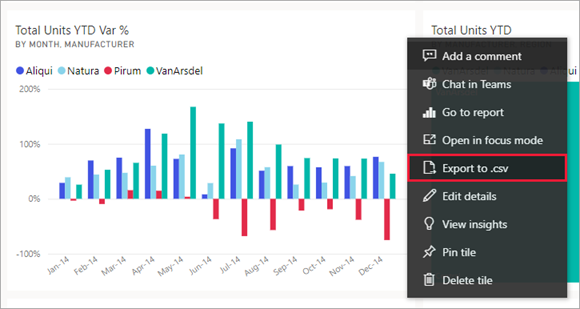
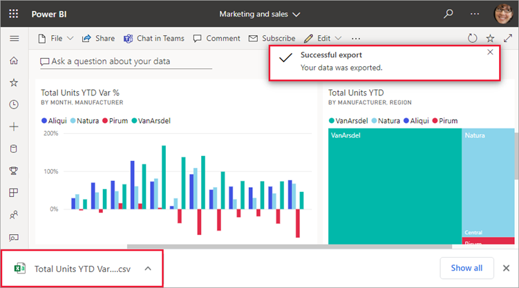
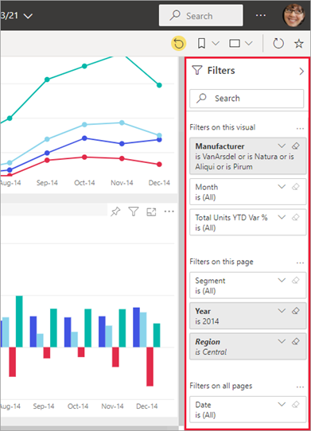

# Export data from a visual

[!INCLUDE[consumer-appliesto-yyny](../includes/consumer-appliesto-yyny.md)]

To see the data that's used to create a visual, [you can display that data in Power BI](end-user-show-data.md), or export it to Excel. The option to export the data requires a certain type or license and edit permissions to the content. If you can't export, check with your Power BI administrator or IT help desk. 

Exporting data requires a Power BI Pro license, or for the dashboard or report to be shared with you using Premium capacity. To learn more, see [Which license do I have?](end-user-license.md). The report author may have turned off data export for a report. If you can't export data, check with the report author.

## From a visual on a Power BI dashboard

1. Start on a Power BI dashboard. Here we're using the dashboard from the ***Marketing and sales sample*** app. You can [download this app from AppSource.com](https://appsource.microsoft.com/en-us/product/power-bi/microsoft-retail-analysis-sample.salesandmarketingsample
).

    

2. Hover over a visual to reveal **More options** (...) and click to display the action menu.

    

3. Select  **Export to .csv**.

4. What happens next depends on which browser you're using. You may be prompted to save the file or you may see a link to the exported file at the bottom of the browser. By default, your export is saved to your local Downloads folder. 

    

5. Open the file in Excel. 

    > [!NOTE]
    > If you don't have permissions to the data, you won't be able to export or open in Excel.  

    

## From a visual in a report
You can export data from a visual in a report as .csv or .xlsx (Excel) format. 

1. On a dashboard, select a tile to open the underlying report.  In this example, we're selecting the same visual as above, *Total Units YTD Var %*. 

    

    Since this tile was created from the *Sales and Marketing Sample* report, that is the report that opens. And, it opens to the page that contains the selected tile visual. 

2. Select the visual in the report. Notice the **Filters** pane to the right. This visual has filters applied. To learn more about filters, see [Use filters in a report](end-user-report-filter.md).

    

3. Select **More options (...)** from the upper right corner of the visualization. Choose **Export data**.

    

4. You'll see options to export Summarized data or Underlying data. If you're using the *Sales and marketing sample* app, **Underlying data** will be disabled. But you may find reports where both options are enabled. Here's an explanation of the difference.

    **Summarized data**: select this option if you want to export data for what you currently see in the visual.  This type of export shows you only the data that was used to create the current state of the visual. If the visual has filters applied, then the data you export will also be filtered. For example, for this visual, your export will include only data for 2014 and the central region, and only data for four of the manufacturers: VanArsdel, Natura, Aliqui, and Pirum. If your visual has aggregates (sum, average, and so on), the export will also be aggregated. 
  

    **Underlying data**: select this option if you want to export data for what you see in the visual **plus** additional data from the underlying dataset.  This may include data that is contained in the dataset but not used in the visual. If the visual has filters applied, then the data you export will also be filtered.  If your visual has aggregates (sum, average, etc.), the export will remove the aggregation; essentially flattening the data. 

    

5. What happens next depends on which browser you're using. You might be prompted to save the file or you might see a link to the exported file at the bottom of the browser. If you're using the Power BI app in Microsoft Teams, your exported file is saved in your local Downloads folder. 

    

    > [!NOTE]
    > If you don't have permissions to the data, you won't be able to export or open in Excel.  

6. Open the file in Excel. Compare the amount of data exported to the data we exported from the same visual on the dashboard. The difference is that this export includes **Underlying data**. 

    

## Next steps

[Display the data used to create a visual](end-user-show-data.md)