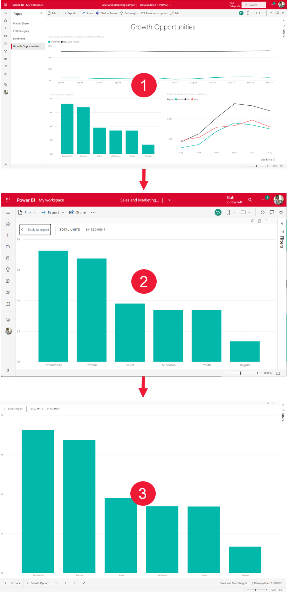
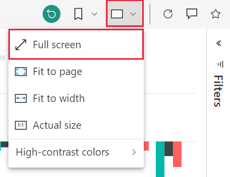
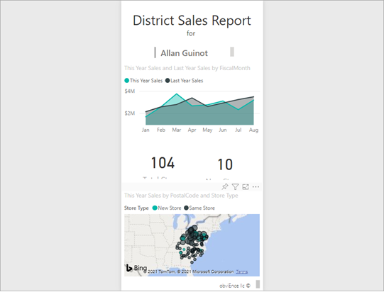
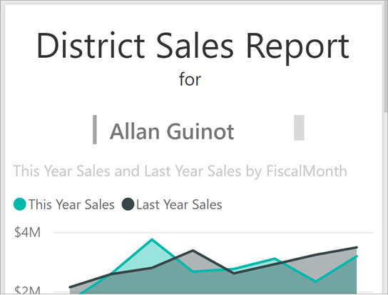
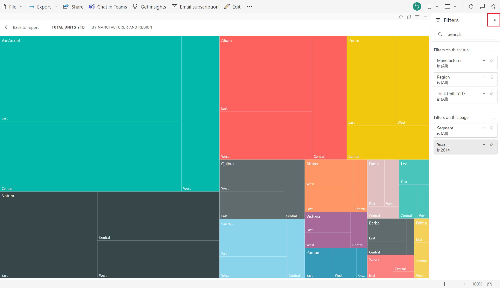

# Display content in more detail: focus mode and full screen mode

[!INCLUDE [consumer-appliesto-yynn](../includes/consumer-appliesto-yynn.md)]

> [!NOTE]  
> This video might use earlier versions of Power BI Desktop or the Power BI service.

<iframe width="560" height="315" src="https://www.youtube.com/embed/dtdLul6otYE" frameborder="0" allowfullscreen></iframe>

Focus mode and full screen mode are two different ways to see more detail in your visuals, reports, and dashboards.  The main difference between the two is that full screen removes all the panes surrounding your content while focus mode allows you to still interact with your visuals. Let's take a closer look at the similarities and differences.  

|Content    | Focus mode  |Full screen mode  |
|---------|---------|----------------------|
|Dashboard     |   Not possible     | Yes |
|Report page   | Not possible  | Yes|
|Report visual | Yes    | Yes |
|Dashboard tile | Yes    | Not possible |
|Windows 10 mobile | Not possible | Yes |

In the following example, we started with a report (1), opened one of the visuals in focus mode (2) and then opened that same visual in full screen mode (3). 

## When to use full screen mode

Display your Power BI service content (dashboards, report pages, and visuals) without the distraction of menus and nav panes. You get an unadulterated, full view of your content at a glance, all the time. This view is sometimes referred to as TV mode.   

If you're using Power BI mobile, [full screen is available for Windows 10 mobile apps](./mobile/mobile-windows-10-app-presentation-mode.md). 

Use full screen mode to:

* Present your dashboard, visual, or report at a meeting or conference.
* Display in an office on a dedicated large screen or projector.
* View on a small screen.
* Review in locked mode--you can touch the screen or mouse over tiles without opening the underlying report or dashboard.

## When to use focus mode

***Focus*** mode lets you expand (pop out) a visual or tile to see more detail. Maybe you have a dashboard or report that is a little crowded and you want to zoom in on only one visual. This function is a perfect use of focus mode.  

While in focus mode, a Power BI *business user* can interact with any filters that were applied when this visual was created. In the Power BI service, you can use focus mode on a dashboard tile or report visual.

## Work in full screen mode

Full screen mode is available for dashboards, report pages, and report visuals. 

- To open a dashboard in full screen mode, select the full screen icon :::image type="icon" source="media/end-user-focus/power-bi-full-screen-icon.png"::: from the top menu bar. 

- To open a report page in full screen mode, select **View** > **Full screen**.

    

- To see a visual in full screen mode, first open it in focus mode and then select **View** > **Full screen**.  

Your selected content fills the entire screen. When you're in full screen mode, navigate using either the menu bars at the top and bottom (reports) or the menu that appears when you move your cursor (dashboards and visuals). Because full screen is available for such a wide variety of content, the navigation options vary.   

  * Select the **Back**, **Go back**, or **Back to report** button  to navigate to the previous page in your browser. If the previous page was a Power BI page, it too will display in full screen mode.  Full screen mode will persist until you exit out.

  * :::image type="icon" source="media/end-user-focus/power-bi-fit-to-screen-icon.png":::    
    Use the **Fit to page** button to display your dashboard at the largest size possible without resorting to scrollbars.  

    

  * :::image type="icon" source="media/end-user-focus/power-bi-fit-width.png":::    
    Sometimes you don't care about scrollbars, but you want the dashboard to fill the entire width of the available space. Select the **Fit to width** button.    

    

  * :::image type="icon" source="media/end-user-focus/power-bi-report-nav2.png":::       
    In full screen reports, use these arrows to move between the pages in the report.    
  * :::image type="icon" source="media/end-user-focus/exit-fullscreen-new.png":::     
  To exit full screen mode, select the **Exit full screen** icon.

      

## Work in focus mode

Focus mode is available for dashboard tiles and report visuals. 

- To open a dashboard tile in focus mode, hover over a dashboard tile or report visual, select **More options** (...) and choose **Open in focus mode**.

    

- To open a report visual in focus mode, hover over the visual and select the **Focus mode** icon :::image type="icon" source="media/end-user-focus/pbi_popout.jpg":::.

   

The visual opens and fills the entire canvas. Notice that you still have a **Filters** pane that you can use to interact with the visual. The **Filters** pane can be collapsed.

   

     

Explore further by [modifying the filters](end-user-report-filter.md) and looking for interesting discoveries in your data. As a *business user*, you can't add new filters, change the fields being used in the visuals, or create new visuals. However, you can interact with the existing filters. 

For a dashboard tile, your changes can't be saved. For a report visual, any modifications you make to the existing filters are saved when you exit Power BI. If you don't want Power BI to remember your modifications, select the **Reset to default** button :::image type="icon" source="media/end-user-focus/power-bi-resets.png":::.

Leave focus mode and return to the dashboard or report by selecting either **Exit focus mode**  or **Back to report** (in the upper left corner of the visual).

    

  

## Considerations and troubleshooting

* When using focus mode with a visual in a report, you'll be able to view and interact with all filters: Visual level, Page level, Drillthrough, and Report level.    
* When using focus mode with a visual on a dashboard, you'll be able to view and interact with only the Visual level filter.

## Next steps

[View settings for reports](end-user-report-view.md)