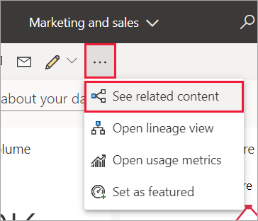

# How to determine that content is up to date

[!INCLUDE[consumer-appliesto-yynn](../includes/consumer-appliesto-yynn.md)]

This article shows you how to determine when your content was last updated or refreshed and also suggests ways to stay in sync with your most important data.

## Timestamps in the Power BI service

As a business user, you interact with content that's created by designers and made available to you. The content contains timestamps, so you know when it was published, shared, or last updated. Knowing that you're working with the freshest content gives you confidence and is often critical in making the right decisions.

What can you do to ensure you're using the latest content? In most cases, you don’t need to do anything at all. Any content, like apps, dashboards, scorecards, or reports, that's been shared with you is automatically refreshed and updated on a schedule that's set by the designer. The designer either manually updates content, or they can update it automatically by setting an automated refresh schedule.

If you have questions about content freshness, contact the designer directly. The examples below show you how to identify and contact the owner of your content.

:::image type="content" source="media/end-user-fresh/power-bi-owner.png" alt-text="Screenshot showing contact information in the title menu.":::

## Different types of timestamps

Power BI adds date and time information when content is published, shared, updated, and refreshed. The type of date depends on the content. For example, apps have a published date and the content within an app has an updated date. Other types of content have shared and refreshed dates.

It's less helpful to know which type of timestamp goes where, and more helpful to know where to find a timestamp. The following are general guidelines to help you determine the freshness of your content.

## Content lists

In a list of content in the Power BI service, there's an owner column and a timestamp column. The type of owner and timestamp depends on the content. The following example shows the Publisher name and Published date on the **Apps** page.

:::image type="content" source="media/end-user-fresh/power-bi-app.png" alt-text="Screenshot showing a list of apps with a published date and publisher.":::

The next example shows the owner of the content and the Shared date when you go to the Browse page and then the Shared with me tab.

:::image type="content" source="media/end-user-fresh/power-bi-shared.png" alt-text="Screenshot showing shared with me screen. Shared date and owner are outlined.":::

The final example shows a content list in a workspace. The owner of the content, the Refreshed date, and the date of the Next refresh are listed.

:::image type="content" source="media/end-user-fresh/power-bi-app-workspace-list.png" alt-text="Screenshot showing a workspace open to the content list. Refresh dates and owner are outlined.":::

The designer sets up the refresh schedule for content. Some content gets updates continually and other content might refresh daily, weekly, or not at all. Not all content is scheduled for refreshing, so you might see empty entries. If an error occurs during a refresh, an error icon appears in the timestamp column.

## View reports

In a report, there's an arrow on the title bar. Select the arrow to see contact information and a timestamp. Dashboards, worksheets, and scorecards show the owner but not a timestamp. Select the **Owner** or **Contact** link if you have questions or suggestions for the owner of the report.

:::image type="content" source="media/end-user-fresh/power-bi-owners.png" alt-text="Screenshot showing the title menu on a report.":::

## View dashboards

The dashboard title menu shows a contact, but not a timestamp. However, you can view the last refresh date for individual dashboard tiles and for the underlying dataset.

:::image type="content" source="media/end-user-fresh/power-bi-dashboard-menu.png" alt-text="Screenshot showing the Marketing and sales dashboard title menu.":::

1. View a tile in Focus mode to see the Last refresh timestamp. On a dashboard tile, select **More options** (...) and choose **Open in focus mode**.

    

    The last refresh date is in the upper right corner. If you don't see it, expand your browser to make it wider.

    

2. Return to the dashboard, select **More actions (...)**, and then select **See related content** from the Power BI upper menu bar.

    

    The **Related content** pane shows the last refresh information for the dashboard or report's underlying dataset.

    

## Stay in sync with your content

There are built-in Power BI features available that can help you stay up-to-date with your most important content.

## Set data alerts

To be notified if data goes above or below a specified limit, [Create a data alert](end-user-alerts.md) for a dashboard. It's easy to stay up-to-date by using data alerts. Adjust your settings, so Power BI sends you an email if a value on a dashboard passes a specific threshold. For example, receive an alert if inventory falls below 25 units or if sales exceed stated goals.  

## Subscribe to see changes

Another way to stay up-to-date is to subscribe to a report or dashboard. Instead of logging in to view a report or dashboard, have a snapshot sent to you on a schedule that you set. For more information, see [subscribe to dashboards and reports](end-user-subscribe.md).

## Considerations and limitations

Each individual piece of content within an app has its own updated date and owner. That information might be different from the published date and app owner for the entire app.

## Next steps

[Create a data alert](end-user-alerts.md)  
[Subscribe to dashboards and reports](end-user-subscribe.md)  
[View related content](end-user-related.md)  
