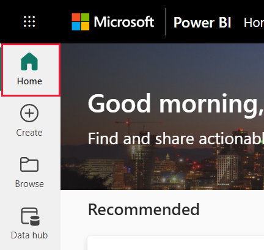
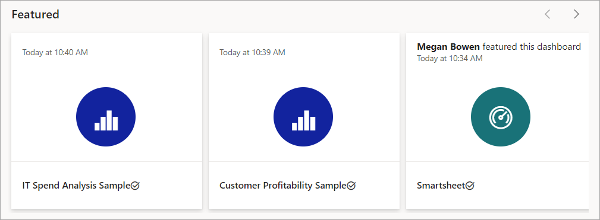
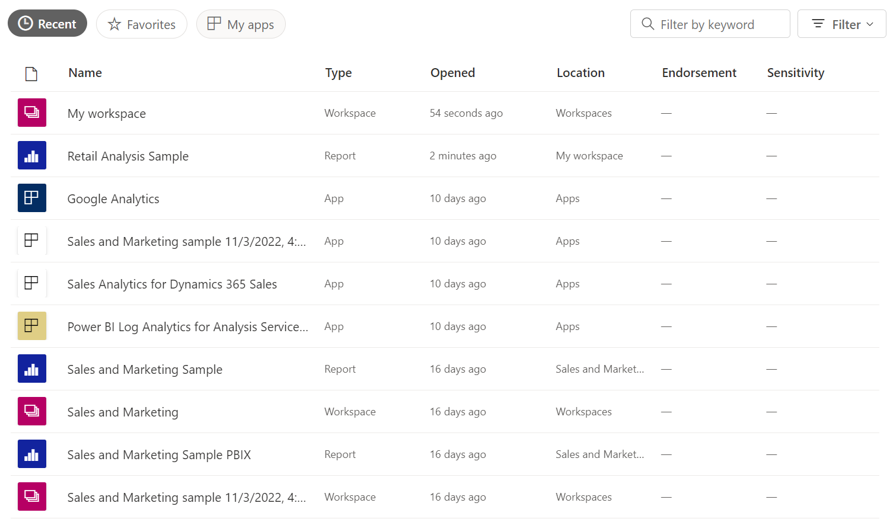
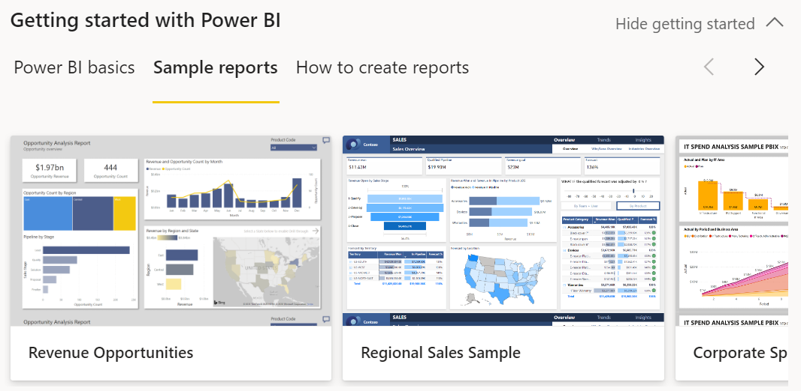
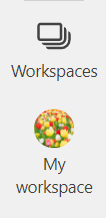
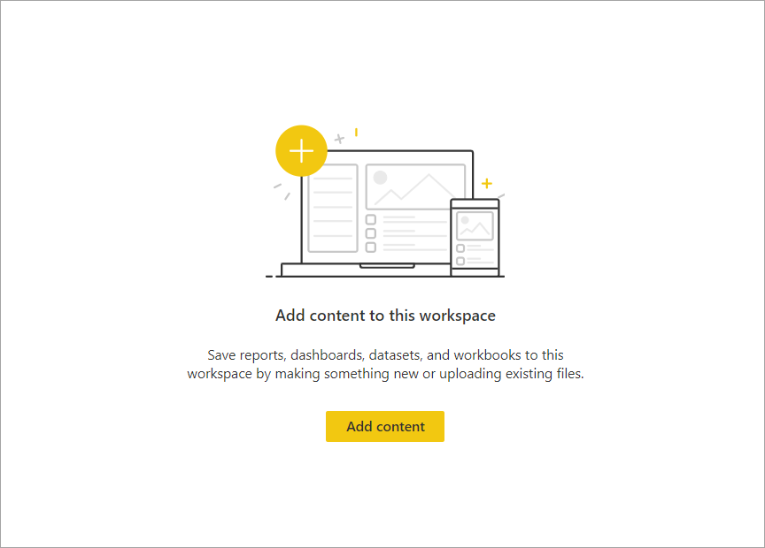
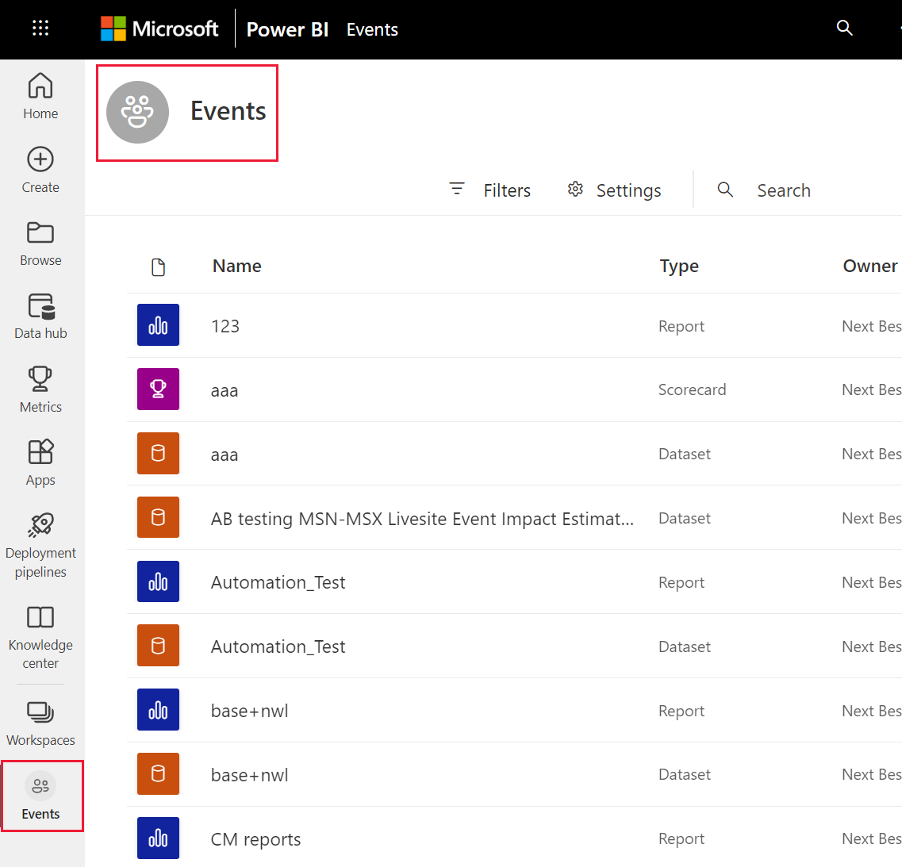

# Find your dashboards, reports, and apps

[!INCLUDE[consumer-appliesto-yynn](../includes/consumer-appliesto-yynn.md)]

In Power BI, the term *content* refers to apps, dashboards, reports, and more. Content is created by Power BI *designers*, who share it with their colleagues. Your content is accessible and viewable in the Power BI service, and often the best place to start working in the Power BI service is from Power BI **Home**.

## Explore Power BI Home
After you sign in to the Power BI service, select **Home** from the navigation pane. 

Power BI displays your Home canvas. The layout and content on Home is different for every user. New users will have less content, but that will change as they use Power BI more often. Only content that you can access will display on your Home. For example, if you don't have permissions to a report, then that report won't appear on Home. 

> [!NOTE]
> The **Getting started** section on Home is being deprecated in mid December 2022. The articles and modules included in **Getting started** will continue to be available from the Power BI online documentation. The sample reports are already available from the **Learning/Knowledge center**. 
>
> :::image type="content" source="media/end-user-home/power-bi-knowledge-center.png" alt-text="Screenshot of the left navigation menu with Knowledge center selected":::

## Simplified layout and Expanded layout
Your Home view will also depend on the layout you've selected. By default, you'll see the **Simplified** view. This view includes **Recommended** content at the top with tabs for **Recent**, **Favorites**, and **My apps** below. **Recommended** content may include content that:
- you've marked as a favorite
- you visit often
- is visited most often by colleagues in your organization
- has been featured on Home
- is used frequently by your closest colleagues
- is Getting started content

The screenshots below show an example **Simplified** layout for a new user and then for a more experienced user.

:::image type="content" source="media/end-user-home/power-bi-home.png" alt-text="Screenshot of Simplified view for a new user.":::

:::image type="content" source="media/end-user-home/power-bi-simplified-user.png" alt-text="Screenshot showing Power BI Home of an experienced user with the Simplified toggle selected.":::

The **Expanded** layout includes a different set of information. The images below are using the *Expanded* view. Once you've selected the **Expanded** toggle, the expanded layout will become your default Home layout. 

This view includes **Favorites + frequents** and **Featured** at the top, with tabs for **Recent**, **Favorites**, **My apps**, and **From external orgs** below. 

:::image type="content" source="media/end-user-home/power-bi-expanded.png" alt-text="Screenshot showing the Power BI service Home of an experienced user with the Expanded toggle selected.":::

## Locating content from your Home canvas

Power BI Home offers three different ways of locating and viewing your content. All three access the same pool of content, they're merely different ways of getting to that content. Occasionally, searching will be the easiest and quickest way to find something, while other times, selecting a *card* on the Home canvas will be your best option.

- The Home canvas displays and organizes your favorite, frequent, recent, and recommended, along with apps and workspaces.  If you're new to the Power BI service, you'll also have Getting started content. Select a card, or an item in a list, to open it.
- Along the left side, is a navigation pane, referred to as the nav pane. On the nav pane, your same content is organized a little differently. Select **Browse** to see your recent, favorite, and shared content. Select **Data hub** to see data available to you from across your organization. Select **Apps** to see a list of apps available to you. And, select **Knowledge/Learning center** to see learning materials, sample reports, training, and more. 
- At the top, the global search box lets you search for content by title, name, or keyword.

The following topics review each of these options for finding and viewing content.

## Home canvas
On the Home canvas, you can view all the content that you have permission to use. Your Home canvas also updates with getting started content, samples, and learning resources. At first, you might not have much content on your Home canvas, but that will change as you start to use Power BI with your colleagues.
 
As you work in the Power BI service, you'll receive dashboards, reports, and apps from colleagues, and then Power BI Home will eventually fill in. Over time, it might resemble the following (shown using Expanded layout).

:::image type="content" source="media/end-user-home/power-bi-full.png" alt-text="A screenshot of the Welcome screen for the Power BI service.":::

 
The next few topics take a closer look at each section of Home. Your Home landing page may look different. Power BI optimizes Home based on your usage and settings and the layout that you've selected.

## Most important content at your fingertips

### Favorites and frequents
This section contains links to the content that you visit most often or that you've tagged as [a favorite](end-user-favorite.md). Notice that these cards have black stars; they've been tagged as favorites. 

### Featured
The **Featured** section contains content that your administrator or colleagues have *promoted* to your Home. Typically, this content is important or helpful for you to do your job. In this example, the featured content includes metrics to track success.  Unless it has been disabled by your administrator, any user with Admin, Member, or Contributor permissions to a workspace can feature content on Home. For more information about featuring content on Home, see [Feature content on colleagues' Power BI Home](../collaborate-share/service-featured-content.md)

### Recents and My apps
The next section is two (or more) tabbed lists. 
- **Recent** is the content you've visited most recently. Notice the timestamp for each item. 

- The **My apps** section lists [apps that have been shared with you](end-user-apps.md) or that you've [downloaded from AppSource](end-user-apps.md); the most recent apps are listed here. 

- **From external orgs** (Preview) lists shared datasets available from other tenants. Use this list to discover and connect to data from external providers.

- In some scenarios, you'll also see a tab for content that you've tagged as [**Favorites**](end-user-favorite.md). 

 
### Getting started learning resources
The exact resources that appear depend on your activity, settings, and Power BI administrator. If you're a new user, you'll see Getting started content under **Recommended** in **Simplified** layout. And you'll see a **Getting started with Power BI** section in **Expanded** layout.  In **Expanded** layout, when you no longer need to see the Getting started tabs, select **Hide getting started**.

## Explore the nav pane

The nav pane classifies your content in ways that help you find what you need, quickly.  

Use the nav pane to locate and move between dashboards, reports, apps, and other content. Occasionally, using the nav pane will be the quickest way to get to content. The nav pane is there when you open your Home landing page, and remains there as you open other areas of the Power BI service. It can be collapsed by selecting this icon  .
  
The nav pane organizes your content into containers that are similar to what you've already seen on the Home canvas: Favorites, Recent, Apps, Datasets, Metrics, Shared with me, and workspaces. Some containers have flyouts that offer you the option of viewing just the most-recent content in a container. Otherwise, select a container to see all content.
 
- To open one of these content sections and display a list of all items, select the heading.
- To see the most recent in either the **Favorites** or **Recent** container, select the flyout (**>**).

    

 
To summarize, the nav pane is another way for you to find the content you want, quickly. Content is organized in a manner similar to the Home canvas, but shown in lists instead of cards. 

### Workspaces
Every Power BI service user has one **My workspace**. **My workspace** will only contain content if you've downloaded Microsoft samples or created your own dashboards, reports, or apps. For many *business users*, **My workspace** will be empty and will remain empty. If you're a brand new user, you'll only have one workspace, **My workspace**.

And if you select that one workspace, you'll find it empty.

If someone in your organization adds you to a workspace, you'll see it in your list of workspaces. Over time, you'll have more than one workspace. For example, your coworkers can add you to a workspace by giving you a role, such as Member, Contributor, or Viewer. If you [download a template app](end-user-app-marketing.md) from outside your organization, you'll get the combination of an app and a new workspace. You can also create workspaces, if you have a Power BI Pro or Premium Per User license. To open a *workspace*, select it from the nav pane. 

The workspace opens on your canvas and the name of the workspace will be listed on your nav pane. When you open a workspace, you'll see the content it contains. This content includes: dashboards, reports, worksheets, dataflows, and more.  In this example, we've opened the **Supplier Quality Analysis** workspace and see that it contains one report, one dashboard, and one dataset.

## Search all of your content
Sometimes, the fastest way to find your content is to search for it. For example, perhaps you've discovered that a dashboard you haven't used in a while isn't showing up on your Home canvas. Or, you remember that your colleague shared something with you, but you don't remember what he called it or what type of content he shared, whether it was a dashboard or a report. Or you may have so much content that it's easier to search than it is to scroll or sort. 
 
The search field is located in the upper right section of the Home menu bar. You can enter the full or partial name of that dashboard and search for it. Additionally, you can enter your colleague's name and search for content that they've shared with you. The search is scoped to look for matches in all the content that you own or have access to.

## Considerations and limitations

We've deprecated the ability to hide items on Power BI Home.  However, if you previously hid items, they'll remain hidden.  To manage your hidden items, select **Settings** > **Settings** > **General** > **Hidden items**.

:::image type="content" source="media/end-user-home/power-bi-hidden.png" alt-text="Screenshot of the General tab showing Hidden items option selected":::

## Next steps
Overview of the [Power BI basic concepts](end-user-basic-concepts.md)

