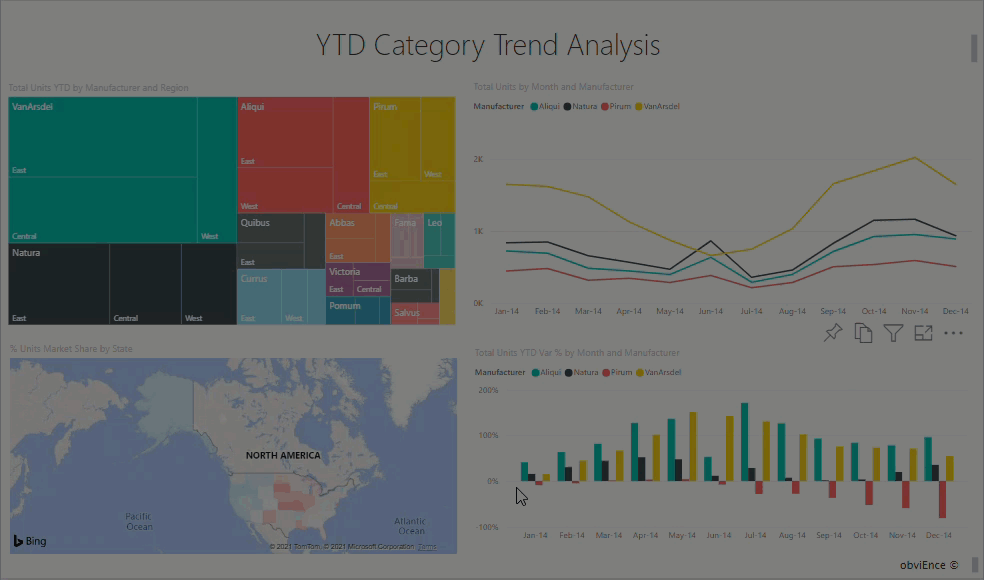

# How visuals cross-filter each other in a Power BI report

[!INCLUDE[consumer-appliesto-yyny](../includes/consumer-appliesto-yyny.md)]

One of the great features of Power BI is the way all visuals on a report page are interconnected. If you select a data point on one of the visuals, all the other visuals on the page that contain the same data change based on your selection.

## How visuals interact with each other

By default, selecting a data point in one visual on a report page will cross-filter or cross-highlight the other visuals on the page. The report *designer* sets how the visuals on a page interact. *Designers* have options to turn visual interactions on and off, and to change the default cross-filtering, cross-highlighting, and [drilling](end-user-drill.md) behavior.

If you haven't encountered hierarchies or drilling yet, you can learn all about them by reading [Drill down in Power BI](end-user-drill.md).

### Cross-filter and cross-highlight

Cross-filtering and cross-highlighting can be useful to identify how one value in your data contributes to another. The terms *cross-filter* and *cross-highlight* are used to distinguish the behavior described here from what happens when you use the **Filters** pane to filter and highlight visuals.  

The following report pages show examples of cross-filtering and cross-highlighting. The **Total Category Volume by Segment** bar chart has two values, **Moderation** and **Convenience**.

:::image type="content" source="media/end-user-interactions/power-bi-gauge.png" alt-text="Screenshot of the VanArsdel Market Share report page with a visual highlighted.":::

In the following example, **Moderation** is selected.

:::image type="content" source="media/end-user-interactions/power-bi-filtered.png" alt-text="Screenshot of a report page after the Moderation segment of the bar chart is selected.":::

Because **Moderation** is selected on the bar chart:

- **Cross-filtering** removes data that doesn't apply. Selecting **Moderation** in the bar chart cross-filters the line chart. The line chart now only displays data points for the Moderation segment.

- **Cross-highlighting** retains all the original data points but dims the portion that doesn't apply to your selection. Selecting **Moderation** in the bar chart cross-highlights the column chart. The column chart dims all the data that applies to the Convenience segment and highlights all the data that applies to the Moderation segment.

## Considerations and troubleshooting

- If your report has a visual that supports [drilling](end-user-drill.md), by default, drilling one visual has no effect on the other visuals on the report page. However, the report *designer* can change this behavior, so check your drillable visuals to see if **drilling filters other visuals** has been enabled by the report *designer*.

- Visual-level filters are retained when cross-filtering and cross-highlighting other visuals on the report page. So, if VisualA has visual-level filters applied by the report designer or by you, and you use VisualA to interact with VisualB, visual-level filters from VisualA will be applied to VisualB.

    :::image type="content" source="media/end-user-interactions/power-bi-visual-filters.png" alt-text="Screenshot of a report visual with filters already set.":::

- If the tables have no hierarchical relationships, slicing up the measures (often referred as complex slicers) might result in an error. If you have access to the logs, you'll see the message "Measures are not allowed with complex slicers unless they have a filter context change". To avoid this situation, don't use complex slicers or remodel the relationships to get the desired output.

## Next steps

[Take a tour of the report Filters pane](end-user-report-filter.md)
