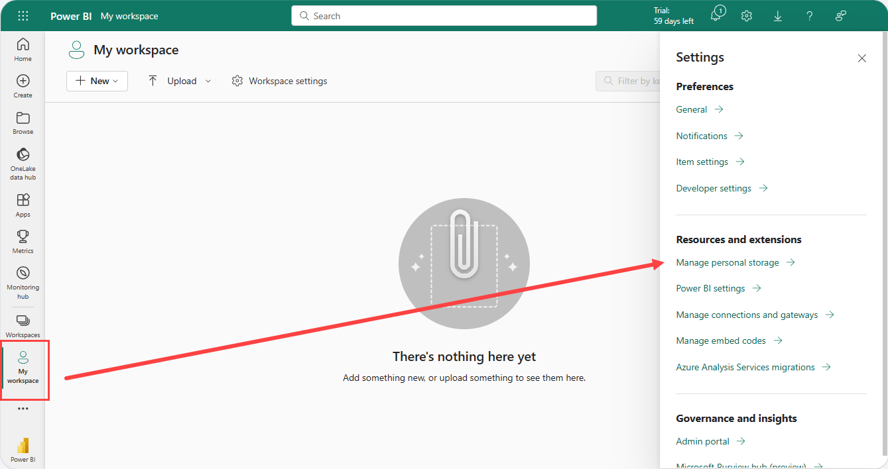
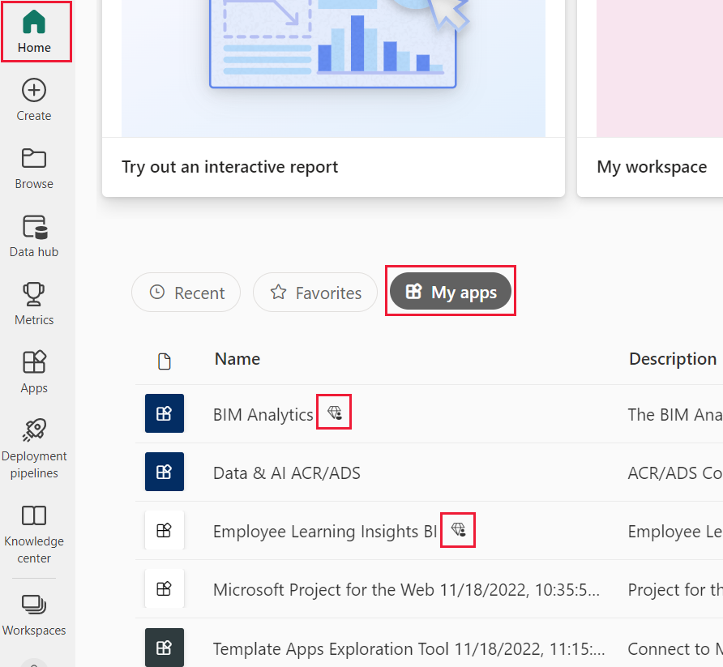

# Licenses and subscriptions for *business users*

[!INCLUDE[consumer-appliesto-ynnn](../includes/consumer-appliesto-ynnn.md)]

As a [*business user*](end-user-consumer.md), you use the Power BI service to explore reports and dashboards so you can make data-backed business decisions. If you've been using Power BI for a while, or have been chatting with your *designer* colleagues, you've probably discovered that there are some features that only work if you have a certain type of license, subscription, or permissions.

What you can do in the Power BI service depends on three things:
-    the type of license and subscription you're using,
-    where content is stored, and
-    the roles and permissions you're assigned.

In this article, we describe the capabilities of each license type and how *where content is stored* can affect *what you can do with it*. You'll also learn how to look up your license and subscription and figure out where your content is stored. For more information about roles and permissions, see [workspace roles](end-user-workspaces.md).

## Licenses

Each user of the Power BI service has either a *free* license, a *Pro* license, or a *Premium per-user* license. If you're a Power BI *business user*, you're probably using a free license that is managed by your Power BI admin.

It's possible to have more than one license at the same time.  The service always delivers you the experience equal to the most-permissive license you currently have.

## Power BI Premium capacity subscription

Premium is an organizational *subscription* that provides a different way to store content--in a virtual container called a *capacity*. With Premium capacity, anyone with permissions, whether they're inside or outside your organization, can view content stored in this Premium capacity, without purchasing individual Power BI Pro or Premium per-user licenses. 

Premium capacity enables widespread distribution of content by Pro users without requiring Pro licenses for the recipients who view the content. The person who is creating the content in the Premium capacity uses a Pro license to connect to data sources, model data, and create reports and dashboards that are saved to a workspace in Premium capacity. Users without a Pro license can still access a workspace that's in Power BI Premium capacity, as long as they're assigned a [role in that workspace](end-user-workspaces.md). If the workspace owner creates an app based on content in that workspace, users without a Pro license can still view that app in Premium capacity, as long as they've been given a role that has permissions for that app. 

Within those workspaces, designers assign roles, like **Viewer**, **Contributor**, **Member**, and **Administrator**. These roles determine the extent to which colleagues can interact with the content. For more information, see [workspace permissions and roles.](end-user-workspaces.md) 

When a designer creates and publishes an app, they grant access to entire organizations or individuals. The extent to which you can interact with the app's content depends on the specific access permissions given to you. For example, you may be given access to view the app, connect to the underlying datasets, make copies of reports, or share the content.

For more info about Premium capacity, see [What is Microsoft Power BI Premium?](../enterprise/service-premium-what-is.md).

## Find out which licenses you have
Select your profile picture to display account information. Zalan is using a free license. Other types of licenses are: **Pro** and **Premium per user**. 

To see additional details about your account, select **View account**. 

<!-- [Your Microsoft **My account** page](https://portal.office.com/account) opens in a new browser tab.  To see what licenses are assigned to you.  Select the tab for  **Subscriptions**.

This first user, Pradtanna, has Office 365 E5, which includes a Power BI Pro license.

This second user, Zalan, has a Power BI free license. 

 

## Find out if you have access to Premium capacity

Next, check to see if you're part of an organization that has Premium capacity. Either of the users above, Pro or free, could belong to an organization that has Premium capacity.  Let's check for our second user, Zalan.  

We can determine whether Zalan's organization has Premium capacity by looking up the amount of storage available. 

- In the Power BI service, select **My workspace** and then select the cog icon from the upper right corner. Choose **Manage personal storage**.

    

    If you see more than 10 GB, then you're a member of an organization that has a Premium subscription. The image below shows that Zalan's organization has up to 100 GB of storage. Zalan, personally, doesn't own 100GB as indicated by the heading **Owned by us**.  

    

    Notice that a Pro user has already shared a workspace with Zalan. The diamond icon shows that this workspace is stored in Premium capacity. 

    If you see any amount of storage, the words **Pro user** next to your name, and the heading **Owned by me**, then you have a Premium per-user license.  

    -->

## Identify content hosted in Premium capacity

There are a couple of ways to identify content that is stored in Premium capacity. One way is to look for apps and app workspaces with a diamond icon. The diamond indicates that the content is stored in Premium capacity. 

In the image below, three of the apps are stored in Premium capacity.

If you're a user with a free license, as long as the *designer* places the workspace in a Premium capacity, you have the ability, **within that workspace**, to view shared content, collaborate with colleagues, work with the app dashboards and reports, and more. The extent of your permissions is set by your Power BI administrator and by the content designer.

## Putting it all together

There are many different ways organizations organize their Power BI subscriptions and licenses. From a *business users* perspective, one of the most common scenarios is when an organization buys a Premium subscription, the admin assigns Pro licenses to a small group of users, and all the other users work with free licenses. Typically, the admin assigns the Pro licenses to the employees who will be creating and sharing content. The Pro users create [workspaces](end-user-workspaces.md) and add content (dashboards, reports, datasets, apps) to those workspaces. To allow free users to collaborate in those workspaces, the admin or Pro user then assigns the workspaces to a *Premium capacity*.  

|License type  |Not in Premium capacity | Premium capacity  |
|---------|---------|---------|
|**Free**     |  Use as a personal sandbox where you create content for yourself and interact with that content. A free license is a great way to try out the Power BI service. You can't consume content from anyone else or share your content with others  1     |   Interact with content assigned to Premium capacity and shared with you. Free, Premium per-user, and Pro users can collaborate without requiring the free users to have Pro accounts.      |
|**Pro**     |  Collaborate with Premium per-user and Pro users by creating and sharing content.        |  Collaborate with free, Premium per user, and Pro users by creating and sharing content.       |

1 See [Considerations and troubleshooting](#considerations-and-troubleshooting).

In the diagram below, the left side represents Pro users who create and share content in app workspaces.

- **Workspace A** was not created in a Premium capacity.

- **Workspace B** was created and saved in a Premium capacity. This workspace has a diamond icon.  

    

The Power BI Pro *designer* can share and collaborate with other Pro users in either of the workspaces. But, the only way the Power BI Pro user can share and collaborate with free users is by using Workspace B, which is in a Premium capacity.  Within the workspace, the designer assigns roles to collaborators. Your role determines what actions you can take within the workspace. Power BI *business users* are usually assigned the *Viewer* role. To learn more about roles, see [Workspaces for Power BI business users](end-user-workspaces.md).

## Considerations and troubleshooting

- It's possible to have more than one Power BI license. The Power BI service will always deliver the experience equal to the best license that you currently have. For example, if you have both a Pro and a free license, the Power BI service will use the Pro license.

- If you want to create and share content (dashboards, reports, apps), or open content that someone else shared with you, then you need to have a Pro user license or a Premium per user license. You may be able to sign up for a free 60-day individual trial of the paid version of Power BI Premium Per User. If your organization has enabled self-service trials, select the upgrade dialog that appears in the Power BI service whenever you try to use a Pro feature.

    

  When the 60-day trial expires, your license reverts back to the previous version, either free or Pro. After your trial license reverts, you no longer have access to features that require a Power BI Premium Per User license. If you want to continue with a Premium Per User or a Pro license, contact your administrator or IT Help Desk about purchasing an upgrade. If you don't have an admin or IT Help Desk, visit [the Power BI pricing page](https://powerbi.microsoft.com/pricing/).

- If you signed up for a free license on your own by selecting a *Try it free* type of button, it never expires. So if you upgrade to a trial or your organization provides you with a Pro or Premium Per User license, and then your trial ends or your organization removes your Pro license, you still have the free license to fall back on - unless you cancel the license.

- 1 A free user license for the Power BI service is perfect for someone exploring or using it for personal data analysis and visualizations using **My workspace**. A free standalone user isn't using Power BI to collaborate with colleagues. Standalone users with free  licenses can't view content shared by others or share their own content with other Power BI users.

## Next steps

- [Am I a Power BI *business user*?](end-user-consumer.md)    
- [Learn about workspaces](end-user-workspaces.md)    
- [View Power BI business user features by license type](end-user-features.md)
