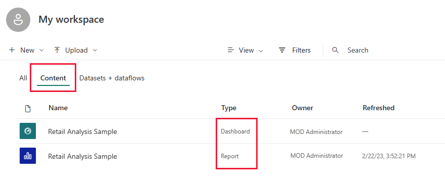
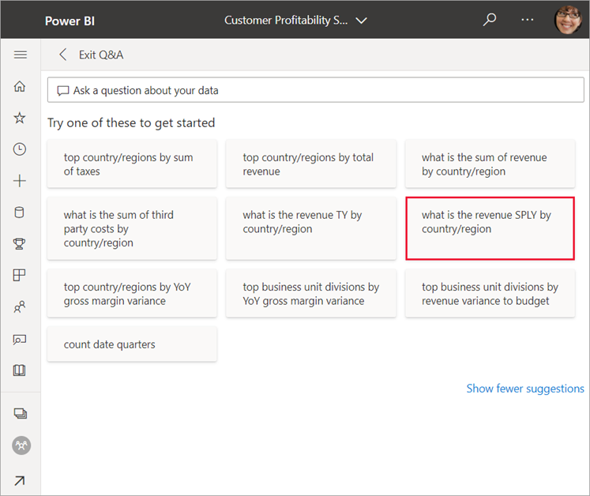
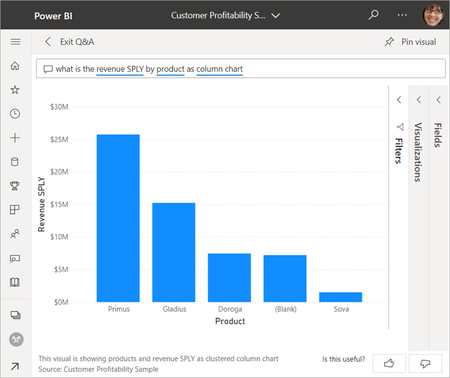
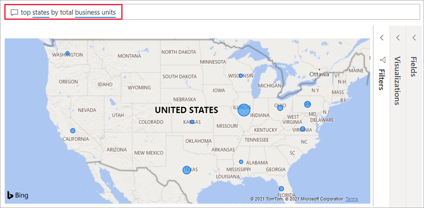
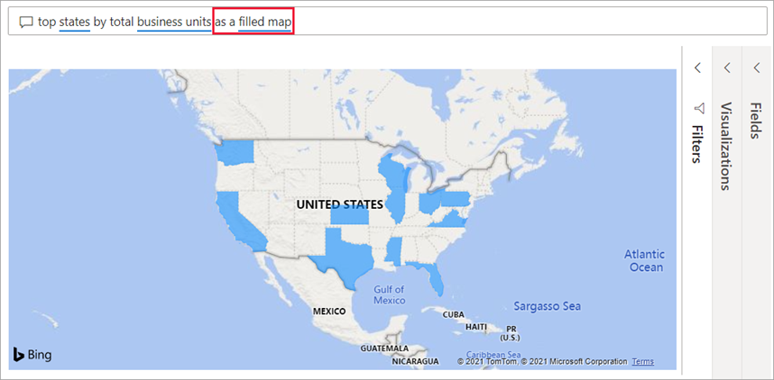
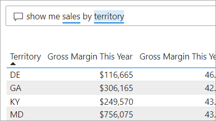
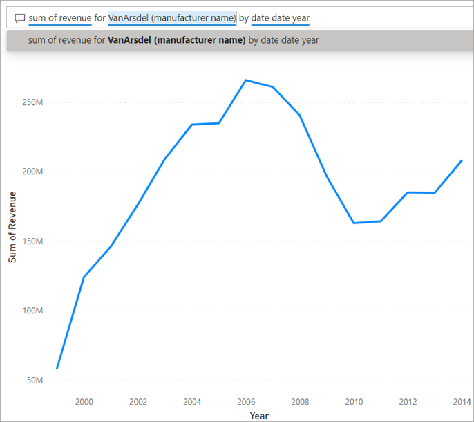

[!INCLUDE [applies-yes-desktop-yes-service](../includes/applies-yes-desktop-yes-service.md)]

# Q&A tutorial

This tutorial shows you how to: 

> [!div class="checklist"]
> * Import the Retail Analysis sample and add it to the Power BI service.
> * Explore the sample in the service.
> * Create a visual by using natural language in *Q&A*.

If you'd like more background information, see [Introduction to Q&A](end-user-q-and-a.md). In that article you learn about Q&A, where to use it, and the difference between Power BI Q&A on a dashboard and the Power BI Q&A visual for reports.  

If you want to familiarize yourself with the built-in sample in this tutorial and its scenario, see [Retail Analysis sample for Power BI: Take a tour](sample-retail-analysis.md) before you begin.

## Prerequisites

- To download a sample in the Power BI service, you can sign up for a [free or trial license](../fundamentals/service-self-service-signup-purchase-for-power-bi.md).

- **Power BI Q&A** is available with a Pro or Premium license.  [Q&A in the Power BI mobile apps](mobile/mobile-apps-ios-qna.md) and [Q&A with Power BI Embedded](../developer/embedded/qanda.md) are covered in separate articles. 
- At the current time, **Power BI Q&A** only supports answering natural language queries asked in English, although there is a preview available for Spanish that can be enabled by your Power BI administrator.

## Import the sample in the Power BI service

1. Open the Power BI service (app.powerbi.com), sign in, and open the workspace where you want to save the sample. 

    If you don't have a Power BI Pro or Premium Per User (PPU) license, you can save the sample to your My Workspace.

    

2. Select **Get data** at the bottom of the nav pane. 

    :::image type="content" source="media/end-user-q-and-a-tutorial/power-bi-get-data.png" alt-text="Select Get data.":::

1. On the **Get Data** page that appears, select **Samples**.

    :::image type="content" source="media/end-user-q-and-a-tutorial/power-bi-get-sample.png" alt-text="Select Samples.":::

1. Select **Retail Analysis Sample** > **Connect**.

   :::image type="content" source="media/end-user-q-and-a-tutorial/power-bi-retail.png" alt-text="Select Samples.":::

## What was imported?

With the built-in samples, when you select **Connect**, Power BI gets a copy of that built-in sample and stores it for you in the cloud.

1. Power BI creates the new dashboard, report, and dataset in your workspace. 

   
2. On the **Content** tab, you see the dashboard and the report, both named *Retail Analysis Sample*.

   

## Use Q&A on a dashboard in the Power BI service
In the Power BI service (app.powerbi.com), a dashboard contains tiles pinned from one or more datasets, so you can ask questions about any of the data contained in any of those datasets. To see what reports and datasets were used to create the dashboard, select **See related content** from the **More actions** dropdown.

## How do I start?
First, get familiar with the content. Take a look at the visuals on the dashboard and in the report. Get a feel for the type and range of data that is available to you. 

For example:

* If a visual's axis labels and values include "sales",  "account", "month", and "opportunities", then you can confidently ask questions such as: "Which *account* has the highest *opportunity*, or show *sales* by month as a bar chart."

* If you have website performance data in Google Analytics, you can ask Q&A about time spent on a web page, number of unique page visits, and user engagement rates. Or, if you're querying demographic data, you might ask questions about age and household income by location.

Once you're familiar with the data, head back to the dashboard  and place your cursor in the question box. This opens the Q&A screen.

 

Even before you start typing, Q&A displays a new screen with suggestions to help you form your question. You see phrases and questions containing the names of the tables in the underlying datasets and may even see *featured* questions created by the dataset owner.

You can select any of these to add them to the question box and then refine them to find a specific answer. 

 

Another way Power BI helps you ask questions is with features such as: prompts, autocomplete, and visual cues. Power BI provides this help for Q&A on dashboards and with the Q&A visual. We'll discuss these features in detail below, in the section [Create a Q&A visual by typing your own natural language query](#create-a-visual-using-your-own-qa-question)

## Use Q&A 
To use Q&A on a dashboard or to use the Q&A visual in a report, select one of the suggested questions or type your own natural language question. 

### Create a visual by using a suggested question

Here, we've selected **top states by total business units**. Power BI does its best to select which visual type to use. In this case, it's a basic map.

But you can tell Power BI which visual type to use by adding it to your natural language query. Keep in mind that not all visual types will work or make sense with your data. For example, this data wouldn't produce a meaningful scatter chart. But it works as a filled map.

If you're unsure what type of questions to ask or terminology to use, expand **Show all suggestions** or look through the other visuals in the report. This will get you familiar with the terms and content of the  dataset.

### Create a visual using your own Q&A question

1. Type your question into the Q&A field using natural language. As you type your question, Power BI helps you with autocomplete, visual cues, and feedback.

    **Autocomplete** - as you type your question, Power BI Q&A shows relevant and contextual suggestions to help you quickly become productive with natural language. As you type, you get immediate feedback and results. The experience is similar to typing in a search engine.

    In this example, the suggestion we want is the first one. 

    

    **Solid and dotted underlines**- Power BI Q&A shows words with underlines to help you see which words Power BI did or did not recognize. 

    A solid blue underline indicates that Power BI recognized the word. The example below shows that Q&A recognized the terms **sales** and **territory**.

    

    A red double underline indicates a word that Power BI doesn't recognize at all. An example could be using the word 'geography' though it doesn't exist anywhere in the data. The word is in the English dictionary, but Q&A marks this term with a red underline. Power BI Q&A cannot create a visualization and suggests that you ask the report designer to add the term.  

    

    If Power BI is unsure of a word, you'll see a dotted underline. Select the word to see a list of suggestions. An example could be the word 'Location'. Multiple fields could contain the word 'Location', so the system prompts you to choose the field you meant.  

    

    
    
    Power BI Q&A recognizes words that mean the same thing, thanks to the integration with Bing and Office. Q&A underlines the word so you know it's not a direct match

    

    **Suggestions** - as you type more of the question, Power BI lets you know if it doesn't understand the question, and tries to help. In the example below, Power BI suggests two different fields that it recognizes for 'VanArsdel'. 

    

    After selecting Power BI's correction, notice that all words are recognized and underlined in blue. Your results display as a line chart. 

    

    But, you can change the line chart to another visual type.  

    

